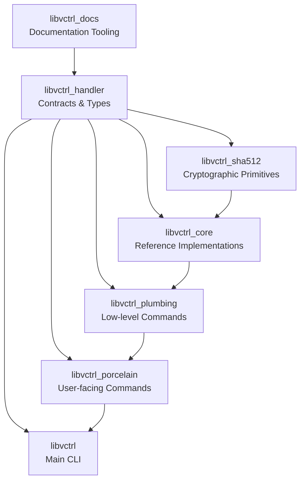
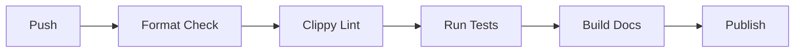

# libvcrtl

**A modular, content-addressable version control system implemented in Rust.**

`libvcrtl` is a workspace containing a collection of Rust crates that together form a version control system. The workspace is designed around a strict separation of contracts, reference implementations, cryptographic primitives, and user-facing commands.

The project is intended to serve as both a production-ready VCS core and an educational reference for building modular Rust applications with safe, well-documented, and testable components.

---

## Table of Contents

- [Overview](#overview)
- [System Architecture](#system-architecture)
- [Core Features](#core-features)
- [Technology Stack](#technology-stack)
- [Project Structure](#project-structure)
- [Getting Started](#getting-started)
  - [Prerequisites](#prerequisites)
  - [Installation](#installation)
  - [Configuration](#configuration)
- [Usage](#usage)
- [Workspace Crates](#workspace-crates)
  - [libvctrl_handler](#libvctrl_handler)
  - [libvctrl_core](#libvctrl_core)
  - [libvctrl_sha512](#libvctrl_sha512)
  - [libvctrl_plumbing](#libvctrl_plumbing)
  - [libvctrl_porcelain](#libvctrl_porcelain)
  - [libvctrl](#libvctrl)
  - [libvctrl_docs](#libvctrl_docs)
- [Testing](#testing)
- [CI/CD Pipeline](#cicd-pipeline)
- [Deployment / Distribution](#deployment--distribution)
- [Security & Compliance](#security--compliance)
- [Contributing](#contributing)
- [License](#license)
- [Changelog](#changelog)

---

## Overview

`libvcrtl` is a modular version control system built from multiple Rust crates. The workspace is designed to demonstrate and enforce best practices in software architecture, including:

- **Contract-first design** – The foundational crate (`libvctrl_handler`) defines immutable data types and behavior traits without implementations.
- **Separation of concerns** – Persistence, serialization, hashing, networking, and signing are isolated behind traits and implemented in dedicated crates.
- **Strict safety** – All crates use `#![forbid(unsafe_code)]` (with one reviewed exception in `libvctrl_sha512`) and deny common Clippy warnings.
- **Comprehensive documentation** – Every public item is documented with doctests.
- **Testing** – Unit tests, doctests, and property-based tests are used throughout.

The workspace provides everything needed to build, use, and extend a version control system, from low-level hash functions to high-level CLI commands.

---

## System Architecture

The workspace follows a layered architecture. The foundational contracts crate is at the bottom; higher-level crates depend on it and on each other as shown:



Dependency direction: `libvctrl_handler` depends on nothing (except std). `libvctrl_sha512` depends on nothing. `libvctrl_core` depends on both handler and sha512. `libvctrl_plumbing` depends on handler and core. `libvctrl_porcelain` depends on plumbing. `libvctrl` (the main binary) depends on porcelain and core.

---

## Core Features

Across the workspace:

- **Content-addressable object model** – Blob, Tree, Commit, Tag, Hash, UserID, TreeEntry.
- **Behavior traits** – ObjectStore, RefStore, Hasher, Encoder, Decoder, Signer, Verifier, Transport.
- **Binary serialization** – Deterministic, versioned, little-endian format.
- **SHA-512, HMAC-SHA-512, HKDF-SHA-512, SHA-384** – Zero-dependency cryptographic primitives.
- **In-memory stores** – ObjectStore and RefStore implementations for testing and ephemeral use.
- **Builder patterns** – Ergonomic construction of blobs, commits, tags, trees.
- **Validation utilities** – Path traversal and resource exhaustion prevention.
- **Strict linting and documentation** – Clippy all, pedantic, nursery, cargo denied; missing_docs denied.
- **Unified error handling** – `VctrlError` with source chaining and comparison.

---

## Technology Stack

- **Language:** Rust (edition 2024)
- **Build tool:** Cargo
- **Dependencies:**
  - `libvctrl_sha512` – zero external dependencies
  - `libvctrl_handler` – no external dependencies
  - `libvctrl_core` – uses `libvctrl_handler` and `libvctrl_sha512`; dev-dependency `proptest`
  - Other crates build on top
- **Testing:** `proptest` for property-based tests, `criterion` for benchmarks
- **License:** MIT for most crates, ISC for `libvctrl_sha512`

---

## Project Structure

```text
libvcrtl/
├── Cargo.toml                 # Workspace manifest
├── Cargo.lock
├── CONTRIBUTING.md
├── CODE_OF_CONDUCT.md
├── SECURITY.md
├── LICENSE
├── Makefile
├── scripts/                   # Helper scripts
├── dev/                       # Development utilities
├── libvctrl/                  # Main CLI / executable crate
├── libvctrl_core/             # Reference implementations
├── libvctrl_docs/             # Documentation tooling
├── libvctrl_handler/          # Contracts, types, traits
├── libvctrl_plumbing/         # Low-level plumbing commands
├── libvctrl_porcelain/        # User-facing porcelain commands
└── libvctrl_sha512/           # SHA-512, HMAC, HKDF
```

Each crate has its own `README.md` with detailed documentation. Refer to those files for crate-specific information.

---

## Getting Started

### Prerequisites

- Rust toolchain 1.96.0 or newer (edition 2024)
- Cargo

No system libraries or external services are required to build and test the workspace.

### Installation

Clone the repository:

```sh
git clone https://github.com/mroczect/libvctrl.git
cd libvcrtl
```

Build the entire workspace:

```sh
cargo build --workspace
```

### Configuration

No global configuration is required. Each crate may have its own feature flags:

- `libvctrl_sha512` features: `default = ["sha384"]`, `sha384`, `opt_size`.
- Other crates do not expose feature flags.

Environment variables are not used by the core libraries. The main CLI (`libvctrl`) may support configuration later.

---

## Usage

### Running the CLI

If the main binary crate `libvctrl` is built, you can run:

```sh
cargo run -p libvctrl -- --help
```

### Using the Libraries

Add the desired crate as a dependency in your `Cargo.toml`:

```toml
[dependencies]
libvctrl_handler = "4.4.0"
libvctrl_core = "2.0.1"
libvctrl_sha512 = "2.0.0"
```

Then use the exported types and traits. Example combining handler and core:

```rust
use libvctrl_handler::{Blob, Encoder, Hasher, ObjectStore};
use libvctrl_core::codec::BinaryEncoder;
use libvctrl_core::hash::Sha512Hasher;
use libvctrl_core::store::MemoryStore;
use std::io::Read;

let blob = Blob::new(b"my content".to_vec());
let encoder = BinaryEncoder;
let bytes = encoder.encode_blob(&blob).unwrap();

let hasher = Sha512Hasher;
let hash = hasher.hash(&bytes).unwrap();

let mut store = MemoryStore::new();
store.put(&hash, &bytes).unwrap();

let mut reader = store.get(&hash).unwrap();
let mut buf = Vec::new();
reader.read_to_end(&mut buf).unwrap();
assert_eq!(buf, bytes);
```

---

## Workspace Crates

Detailed documentation for each crate is available in its respective `README.md`. Below is a summary.

### libvctrl_handler

**Contracts and Types**

The foundational crate that defines:

- Immutable data types: `Blob`, `Tree`, `TreeEntry`, `Commit`, `CommitMeta`, `Tag`, `Hash`, `UserID`
- Logical object kind enum: `EntryKind`
- System constants and limits
- Unified error type: `VctrlError`
- Behavior traits: `ObjectStore`, `RefStore`, `Hasher`, `Encoder`, `Decoder`, `Signer`, `Verifier`, `Transport`

Contains no implementations. All public items are re-exported at crate root.

### libvctrl_core

**Reference Implementations**

Provides production-ready implementations of the handler contracts:

- `BinaryEncoder` and `BinaryDecoder` for serialization
- `Sha512Hasher`
- `MemoryStore` and `MemoryRefStore`
- Builder patterns: `BlobBuilder`, `CommitBuilder`, `TagBuilder`, `TreeBuilder`, `TreeEntryBuilder`
- Validation utilities for names and hashes

This crate is intended as a quality exemplar for custom backend implementations.

### libvctrl_sha512

**Cryptographic Primitives**

Zero-dependency, `no_std`-compatible implementation of:

- SHA-512
- HMAC-SHA-512
- HKDF-SHA-512
- SHA-384 (feature-gated)
- HMAC-SHA-384 and HKDF-SHA-384 (feature-gated)

Uses exported macros to generate HMAC and HKDF structs for different hash lengths.

### libvctrl_plumbing

**Low-level Commands**

Implements the plumbing (low-level) layer of the VCS, operating directly on object stores, refs, and codecs. Depends on `libvctrl_handler` and `libvctrl_core`.

### libvctrl_porcelain

**User-facing Commands**

Implements the porcelain (user-friendly) layer, providing high-level commands such as commit, checkout, branch, tag, etc. Depends on `libvctrl_plumbing`.

### libvctrl

all-in-one Version Control System (VCS) Software Development Kit. It aggregates the three foundational crates of the `libvcrtl` workspace into a single, coherent namespace, allowing developers to bootstrap a fully functional version control system without manually stitching together multiple dependencies.

### libvctrl_docs

**Documentation Tooling**

Utilities and helpers for generating and maintaining project documentation.

---

## Testing

Run all tests in the workspace:

```sh
cargo test --workspace
```

Run tests with all features enabled:

```sh
cargo test --workspace --all-features
```

Run doctests only:

```sh
cargo test --workspace --doc
```

Run benchmarks (from `libvctrl_sha512`):

```sh
cargo bench --workspace
```

---

## CI/CD Pipeline

No CI/CD pipeline is currently configured in the repository.

If one is added, it should include at least the following stages:



Recommended commands per stage:

- Format: `cargo fmt --check`
- Lint: `cargo clippy --workspace --all-targets --all-features -- -D warnings`
- Tests: `cargo test --workspace --all-features`
- Docs: `cargo doc --workspace --no-deps`
- Publish: `cargo publish` for each crate

---

## Deployment / Distribution

Each crate is intended to be published to crates.io independently. Release process:

1. Update version in the crate's `Cargo.toml`.
2. Update its `CHANGELOG.md`.
3. Run `cargo publish --dry-run`.
4. Run `cargo publish` with a valid `CRATES_IO_TOKEN`.

Published crates:

- `libvctrl_handler`
- `libvctrl_core`
- `libvctrl_sha512`
- Possibly others as they stabilize.

---

## Security & Compliance

The workspace enforces strict security practices:

- **No unsafe code** except one reviewed block in `libvctrl_sha512::utils::verify`.
- **Denial-of-service prevention** via size limits and validation.
- **Path traversal prevention** in name validation.
- **Side-channel mitigation** via constant-ish time comparison.
- **Zeroization** of sensitive state in hash implementations.
- **Strict Clippy lints** including pedantic and nursery.

Refer to `SECURITY.md` for reporting vulnerabilities and additional security guidelines.

---

## Contributing

Contributions are welcome. Please read `CONTRIBUTING.md` and follow the project's code of conduct.

General guidelines:

- All public items must have documentation with doctests.
- Run `cargo fmt`.
- Run `cargo clippy --workspace --all-targets --all-features -- -D warnings`.
- Run `cargo test --workspace --all-features`.
- Avoid unsafe code; if necessary, justify it thoroughly.

---

## License

- Most crates in this workspace are licensed under the **MIT License**.
- `libvctrl_sha512` is licensed under the **ISC License**.

See the `LICENSE` file in each crate for details.
