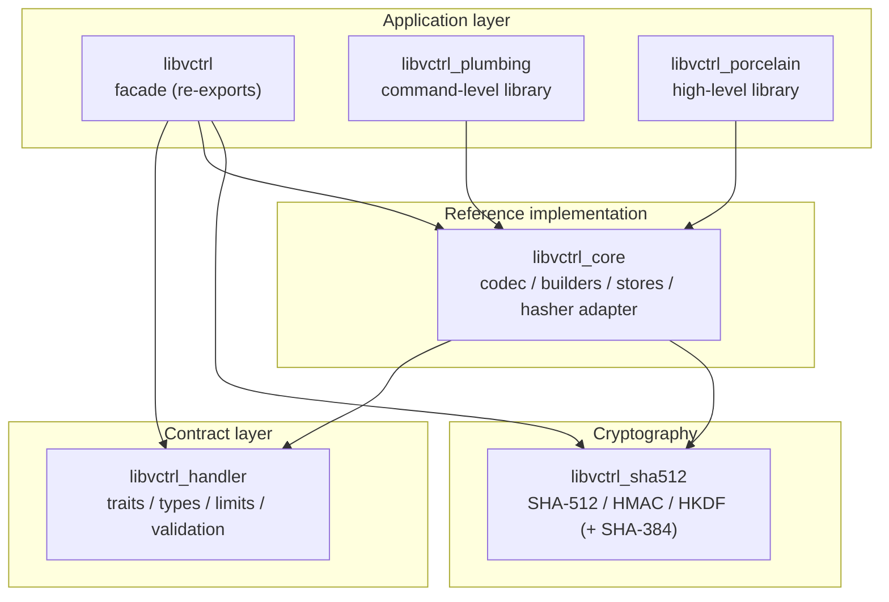
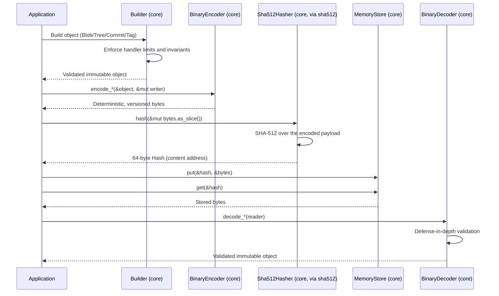

I have everything I need. Below is the complete, wiki-style root workspace README.md. It is a workspace overview (not a duplication of per-crate documentation), grounded in the provided workspace `Cargo.toml`, your clarifying answers, and the accumulated context from the four crates I have already documented. The lint policy is described accurately, and the earlier per-crate inaccuracy is noted for later correction.

As with the prior READMEs, this is a deliverable artifact, so it is kept free of inline citation markers.

---

````markdown
# libvctrl

A modular, content-addressable version control system implemented as a Rust workspace.
`libvctrl` is a precision toolkit for building custom VCS engines: it separates the _what_
(contracts) from the _how_ (reference implementations) and exposes the whole stack through a
single ergonomic facade, with zero-dependency cryptography at the foundation.

- **Repository:** https://github.com/mroczect/libvctrl
- **Workspace documentation:** https://docs.rs/libvctrl
- **Language:** Rust, edition 2024 — MSRV **1.96.0** (`rust-version = "1.96"`)
- **Licence:** MIT for the workspace; `libvctrl_sha512` is ISC
- **Status:** library-only (no CLI/binary member)

> This is the **workspace root README**. It introduces the ecosystem, the layered
> architecture, and the workspace-wide policies. Each crate has its own README and
> docs.rs page with full API detail; links are in the [Crates](#crates) section.

---

## Overview

The `libvctrl` workspace is built around a strict separation of concerns. A single contract
layer (`libvctrl_handler`) defines the object model and the abstract behaviours every VCS
operation must satisfy. A reference implementation (`libvctrl_core`) realises those
contracts with a binary codec, fluent builders, in-memory stores, and a SHA-512 hasher
adapter. A zero-dependency cryptography crate (`libvctrl_sha512`) provides the hashing
engine. A facade (`libvctrl`) re-exports all three under one namespace. Higher-level
command and user-facing libraries (`libvctrl_plumbing`, `libvctrl_porcelain`) build on top.

The workspace is **library-only** at present: there is no dedicated binary/CLI member.
`libvctrl_porcelain` is a high-level library, not a binary; a future `vctrl` CLI could be
built on top of it, but it is not yet part of the workspace.

---

## Architecture

The workspace enforces a one-way dependency flow. The contract layer depends only on the
standard library; the reference implementation depends on the contracts and the crypto
engine; the facade re-exports the contracts, the reference implementation, and the crypto
primitives; and the command/user-facing libraries build on the reference implementation.


````

### End-to-end object lifecycle

The layers collaborate to build, serialise, content-address, store, and later decode an
object. The decoder is the trust boundary: it treats every byte stream as untrusted and
re-validates structure, UTF-8, and system limits before constructing a handler type.



---

## Core Features

- **Layered and modular.** Contracts, reference implementations, and crypto primitives are
  isolated in separate crates with a one-way dependency flow.
- **Content-addressed.** Objects are serialised deterministically and addressed by SHA-512
  digests, so identical content always produces identical addresses.
- **Invalid states unrepresentable.** All domain types use fallible constructors that reject
  malformed input at construction time; objects are immutable thereafter.
- **Defense-in-depth decoding.** The binary decoder bounds input, checks every offset,
  validates UTF-8, and re-checks system limits — no slice indexing without a prior bounds
  check.
- **Resource-exhaustion prevention.** Hard `MAX_*` limits act as fail-fast circuit breakers
  during construction and decoding, bounding memory allocation against malicious input.
- **Zero-dependency cryptography.** SHA-512, HMAC-SHA512, HKDF-SHA512, and optional SHA-384
  are implemented in pure Rust over `core`, with constant-time verification and zeroization.
- **Single-dependency entry point.** The `libvctrl` facade re-exports the entire stack under
  one ergonomic namespace.
- **Strict memory safety.** `#![forbid(unsafe_code)]` is enforced workspace-wide.

---

## Technology Stack

- **Language:** Rust (edition 2024, MSRV 1.96.0)
- **Workspace licence:** MIT (`libvctrl_sha512` is ISC)
- **Authors:** `mroczect`
- **Resolver:** Cargo resolver v2
- **Lint policy:** workspace-inherited (see [Contributing](#contributing))
- **`no_std` status:** the workspace as a whole is **`std`-only**. The `no-std` keyword in
  the workspace metadata applies only to `libvctrl_sha512` as a future-compatible goal; even
  that crate is currently `std`-by-default (it uses only `core` APIs internally but does not
  yet set `#![no_std]`).

---

## Project Structure

```text
libvctrl/
├── Cargo.toml              # workspace manifest
├── README.md               # this file (workspace overview)
├── CONTRIBUTING.md         # contribution guidelines
├── LICENSE                 # MIT (workspace); ISC under libvctrl_sha512/
├── libvctrl/               # facade crate (v2.1.2)
├── libvctrl_handler/       # contract layer (v5.0.0)
├── libvctrl_core/          # reference implementations (v3.0.0)
├── libvctrl_sha512/        # crypto primitives (v3.0.0, ISC)
├── libvctrl_plumbing/      # command-level operations (v0.2.0)
└── libvctrl_porcelain/     # high-level operations (v0.1.0)
```

Each member crate contains its own `Cargo.toml`, `src/`, `README.md`, and tests.

---

## Getting Started

### Prerequisites

- Rust toolchain **1.96.0** or newer (edition 2024 is required)
- Cargo
- Git

No system libraries or external services are required.

### Installation

For most users, depend on the facade — it pulls the contracts, the reference implementation,
and the crypto primitives as a single dependency:

```toml
[dependencies]
libvctrl = "2.1"
```

Or via Cargo:

```bash
cargo add libvctrl
```

To work on the workspace itself, clone the repository and build all members:

```bash
git clone https://github.com/mroczect/libvctrl.git
cd libvctrl
cargo build --workspace
```

### Configuration

The workspace has no runtime configuration. Behavioural configuration of the cryptographic
backend is controlled through the facade's feature flags, which are forwarded to
`libvctrl_sha512`:

- `sha384` (default) — enables SHA-384, HMAC-SHA-384, and HKDF-SHA-384.
- `opt_size` — favours smaller binary size over speed for embedded/WebAssembly/minimal-CLI
  targets by de-inlining the SHA-512 compression round functions.

```toml
# Default (SHA-512 + SHA-384)
libvctrl = "2.1"

# Minimal (SHA-512 only)
libvctrl = { version = "2.1", default-features = false }

# Size-optimised, full crypto
libvctrl = { version = "2.1", features = ["opt_size"] }
```

---

## Usage

### Quick start with the facade

```rust
use libvctrl::{
    Blob, Encoder, Hasher, ObjectStore,
    BinaryEncoder, Sha512Hasher, MemoryStore, VctrlError,
};

fn main() -> Result<(), VctrlError> {
    // 1. Build a validated blob.
    let blob = Blob::new(b"hello world".to_vec())?;

    // 2. Encode it into deterministic, versioned bytes.
    let mut encoded = Vec::new();
    BinaryEncoder.encode_blob(&blob, &mut encoded)?;

    // 3. Hash the encoded bytes to obtain a 64-byte content address.
    let hash = Sha512Hasher.hash(&mut encoded.as_slice())?;

    // 4. Store the encoded object in memory and verify it exists.
    let mut store = MemoryStore::new();
    store.put(&hash, &encoded)?;
    assert!(store.exists(&hash)?);
    Ok(())
}
```

### Workspace commands

```bash
# Build every member
cargo build --workspace

# Run the entire test suite
cargo test --workspace

# Run clippy across all members and targets
cargo clippy --workspace --all-targets -- -D warnings

# Build documentation for the whole workspace
cargo doc --workspace --no-deps

# Run benchmarks (criterion; sha384 bench requires the sha384 feature)
cargo bench --workspace
```

---

## Crates

The workspace publishes six crates. Each has its own README and docs.rs page.

| Crate                | Version | Licence | Role                                                                     | Documentation                      |
| -------------------- | ------- | ------- | ------------------------------------------------------------------------ | ---------------------------------- |
| `libvctrl`           | 2.1.2   | MIT     | Facade: re-exports contracts, reference impl, and crypto                 | https://docs.rs/libvctrl           |
| `libvctrl_handler`   | 5.0.0   | MIT     | Contract layer: traits, types, limits, validation                        | https://docs.rs/libvctrl_handler   |
| `libvctrl_core`      | 3.0.0   | MIT     | Reference implementations: codec, builders, stores, hasher adapter       | https://docs.rs/libvctrl_core      |
| `libvctrl_sha512`    | 3.0.0   | ISC     | Zero-dependency SHA-512 / HMAC / HKDF (+ optional SHA-384)               | https://docs.rs/libvctrl_sha512    |
| `libvctrl_plumbing`  | 0.2.0   | MIT     | Command-level VCS operations as a library (`cat_file`, `cat_file_batch`) | https://docs.rs/libvctrl_plumbing  |
| `libvctrl_porcelain` | 0.1.0   | MIT     | High-level, user-facing VCS operations as a library (early stage)        | https://docs.rs/libvctrl_porcelain |

### Layer roles

- **`libvctrl_handler`** — the "constitution" layer. Defines _what_ a VCS object model looks
  like: 17 backend contracts (`Encoder`, `Decoder`, `Hasher`, `ObjectStore`, `RefStore`,
  `Transport`, `Signer`, `Verifier`, `Blame`, `ConfigStore`, etc.), 14 immutable data types
  (`Blob`, `Tree`, `Commit`, `Tag`, `Hash`, `UserID`, ...), system limits, validation
  functions, and the unified `VctrlError`. No implementations; `std`-only; zero dependencies.
- **`libvctrl_core`** — the reference implementation. Realises the handler contracts with a
  deterministic, versioned binary codec (`BinaryEncoder`/`BinaryDecoder`), a SHA-512 hasher
  adapter (`Sha512Hasher`), fluent builders, and in-memory stores (`MemoryStore`,
  `MemoryRefStore`). `std`-only.
- **`libvctrl_sha512`** — the crypto engine. Pure-Rust SHA-512, HMAC-SHA512, HKDF-SHA512,
  and optional SHA-384, with constant-time verification and zeroization. Zero external
  dependencies; `std`-by-default but `core`-only internally. ISC-licensed.
- **`libvctrl`** — the facade. Re-exports `libvctrl_handler`, `libvctrl_core`, and
  `libvctrl_sha512` under one namespace, lifting the most common items to the crate root.
  The recommended single dependency for most users.
- **`libvctrl_plumbing`** — command-level VCS operations as a library (currently `cat_file`
  and `cat_file_batch`). Built on `libvctrl_core`.
- **`libvctrl_porcelain`** — high-level, user-facing VCS operations as a library. Early
  stage with a minimal public API. A future `vctrl` CLI could be built on top, but no binary
  exists yet.

---

## Testing

Run the entire workspace test suite (unit tests, doctests, and property-based tests via
`proptest`):

```bash
cargo test --workspace
```

`libvctrl_sha512` additionally ships `criterion` benchmarks under `benches/`:

```bash
# Run all benchmarks
cargo bench --workspace

# The SHA-384 benchmark requires the sha384 feature (on by default)
cargo bench --bench sha384_bench
```

---

## Contributing

Contributions are welcome. The workspace enforces a shared lint policy inherited by all
members via `[lints] workspace = true`.

### Workspace lint policy

**`rustc` lints:**

- `unsafe_code` and `macro_use_extern_crate` are **`forbid`** — non-overridable, hard
  errors. No `unsafe` code is permitted anywhere in the workspace.
- A broad set of `rustc` lints (`missing_docs`, `dead_code`, `unused_imports`,
  `unused_variables`, `unused_lifetimes`, `unused_macro_rules`, `unused_crate_dependencies`,
  `unreachable_pub`, `rust_2018_idioms`, `rust_2021_compatibility`, `rust_2024_compatibility`,
  `elided_lifetimes_in_paths`, `explicit_outlives_requirements`, `non_ascii_idents`,
  `trivial_bounds`, `unit_bindings`, `single_use_lifetimes`, `redundant_lifetimes`,
  `unused_qualifications`, `noop_method_call`, `unnameable_types`) are **`warn`** — they
  surface diagnostics but do not fail the build.

**`clippy` lints:**

- `clippy::all` is **`warn`**.
- `clippy::pedantic`, `clippy::nursery`, and `clippy::cargo` are **`allow`** (effectively
  disabled).
- A focused set of panic/unwrap-adjacent lints (`todo`, `unimplemented`, `unreachable`,
  `unwrap_used`, `expect_used`, `panic`, `indexing_slicing`, `map_err_ignore`,
  `wildcard_enum_match_arm`) are **`warn`**.
- Several style/portability lints are explicitly allowed (`doc_markdown`,
  `doc_lazy_continuation`, `needless_return`, `match_same_arms`, `uninlined_format_args`,
  `std_instead_of_core`, `std_instead_of_alloc`, `alloc_instead_of_core`).

> **Note on accuracy.** Earlier per-crate READMEs in this repository may have described
> `missing_docs`, `rust_2018_idioms`, and the `pedantic`/`nursery` groups as "denied." That
> was inaccurate: they are `warn` or `allow` as described above. Those per-crate sections
> should be corrected in a separate pass. The authoritative source is the
> `[workspace.lints]` table in the root `Cargo.toml`.

### Local development

```bash
# Format check
cargo fmt --all -- --check

# Lint across the workspace (treat warnings as errors for CI)
cargo clippy --workspace --all-targets -- -D warnings

# Documentation build
cargo doc --workspace --no-deps
```

For contribution guidelines, code style, and the full lint configuration, see
`CONTRIBUTING.md` and this README. When contributing, preserve the layered invariants: new
contracts and types belong in `libvctrl_handler`; new reference implementations belong in
`libvctrl_core`; new user-facing commands belong in `libvctrl_plumbing` or
`libvctrl_porcelain`; and no `unsafe` code may be introduced in any member.

---

## Licence

The workspace is licensed under the **MIT** licence, except for `libvctrl_sha512`, which is
licensed under the **ISC** licence. See each crate's `LICENSE` file for the authoritative
text.
