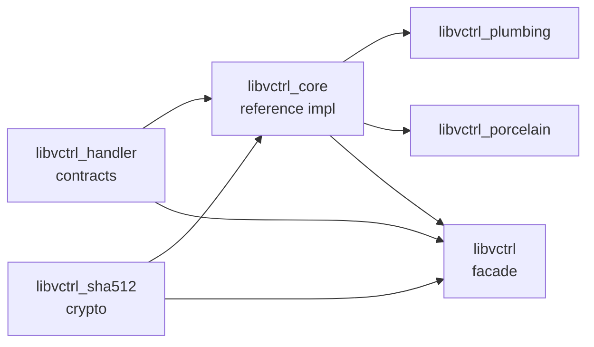

# libvctrl

A precision toolkit for building custom version control systems in Rust.

`libvctrl` is a workspace of six crates that together provide:

- **contracts** for VCS objects, storage, transport, signing, and traversal
- **reference implementations** of those contracts
- **cryptographic primitives** for content addressing and authentication
- **plumbing and porcelain** command-level building blocks
- a **facade crate** that re-exports the entire SDK under one namespace

The workspace is designed to be layered, auditable, and usable either as a complete
batteries-included VCS SDK or as a set of focused, standalone libraries.

---

## Workspace at a glance

| Crate                | Version | Role                                                       | MSRV   | License |
| -------------------- | ------- | ---------------------------------------------------------- | ------ | ------- |
| `libvctrl`           | 2.2.0   | Facade: re-exports the full SDK                            | 1.96.0 | MIT     |
| `libvctrl_handler`   | 5.2.0   | Contracts: traits, immutable types, limits, validation     | 1.96.0 | MIT     |
| `libvctrl_core`      | 3.2.0   | Reference implementations: codec, builders, stores, hasher | 1.96.0 | MIT     |
| `libvctrl_sha512`    | 3.2.0   | SHA-512, HMAC-SHA512, HKDF-SHA512, optional SHA-384        | 1.96.0 | ISC     |
| `libvctrl_plumbing`  | 0.2.0   | Command-level VCS operations built on `libvctrl_core`      | 1.96.0 | MIT     |
| `libvctrl_porcelain` | 0.1.0   | High-level, user-facing VCS operations                     | 1.96.0 | MIT     |

All crates share Rust edition 2024 and are tested against Rust **1.96.0**.

---

## Architecture

The dependency flow is strictly one-way:



- `libvctrl_handler` is the foundation. It contains only traits, types, constants, and
  validation; no concrete implementations.
- `libvctrl_core` implements those contracts, using `libvctrl_sha512` for hashing.
- `libvctrl_plumbing` and `libvctrl_porcelain` build command-level behaviour on top of
  `libvctrl_core`.
- `libvctrl` is a facade that re-exports all three foundational crates into a single
  ergonomic namespace.

---

## Features

- **Invalid states are unrepresentable.** Fallible constructors enforce invariants at
  construction time; objects are immutable thereafter.
- **Resource-exhaustion prevention.** Hard limits on blob size, tree entries, message
  length, parent count, and name length.
- **Strong typing over raw mode bits.** Tree entry kinds are represented by the
  `EntryKind` enum, not raw integers.
- **Deterministic serialization.** The binary codec produces a versioned, little-endian,
  deterministic byte stream for stable content addressing.
- **Defense-in-depth decoding.** The decoder bounds input, checks every offset, validates
  UTF-8, and re-checks limits before constructing objects.
- **Constant-time verification.** Cryptographic tag and hash comparisons do not
  short-circuit.
- **Zeroization.** Sensitive hash and HMAC state is cleared using the `zeroize` crate.
- **Zero/minimal dependencies.** The crypto crate has only one optional-feature dependency;
  the handler crate has no runtime dependencies.
- **Strict lint policy.** `#![forbid(unsafe_code)]`, denied missing-docs, rust idioms, and
  broad Clippy groups are enforced workspace-wide.

---

## Quick start

Add the facade to your `Cargo.toml`:

```toml
[dependencies]
libvctrl = "2.2"
```

Build, encode, hash, store, and decode a blob:

```rust
use std::io::Cursor;
use libvctrl::{
    Blob, BinaryDecoder, BinaryEncoder, Decoder, Encoder, Hasher, MemoryStore,
    ObjectStore, Sha512Hasher, VctrlError,
};

fn main() -> Result<(), VctrlError> {
    // 1. Create a validated blob.
    let blob = Blob::new(b"hello world".to_vec())?;

    // 2. Encode it into deterministic bytes.
    let mut encoded = Vec::new();
    BinaryEncoder.encode_blob(&blob, &mut encoded)?;

    // 3. Hash the encoded bytes to get a 64-byte content address.
    let hash = Sha512Hasher.hash(&mut encoded.as_slice())?;

    // 4. Store the object in memory.
    let mut store = MemoryStore::new();
    store.put(&hash, &encoded)?;

    // 5. Retrieve and decode it back.
    let reader = store.get(&hash)?;
    let decoded = BinaryDecoder.decode_blob(reader)?;

    assert_eq!(decoded, blob);
    Ok(())
}
```

---

## Using a focused crate

If you only need contracts, crypto, or the reference implementation, depend on the
individual crate instead of the facade:

```toml
[dependencies]
libvctrl_handler = "5.2"     # contracts only
libvctrl_core = "3.2"        # codec, builders, stores, hasher adapter
libvctrl_sha512 = "3.2"      # raw SHA-512/HMAC/HKDF
```

The crypto crate supports feature flags for SHA-384 and size optimisation:

```toml
# Minimal SHA-512 only
libvctrl_sha512 = { version = "3.2", default-features = false }

# Size-optimised SHA-512
libvctrl_sha512 = { version = "3.2", default-features = false, features = ["opt_size"] }
```

---

## Repository layout

```text
libvctrl/
├── Cargo.toml
├── rust-toolchain.toml
├── README.md
├── libvctrl/
├── libvctrl_handler/
├── libvctrl_core/
├── libvctrl_sha512/
├── libvctrl_plumbing/
└── libvctrl_porcelain/
```

Each crate has its own `README.md` and `Cargo.toml`.

---

## Testing, linting, and documentation

Run the full workspace test suite:

```bash
cargo test --workspace --all-targets --all-features
```

Run formatting checks:

```bash
cargo fmt --all -- --check
```

Run Clippy with warnings denied:

```bash
cargo clippy --workspace --all-targets --all-features -- -D warnings
```

Build documentation:

```bash
cargo doc --workspace --no-deps
```

Run benchmarks for crypto and handler crates:

```bash
cargo bench -p libvctrl_sha512
cargo bench -p libvctrl_handler
```

---

## Security and safety

The workspace enforces:

- `#![forbid(unsafe_code)]` in every crate
- denial of `unwrap_used`, `expect_used`, `panic`, and `indexing_slicing` where feasible
- `unsafe_code = "forbid"` at the workspace level
- zeroization of sensitive cryptographic state
- constant-time comparison for tags and hashes
- bounded reads and allocation limits on untrusted input

No formal security audit has been performed. Use at your own risk in production.

---

## Contributing

Contributions are welcome. See `CONTRIBUTING.md` for guidelines.

General rules:

- Keep the contract layer free of concrete implementations.
- Keep the crypto crate dependency-light.
- Preserve the facade as a pure re-export layer.
- Ensure `cargo fmt`, `cargo clippy`, and `cargo test --workspace` pass before opening a PR.

---

## License

The workspace is licensed under the **MIT License**, except for `libvctrl_sha512`, which
is licensed under the **ISC License**.

See the individual crate `LICENSE` files for full text.
