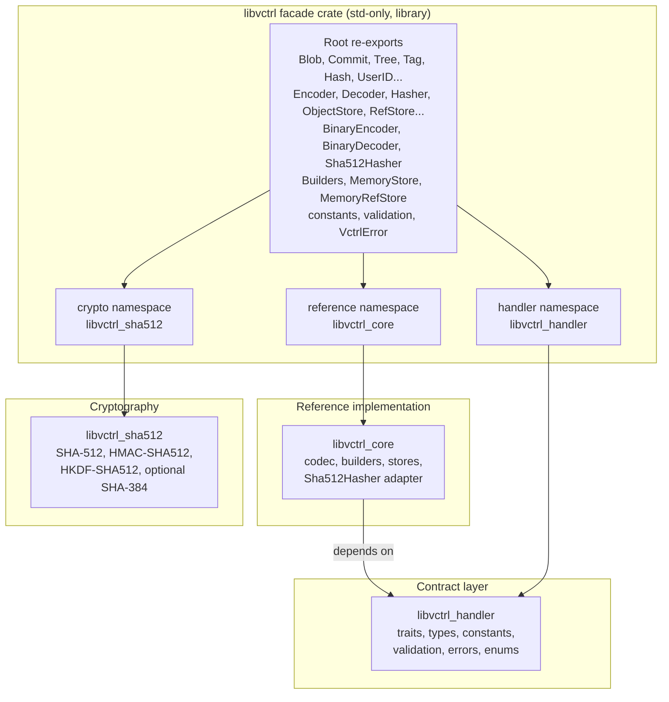
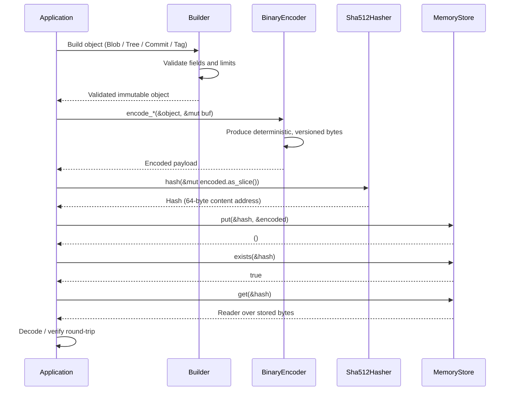
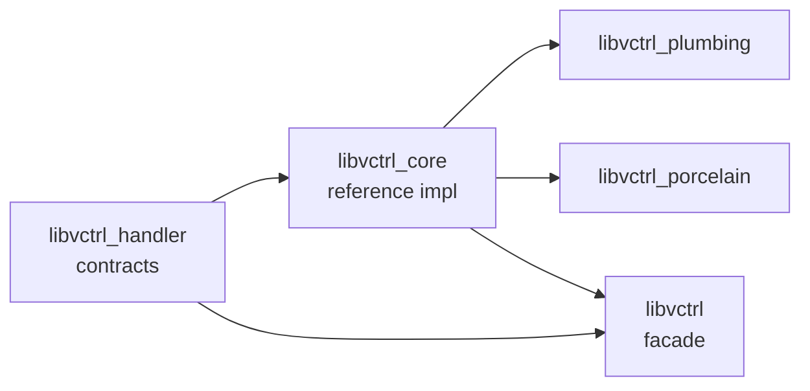

# libvctrl

A precision toolkit for building custom version control systems. `libvctrl` is the
all-in-one facade crate of the `libvctrl` workspace: it re-exports the contract layer,
the reference implementation, and the cryptographic primitives of a content-addressable
VCS into a single, ergonomic namespace.

- **Crate:** `libvctrl` 2.1.3 (library-only, `std`-only)
- **Language:** Rust, edition 2024 — MSRV **1.96.0**
- **License:** MIT
- **Repository:** https://github.com/mroczect/libvctrl
- **Documentation:** https://docs.rs/libvctrl

> `libvctrl` is a **library facade**. It contains no logic of its own; every public
> item is a compile-time re-export of one of three underlying workspace crates. A
> future binary crate (for example, a `vctrl` CLI) may be built on top of this facade,
> but no such binary exists at the 2.1.2 release.

---

## Overview

`libvctrl` aggregates the three foundational crates of the `libvctrl` ecosystem into one
dependency. Integrators who need a complete, batteries-included VCS stack can depend on
a single crate instead of stitching together the contract, reference, and crypto layers
manually.

The facade exposes three top-level namespaces and lifts the most commonly used items to
the crate root:

- `handler` — re-export of `libvctrl_handler`: abstract traits, immutable data types,
  system limits, and validation functions.
- `reference` — re-export of `libvctrl_core`: production-ready implementations of the
  handler contracts (binary codec, SHA-512 hasher adapter, builders, in-memory stores).
- `crypto` — re-export of `libvctrl_sha512`: zero-dependency SHA-512, HMAC-SHA512,
  HKDF-SHA512, and optional SHA-384 primitives.

All re-exports are zero-cost aliases. There is no runtime overhead and no duplicated
code; the only cost is a larger public API surface.

---

## Architecture

`libvctrl` is a classic facade over a strictly layered dependency graph. The contract
layer (`libvctrl_handler`) depends only on the Rust standard library and defines _what_
a VCS object model looks like. The reference layer (`libvctrl_core`) depends on the
contract layer and provides _how_ those contracts are realised. The crypto layer
(`libvctrl_sha512`) provides the hashing primitive and is wired into the facade with
`default-features = false` so the facade controls which crypto symbols are visible.

The `crypto` namespace alias exists for a deliberate reason: it isolates the
cryptographic `Hash` hasher type from the VCS `Hash` content-address type, preventing a
name collision when both are imported into the same scope.



The crate is `std`-only. The facade and its immediate dependencies rely on `String`,
`Vec`, `HashMap`, `std::io`, and `std::error::Error`. Although the underlying
`libvctrl_sha512` core may be `no_std`-compatible, the facade re-exports the full SDK,
including the `std`-dependent stores and codecs, so `libvctrl` itself cannot be built
without the standard library.

### Object lifecycle workflow

A typical interaction with the facade follows the same pattern as a Git-like
content-addressable store: build a validated object, encode it to deterministic bytes,
hash the encoded bytes to obtain a content address, store the bytes under that address,
and later retrieve and verify them.



---

## Core Features

- **Facade pattern.** One crate exposes the entire VCS stack, removing the need to
  manage three separate dependencies.
- **Namespace isolation.** The cryptographic primitives live under `crypto` to avoid a
  name collision between the VCS `Hash` content-address type and the SHA-512 `Hash`
  hasher type.
- **Batteries included.** In-memory storage, binary serialization, a SHA-512 hasher
  adapter, and fluent builders are available out of the box.
- **Root-level ergonomics.** Frequently used types and traits are re-exported at the
  crate root, so `use libvctrl::Blob;` works without a long path.
- **Strict safety.** `#![forbid(unsafe_code)]` is enforced, and the crate inherits
  strict, denied Clippy and rustc documentation lints from the workspace.
- **Feature forwarding.** The `sha384` and `opt_size` features are forwarded to
  `libvctrl_sha512`, letting integrators configure the cryptographic backend without
  touching the underlying crate directly.

---

## Technology Stack

- **Language:** Rust (edition 2024, MSRV 1.96.0)
- **Dependencies:**
  - `libvctrl_handler` 5.0.0 — contracts and types (path dependency)
  - `libvctrl_core` 3.0.0 — reference implementations (path dependency)
  - `libvctrl_sha512` 3.0.0 — cryptography, `default-features = false` (path dependency)
- **Dev-dependencies:** `proptest` 1.11.0
- **Lint policy:** workspace-inherited, `#![forbid(unsafe_code)]`, denied missing-docs,
  rust-2018-idioms, and a broad set of Clippy lints (including pedantic and nursery
  groups). See the repository for the authoritative lint configuration.

---

## Project Structure

The facade crate consists of a single source file. All functionality is provided
through re-exports; no additional modules are defined.

```text
libvctrl/
├── Cargo.toml
└── src/
    └── lib.rs        # Re-exports only; no runtime logic
```

---

## Getting Started

### Prerequisites

- Rust toolchain **1.96.0** or newer (edition 2024 is required)
- Cargo

No system libraries or external services are required.

### Installation

Add `libvctrl` to your `Cargo.toml`:

```toml
[dependencies]
libvctrl = "2.1.2"
```

Or use Cargo directly:

```bash
cargo add libvctrl
```

This will automatically pull `libvctrl_handler`, `libvctrl_core`, and `libvctrl_sha512`
as transitive dependencies.

### Configuration

No runtime configuration is required. The behaviour of the cryptographic backend is
controlled through Cargo features.

| Use case                      | Configuration                                       |
| ----------------------------- | --------------------------------------------------- |
| Default full functionality    | `default` (includes `sha384`)                       |
| Minimal SHA-512 only          | `default-features = false`                          |
| Size-optimised build          | `features = ["opt_size"]`                           |
| Size-optimised + SHA-512 only | `default-features = false, features = ["opt_size"]` |

```toml
# Default (SHA-512 + SHA-384)
libvctrl = "2.1.2"

# Minimal: SHA-512 only
libvctrl = { version = "2.1.2", default-features = false }

# Size-optimised, full crypto
libvctrl = { version = "2.1.2", features = ["opt_size"] }

# Size-optimised, SHA-512 only
libvctrl = { version = "2.1.2", default-features = false, features = ["opt_size"] }
```

- **`sha384`** (default): enables SHA-384, HMAC-SHA-384, and HKDF-SHA-384 in the `crypto`
  namespace. Disable it to reduce compile time and code size when only SHA-512 is needed.
- **`opt_size`**: favours smaller binary size over speed by selecting smaller, slower
  SHA-512 variants. Intended for binary-size-sensitive targets such as embedded devices,
  WebAssembly, or minimal CLI builds. It does **not** enable `no_std`.

> `libvctrl` is `std`-only. `opt_size` is a code-size optimisation, not a `no_std`
> switch. If you need a `no_std`-compatible hashing core, depend on `libvctrl_sha512`
> directly rather than through this facade.

---

## Usage

### Build, encode, hash, and store a Blob

```rust
use libvctrl::{
    Blob, Encoder, Hasher, ObjectStore,
    BinaryEncoder, Sha512Hasher, MemoryStore, VctrlError,
};

fn main() -> Result<(), VctrlError> {
    // 1. Create a validated blob.
    let blob = Blob::new(b"my content".to_vec())?;

    // 2. Encode the blob into deterministic, versioned bytes.
    let mut encoded = Vec::new();
    BinaryEncoder.encode_blob(&blob, &mut encoded)?;

    // 3. Hash the encoded bytes to obtain a content address.
    let hash = Sha512Hasher.hash(&mut encoded.as_slice())?;

    // 4. Store the encoded object in memory.
    let mut store = MemoryStore::new();
    store.put(&hash, &encoded)?;

    // 5. Verify the object exists.
    assert!(store.exists(&hash)?);
    Ok(())
}
```

### Build, encode, hash, and store a Tree

```rust
use libvctrl::{
    EntryKind, Hash, TreeBuilder, TreeEntryBuilder,
    BinaryEncoder, Sha512Hasher, MemoryStore,
    Encoder, Hasher, ObjectStore, VctrlError,
};
use std::io::Read;

fn main() -> Result<(), VctrlError> {
    // 1. Build a Tree containing a single file entry.
    let blob_hash = Hash::from_bytes(&[0xAB; 64])?;
    let entry = TreeEntryBuilder::new("file.txt".to_string(), EntryKind::Blob, blob_hash).build()?;
    let tree = TreeBuilder::new().entry(entry).build()?;

    // 2. Encode the Tree into binary format.
    let encoder = BinaryEncoder;
    let encoded_bytes = encoder.encode_tree(&tree)?;

    // 3. Hash the encoded bytes to get an address.
    let hasher = Sha512Hasher;
    let tree_hash = hasher.hash(&encoded_bytes)?;

    // 4. Store the encoded object in memory.
    let mut store = MemoryStore::new();
    store.put(&tree_hash, &encoded_bytes)?;

    // 5. Retrieve and verify the object.
    assert!(store.exists(&tree_hash)?);
    let mut reader = store.get(&tree_hash)?;
    let mut buf = Vec::new();
    reader.read_to_end(&mut buf).map_err(VctrlError::IoError)?;
    assert_eq!(buf, encoded_bytes);
    Ok(())
}
```

### Building a Commit

```rust
use libvctrl::{CommitBuilder, Hash, UserID};

fn main() -> Result<(), Box<dyn std::error::Error>> {
    let tree = Hash::from_bytes(&[0; 64])?;
    let user = UserID::new("Alice".to_owned(), "alice@example.com".to_owned())?;
    let commit = CommitBuilder::new()
        .tree(tree)
        .author(user.clone())
        .committer(user)
        .message("Initial commit")
        .build()?;
    assert_eq!(commit.message(), "Initial commit");
    Ok(())
}
```

### Namespace-isolated cryptography

Because the VCS `Hash` type and the SHA-512 `Hash` hasher share a name, use the `crypto`
namespace to access raw hashing primitives unambiguously:

```rust
use libvctrl::crypto::Hash as Sha512Hasher;

let digest = Sha512Hasher::hash(b"hello world");
assert_eq!(digest.len(), 64);
```

---

## API Reference / Core Modules

Full API documentation is published at <https://docs.rs/libvctrl>. The summary below
describes the module organisation and the most important re-exports.

### Sub-crate namespaces

| Namespace   | Underlying crate   | Contents                                                         |
| ----------- | ------------------ | ---------------------------------------------------------------- |
| `handler`   | `libvctrl_handler` | Traits, immutable types, constants, validation, errors, enums    |
| `reference` | `libvctrl_core`    | Binary codec, builders, in-memory stores, SHA-512 hasher adapter |
| `crypto`    | `libvctrl_sha512`  | SHA-512, HMAC-SHA512, HKDF-SHA512, optional SHA-384              |

### Root re-exports: contracts (from `handler`)

**Traits:** `Encoder`, `Decoder`, `Hasher`, `ObjectStore`, `RefStore`, `Signer`,
`Verifier`, `Transport`.

**Types:** `Blob`, `Tree`, `TreeEntry`, `Commit`, `CommitMeta`, `Tag`, `Hash`,
`UserID`, `EntryKind`.

**Error:** `VctrlError` — the unified error type returned by every fallible operation
across the ecosystem.

**Constants:** `HASH_LENGTH`, `MAX_BLOB_SIZE`, `MAX_MESSAGE_LENGTH`, `MAX_NAME_LENGTH`,
`MAX_PARENT_COUNT`, `MAX_TREE_ENTRIES`.

**Validation functions:** `validate_hash_bytes`, `validate_name`, `validate_ref_name`,
`validate_tree_entry_name`.

**Modules:** `constants`, `enums`, `errors`, `macros`, `traits`, `types`, `validation`.

### Root re-exports: reference implementations (from `reference`)

**Codec:** `BinaryEncoder`, `BinaryDecoder` — deterministic, versioned binary payloads
with strict bounds checking.

**Hasher:** `Sha512Hasher` — implements the `Hasher` trait and produces 64-byte content
addresses.

**Builders:** `BlobBuilder`, `CommitBuilder`, `TagBuilder`, `TreeBuilder`,
`TreeEntryBuilder` — fluent APIs for constructing validated objects.

**Stores:** `MemoryStore` (implements `ObjectStore` via `HashMap`) and `MemoryRefStore`
(implements `RefStore` via `HashMap`).

**Modules:** `codec`, `object`, `store`.

### Root re-exports: cryptography (from `crypto`)

The `crypto` namespace exposes the `libvctrl_sha512` crate directly. SHA-384 symbols are
available only when the `sha384` feature is enabled (the default).

---

## Testing

Run the crate's test suite with Cargo:

```bash
cargo test
```

Property-based tests use `proptest` (a dev-dependency). Because the facade crate contains
only re-exports, most behavioural tests live in the underlying workspace crates
(`libvctrl_handler`, `libvctrl_core`, `libvctrl_sha512`). To run the entire workspace
test suite from the repository root:

```bash
cargo test --workspace
```

To verify that the strict lint policy is satisfied:

```bash
cargo clippy --workspace --all-targets -- -D warnings
cargo doc --workspace --no-deps
```

---

## Contributing

Contributions are welcome. The crate enforces `#![forbid(unsafe_code)]` and inherits a
strict, denied Clippy and documentation-lint policy from the workspace; all public items
must be documented.

For contribution guidelines, code style, and the full lint configuration, see the
repository's `CONTRIBUTING.md` and the workspace root `README.md`:

- Repository: https://github.com/mroczect/libvctrl

When contributing to this facade crate specifically, keep in mind that it must remain a
pure re-export layer: no new logic, types, or `unsafe` code should be introduced here.
New functionality belongs in the appropriate underlying crate.

---

## Workspace

`libvctrl` is the facade crate of a larger workspace. The sibling crates are listed
below; each has its own documentation and may be depended on directly when only a subset
of the stack is required.

| Crate                | Role                                               | Documentation                      |
| -------------------- | -------------------------------------------------- | ---------------------------------- |
| `libvctrl_handler`   | Contract layer: traits, types, limits, validation  | https://docs.rs/libvctrl_handler   |
| `libvctrl_core`      | Reference implementations: codec, builders, stores | https://docs.rs/libvctrl_core      |
| `libvctrl_sha512`    | Zero-dependency SHA-512 / HMAC / HKDF primitives   | https://docs.rs/libvctrl_sha512    |
| `libvctrl_plumbing`  | Command-level VCS operations built on `core`       | https://docs.rs/libvctrl_plumbing  |
| `libvctrl_porcelain` | High-level, user-facing VCS operations             | https://docs.rs/libvctrl_porcelain |

The dependency flow is strictly one-way:



---

## License

Licensed under the MIT License. See the repository for the full license text.
