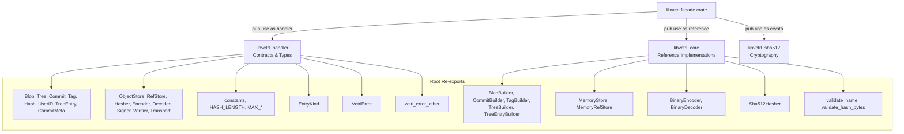
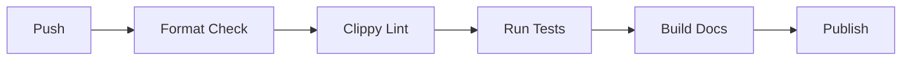

# libvctrl

**Version:** 2.1.1  
**License:** MIT  
**Crate type:** Rust library (facade / SDK)  
**Workspace:** libvcrtl

`libvctrl` is the **all-in-one Version Control System (VCS) Software Development Kit**. It aggregates the three foundational crates of the `libvcrtl` workspace into a single, coherent namespace, allowing developers to bootstrap a fully functional version control system without manually stitching together multiple dependencies.

The crate itself contains almost no new logic. Instead, it re-exports the essential types, traits, implementations, and cryptographic primitives from:

- `libvctrl_handler` – pure contracts and data types
- `libvctrl_core` – ready-to-use reference implementations
- `libvctrl_sha512` – zero-dependency cryptographic primitives

This facade design gives downstream users one convenient entry point while preserving strict separation of concerns internally.

---

## Table of Contents

- [Overview](#overview)
- [System Architecture](#system-architecture)
- [Core Features](#core-features)
- [Technology Stack](#technology-stack)
- [Project Structure](#project-structure)
- [Getting Started](#getting-started)
  - [Prerequisites](#prerequisites)
  - [Installation](#installation)
  - [Configuration](#configuration)
- [Usage](#usage)
- [API Reference](#api-reference)
  - [Sub-crate Modules](#sub-crate-modules)
    - [handler](#handler)
    - [reference](#reference)
    - [crypto](#crypto)
  - [Root Re-exports: Contracts](#root-re-exports-contracts)
  - [Root Re-exports: Reference Implementations](#root-re-exports-reference-implementations)
- [Testing](#testing)
- [CI/CD Pipeline](#cicd-pipeline)
- [Deployment / Distribution](#deployment--distribution)
- [Security & Compliance](#security--compliance)
- [Contributing](#contributing)
- [License](#license)
- [Changelog](#changelog)

---

## Overview

`libvctrl` is designed for developers who want to build a custom version control system, or use an existing VCS core, without needing to know the exact module paths of each underlying crate.

It provides:

- **Contracts**: Immutable domain types like `Blob`, `Commit`, `Tree`, `Hash`, and behavior traits like `ObjectStore`, `Encoder`, `Hasher`, and `Transport`.
- **Reference implementations**: In-memory stores (`MemoryStore`, `MemoryRefStore`), binary serialization (`BinaryEncoder`, `BinaryDecoder`), SHA-512 hasher adapter (`Sha512Hasher`), and ergonomic builders.
- **Cryptography**: Full SHA-512, HMAC-SHA-512, HKDF-SHA-512, and optional SHA-384 implementations.

All public items are re-exported at the crate root for maximum ergonomics, while the original sub-crate modules remain accessible for explicit use.

---

## System Architecture

`libvctrl` acts as a facade. It re-exports three underlying crates into top-level modules and then lifts many of their types to the root.



This architecture ensures that users can choose between:

- **Implicit, root-level imports** for rapid development: `use libvctrl::*;`
- **Explicit, module-qualified imports** for clarity: `use libvctrl::handler::Blob;`

---

## Core Features

- **Facade pattern**  
  A single crate exposes the entire VCS stack, reducing dependency management burden.

- **Namespace isolation**  
  The cryptographic primitives are grouped under `crypto` to avoid conflicts between the VCS `Hash` type and the SHA-512 `Hash` hasher.

- **Batteries-included**  
  In-memory storage, binary serialization, SHA-512 hashing, and builders are all available out of the box.

- **Strict safety**  
  `#![forbid(unsafe_code)]` and a comprehensive set of denied Clippy lints ensure memory safety and code quality.

- **Root-level ergonomics**  
  Frequently used types and traits are re-exported at the crate root, enabling `use libvctrl::Blob;` instead of deep paths.

- **Feature forwarding**  
  Features for SHA-384 and code-size optimization are forwarded to `libvctrl_sha512`, allowing users to configure the underlying crypto implementation.

---

## Technology Stack

- **Language:** Rust (edition 2024)
- **Dependencies:**
  - `libvctrl_handler` 4.4.0 – contracts and types
  - `libvctrl_core` 2.0.1 – reference implementations
  - `libvctrl_sha512` 2.0.0 – cryptography (with `default-features = false`)
- **Dev dependencies:**
  - `proptest` 1.11.0
- **Features:**
  - `default = ["sha384"]`
  - `sha384` – enables `libvctrl_sha512/sha384`
  - `opt_size` – enables `libvctrl_sha512/opt_size`
- **Strict lints:**
  - Clippy: `all`, `pedantic`, `nursery`, `cargo`, `missing_const_for_fn`, `redundant_clone`, `unwrap_used`, `expect_used`, `panic` (all denied)
  - Rust: `unsafe_code` forbidden, `missing_docs` denied, `rust_2018_idioms` denied, `unreachable_pub` denied, `unused_qualifications` denied

---

## Project Structure

The crate consists of a single source file that re-exports the underlying crates.

```text
libvctrl/
├── Cargo.toml
└── src/
    └── lib.rs
```

No additional modules are defined. All functionality is provided through re-exports.

---

## Getting Started

### Prerequisites

- Rust toolchain 1.96.0 or newer (edition 2024)
- Cargo

No system libraries or external services are required.

### Installation

Add `libvctrl` to your `Cargo.toml`:

```toml
[dependencies]
libvctrl = "2.1.1"
```

Or use Cargo:

```sh
cargo add libvctrl
```

This will automatically pull the required `libvctrl_handler`, `libvctrl_core`, and `libvctrl_sha512` dependencies.

### Configuration

No runtime configuration is required. Available feature flags:

```toml
[dependencies]
libvctrl = { version = "2.1.1", features = ["sha384", "opt_size"] }
```

- `sha384` is enabled by default and adds SHA-384, HMAC-SHA-384, and HKDF-SHA-384.
- `opt_size` favors smaller binary size over speed by changing inline attributes in the SHA-512 implementation.

Disable default features if you do not need SHA-384:

```toml
[dependencies]
libvctrl = { version = "2.1.1", default-features = false }
```

---

## Usage

### Build, Encode, Hash, and Store a Tree

```rust
use libvctrl::{
    EntryKind, Hash, TreeBuilder, TreeEntryBuilder, BinaryEncoder, Sha512Hasher,
    MemoryStore, Encoder, Hasher, ObjectStore, VctrlError,
};
use std::io::Read;

// 1. Build a Tree containing a single file entry
let blob_hash = Hash::from_bytes(&[0xAB; 64])?;
let entry = TreeEntryBuilder::new("file.txt".to_string(), EntryKind::Blob, blob_hash).build()?;
let tree = TreeBuilder::new().entry(entry).build()?;

// 2. Encode the Tree into binary format
let encoder = BinaryEncoder;
let encoded_bytes = encoder.encode_tree(&tree)?;

// 3. Hash the encoded bytes to get an address
let hasher = Sha512Hasher;
let tree_hash = hasher.hash(&encoded_bytes)?;

// 4. Store the encoded object in memory
let mut store = MemoryStore::new();
store.put(&tree_hash, &encoded_bytes)?;

// 5. Retrieve and verify the object
assert!(store.exists(&tree_hash)?);
let mut reader = store.get(&tree_hash)?;
let mut buf = Vec::new();
reader.read_to_end(&mut buf).map_err(VctrlError::IoError)?;
assert_eq!(buf, encoded_bytes);

# Ok::<(), VctrlError>(())
```

### Using Namespace-Isolated Cryptography

```rust
use libvctrl::crypto::Hash as Sha512Hasher;

let digest = Sha512Hasher::hash(b"hello world");
assert_eq!(digest.len(), 64);
```

### Building a Commit

```rust
use libvctrl::{CommitBuilder, Hash, UserID};

let tree = Hash::from_bytes(&[0; 64]).unwrap();
let user = UserID::new("Alice".to_owned(), "alice@example.com".to_owned()).unwrap();

let commit = CommitBuilder::new()
    .tree(tree)
    .author(user.clone())
    .committer(user)
    .message("Initial commit")
    .build()
    .unwrap();

assert_eq!(commit.message(), "Initial commit");
```

---

## API Reference

### Sub-crate Modules

The three underlying crates are re-exported as top-level modules.

#### handler

Full namespace: `libvctrl::handler`

Re-exports `libvctrl_handler` – the pure contracts crate.

Contains:

- Data types: `Blob`, `Tree`, `TreeEntry`, `Commit`, `CommitMeta`, `Tag`, `Hash`, `UserID`
- Enum: `EntryKind`
- Error type: `VctrlError`
- Traits: `ObjectStore`, `RefStore`, `Hasher`, `Encoder`, `Decoder`, `Signer`, `Verifier`, `Transport`
- Constants and limits
- Macros

**Example:**

```rust
use libvctrl::handler::Blob;

let blob = Blob::new(b"hello".to_vec());
```

#### reference

Full namespace: `libvctrl::reference`

Re-exports `libvctrl_core` – the reference implementation crate.

Contains:

- Codec: `BinaryEncoder`, `BinaryDecoder`
- Hash adapter: `Sha512Hasher`
- Stores: `MemoryStore`, `MemoryRefStore`
- Builders: `BlobBuilder`, `CommitBuilder`, `TagBuilder`, `TreeBuilder`, `TreeEntryBuilder`
- Validation utilities

**Example:**

```rust
use libvctrl::reference::MemoryStore;
```

#### crypto

Full namespace: `libvctrl::crypto`

Re-exports `libvctrl_sha512` – the cryptographic primitives crate.

Contains:

- SHA-512 hasher
- HMAC-SHA-512
- HKDF-SHA-512
- Optional SHA-384 and HMAC/HKDF-SHA-384 (feature-gated)

**Example:**

```rust
use libvctrl::crypto::Hash as Sha512Hash;

let digest = Sha512Hash::hash(b"data");
```

---

### Root Re-exports: Contracts

These items are available directly at `libvctrl::`.

#### Constants

| Item                 | Description |
| -------------------- | ----------- |
| `HASH_LENGTH`        | 64 bytes    |
| `MAX_NAME_LENGTH`    | 255 bytes   |
| `MAX_BLOB_SIZE`      | 100 MiB     |
| `MAX_TREE_ENTRIES`   | 100,000     |
| `MAX_MESSAGE_LENGTH` | 1 MiB       |

Also available: `libvctrl::constants::{HASH_LENGTH, ...}`.

#### Enums

| Item        | Description                                                              |
| ----------- | ------------------------------------------------------------------------ |
| `EntryKind` | Logical entry kind: `Blob`, `Executable`, `Symlink`, `Tree`, `Submodule` |

#### Errors

| Item         | Description                                    |
| ------------ | ---------------------------------------------- |
| `VctrlError` | Unified error type for all fallible operations |

#### Traits

| Item          | Description                        |
| ------------- | ---------------------------------- |
| `ObjectStore` | Content-addressable object storage |
| `RefStore`    | Named reference management         |
| `Hasher`      | Cryptographic hashing              |
| `Encoder`     | Serialization to bytes             |
| `Decoder`     | Deserialization from bytes         |
| `Signer`      | Cryptographic signing              |
| `Verifier`    | Signature verification             |
| `Transport`   | Remote object synchronization      |

#### Types

| Item         | Description                            |
| ------------ | -------------------------------------- |
| `Blob`       | Immutable raw byte content             |
| `Tree`       | Sorted list of `TreeEntry`             |
| `TreeEntry`  | Name, kind, and hash                   |
| `Commit`     | Snapshot with parents and metadata     |
| `CommitMeta` | Timestamp, timezone, encoding          |
| `Tag`        | Named reference with optional metadata |
| `Hash`       | 64-byte content address                |
| `UserID`     | Name and email identity                |

#### Macros

| Item                 | Description                                        |
| -------------------- | -------------------------------------------------- |
| `vctrl_error_other!` | Creates `VctrlError::Other` with formatted message |

---

### Root Re-exports: Reference Implementations

These items are available directly at `libvctrl::`.

#### Codec

| Item            | Description            |
| --------------- | ---------------------- |
| `BinaryEncoder` | Implements `Encoder`   |
| `BinaryDecoder` | Implements `Decoder`   |
| `codec`         | Module containing both |

#### Hash

| Item           | Description                               |
| -------------- | ----------------------------------------- |
| `Sha512Hasher` | Adapter for SHA-512 implementing `Hasher` |

#### Stores

| Item             | Description             |
| ---------------- | ----------------------- |
| `MemoryStore`    | In-memory `ObjectStore` |
| `MemoryRefStore` | In-memory `RefStore`    |
| `store`          | Module containing both  |

#### Builders

| Item               | Description                    |
| ------------------ | ------------------------------ |
| `BlobBuilder`      | Builder for `Blob`             |
| `CommitBuilder`    | Builder for `Commit`           |
| `TagBuilder`       | Builder for `Tag`              |
| `TreeBuilder`      | Builder for `Tree`             |
| `TreeEntryBuilder` | Builder for `TreeEntry`        |
| `object`           | Module containing all builders |

#### Validation

| Item                  | Description                             |
| --------------------- | --------------------------------------- |
| `validate_name`       | Validates a name against security rules |
| `validate_hash_bytes` | Validates hash byte length              |
| `validate`            | Module containing validation utilities  |

---

## Testing

The crate itself contains only re-exports and no new logic, so most tests reside in the underlying crates. However, doctests in `libvctrl` validate the re-exported API.

Run all tests for this crate:

```sh
cargo test -p libvctrl
```

Run all tests with default features:

```sh
cargo test -p libvctrl --all-features
```

Run doctests only:

```sh
cargo test -p libvctrl --doc
```

Run strict Clippy checks:

```sh
cargo clippy -p libvctrl --all-targets --all-features -- -D warnings
```

---

## CI/CD Pipeline

No CI/CD pipeline is currently configured in the repository.

If one is added, it should include at least the following stages:



Recommended commands per stage:

- Format: `cargo fmt --check`
- Lint: `cargo clippy -p libvctrl --all-targets --all-features -- -D warnings`
- Tests: `cargo test -p libvctrl --all-features`
- Docs: `cargo doc -p libvctrl --no-deps`
- Publish: `cargo publish`

---

## Deployment / Distribution

The crate is intended to be published to crates.io.

Release process:

1. Update version in `Cargo.toml`.
2. Update `CHANGELOG.md`.
3. Run `cargo publish --dry-run`.
4. Run `cargo publish`.

After publication, documentation will be available at `https://docs.rs/libvctrl`.

---

## Security & Compliance

`libvctrl` inherits the strict security posture of its underlying crates:

- **No unsafe code**  
  `#![forbid(unsafe_code)]` is set at the crate level. The only `unsafe` in the dependency tree is a single reviewed block in `libvctrl_sha512::utils::verify`.

- **Strict linting**  
  Clippy `all`, `pedantic`, `nursery`, `cargo`, and additional lints like `unwrap_used`, `expect_used`, and `panic` are denied, reducing the chance of accidental panics.

- **DoS protection**  
  Underlying validators and decoders enforce size limits (`MAX_BLOB_SIZE`, `MAX_MESSAGE_LENGTH`, `MAX_TREE_ENTRIES`) and validate UTF-8.

- **Path traversal prevention**  
  `validate_name` rejects `/`, `.`, and `..` in names used for refs and tree entries.

- **Side-channel mitigation**  
  SHA-512 verification and HMAC comparison use non-short-circuiting XOR accumulation.

- **Zeroization**  
  Hash and HMAC implementations clear internal state on drop or explicit call.

Refer to `SECURITY.md` in the workspace root for reporting vulnerabilities and additional security guidelines.

---

## Contributing

Contributions are welcome. Follow the workspace `CONTRIBUTING.md`.

For this crate, ensure:

- All public items have documentation with doctests.
- Do not introduce new logic unless it is strictly necessary for the facade.
- Run `cargo fmt`.
- Run `cargo clippy -p libvctrl --all-targets --all-features -- -D warnings`.
- Run `cargo test -p libvctrl --all-features`.
- Avoid unsafe code.

---

## License

This project is licensed under the MIT License. See the `LICENSE` file in the workspace root for details.
