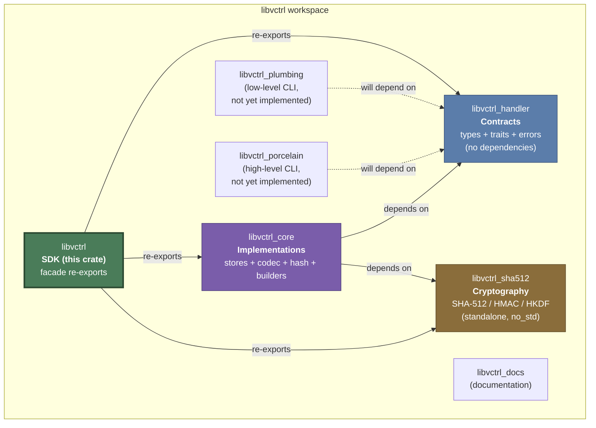
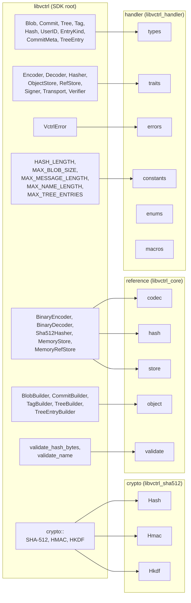

# libvctrl

## Overview

`libvctrl` is an all-in-one, batteries-included Software Development Kit for building custom version control systems. It aggregates three foundational layers -- contracts, reference implementations, and cryptography -- into a single coherent namespace, allowing developers to bootstrap a fully functional, content-addressable VCS backend without stitching multiple crates together manually.

The SDK applies the **Facade Pattern**: every essential type, trait, and implementation is re-exported at the crate root. A simple `use libvctrl::*;` grants access to the entire stack. Low-level cryptographic primitives are namespaced under the `crypto` module to prevent collision with the VCS-level `Hash` type.

Every crate in the stack enforces `#![forbid(unsafe_code)]`, denies `unwrap_used`, `expect_used`, and `panic` at the compiler level, and passes `clippy::pedantic` plus `clippy::nursery`. The result is a memory-safe, panic-free, production-grade foundation.

## Architecture

### Three-Layer Design

The SDK is composed of three re-exported sub-crates, each with a distinct responsibility:

| Layer           | Crate              | Module Alias | Responsibility                                                                                             |
| --------------- | ------------------ | ------------ | ---------------------------------------------------------------------------------------------------------- |
| Contracts       | `libvctrl_handler` | `handler`    | Pure data types, behavior traits, error definitions, structural limits. Zero business logic.               |
| Implementations | `libvctrl_core`    | `reference`  | Ready-to-use backends: in-memory store, binary codec, SHA-512 hasher adapter, object builders, validators. |
| Cryptography    | `libvctrl_sha512`  | `crypto`     | Pure-Rust, `no_std`-compatible SHA-512, HMAC-SHA-512, HKDF-SHA-512.                                        |

### Workspace Dependency Graph



### Internal Module Architecture

The following diagram shows how the SDK's root-level re-exports map to the three sub-crates and their internal modules:



### Object Lifecycle and Data Flow

The following sequence diagram illustrates the complete lifecycle of a VCS object: construction via a builder, validation, encoding into the binary wire format, hashing for content-addressable identity, storage, and retrieval:

```mermaid
sequenceDiagram
    participant App as Application
    participant Builder as Object Builder
    participant Validate as validate module
    participant Encoder as BinaryEncoder
    participant Hasher as Sha512Hasher
    participant Store as MemoryStore

    rect rgb(230, 240, 230)
        Note over App,Builder: 1. CONSTRUCT
        App->>Builder: TreeBuilder::new().entry(...).build()
        Builder->>Validate: validate_name() for each entry
        Validate-->>Builder: Ok or VctrlError
        Builder-->>App: Tree (immutable)
    end

    rect rgb(230, 230, 245)
        Note over App,Encoder: 2. ENCODE
        App->>Encoder: encode_tree(&tree)
        Encoder-->>App: Vec&lt;u8&gt; (versioned binary payload)
    end

    rect rgb(245, 235, 220)
        Note over App,Hasher: 3. HASH
        App->>Hasher: hash(&encoded_bytes)
        Hasher-->>App: Hash (64-byte SHA-512 digest)
    end

    rect rgb(240, 230, 230)
        Note over App,Store: 4. STORE
        App->>Store: put(&hash, &data)
        Store-->>App: Ok(())
    end

    rect rgb(235, 235, 235)
        Note over App,Store: 5. RETRIEVE
        App->>Store: get(&hash)
        Store-->>App: Box&lt;dyn Read&gt;
        Note over App: BinaryDecoder.decode_*() restores original object
    end
```

## Core Features

### Contracts Layer (handler)

- **Immutable Domain Models** -- `Blob`, `Tree`, `Commit`, `Tag`, `Hash`, `UserID`, `TreeEntry`, `CommitMeta` are strongly-typed, immutable value objects. Construction validates all invariants at the boundary.
- **Behavior Traits** -- `Encoder`, `Decoder`, `Hasher`, `ObjectStore`, `RefStore`, `Signer`, `Transport`, `Verifier` define the interfaces that any concrete backend must implement.
- **Unified Error Type** -- `VctrlError` is the single error enum returned by every fallible operation across the entire SDK.
- **Structural Limits** -- `HASH_LENGTH`, `MAX_BLOB_SIZE`, `MAX_MESSAGE_LENGTH`, `MAX_NAME_LENGTH`, `MAX_TREE_ENTRIES` centralize all magic numbers. Every constructor, encoder, and decoder references these constants.
- **Logical Entry Kinds** -- `EntryKind` (Blob, Executable, Symlink, Tree, Submodule) decouples object classification from raw filesystem mode bits.
- **Helper Macros** -- `vctrl_error_other!` and similar macros simplify ergonomic error construction.

### Implementations Layer (reference)

- **Binary Codec** -- `BinaryEncoder` and `BinaryDecoder` implement a deterministic, versioned, little-endian wire format with length-prefixed variable-length fields. Full round-trip fidelity for all four object types.
- **Defensive Decoding** -- `BinaryDecoder` is panic-free. Every slice access is bounds-checked. Malformed or truncated payloads return `VctrlError::CorruptedData`.
- **DoS-Resistant Allocation** -- Before allocating memory for variable-length fields (blob data, commit messages, tag messages), the decoder validates the requested length against `MAX_BLOB_SIZE`, `MAX_MESSAGE_LENGTH`, and `MAX_TREE_ENTRIES`.
- **SHA-512 Content Addressing** -- `Sha512Hasher` delegates to the audited, pure-Rust `libvctrl_sha512` crate to produce 64-byte digests.
- **In-Memory Object Store** -- `MemoryStore` implements `ObjectStore` with `HashMap<Hash, Vec<u8>>` for testing, simulation, and prototyping.
- **In-Memory Reference Store** -- `MemoryRefStore` implements `RefStore` with a `RefsIterator` for managing named references (branches, tags) in RAM.
- **Fluent Object Builders** -- `BlobBuilder`, `CommitBuilder`, `TagBuilder`, `TreeBuilder`, `TreeEntryBuilder` solve the telescoping constructor problem with a step-by-step fluent API. Validation is deferred to the `.build()` call.
- **Input Validation** -- `validate_hash_bytes` enforces 64-byte length. `validate_name` enforces non-empty, length-limited, path-traversal-free identifiers.

### Cryptography Layer (crypto)

- **SHA-512** -- Pure-Rust, `no_std`-compatible one-shot and incremental hashing.
- **HMAC-SHA-512** -- Hash-based Message Authentication Code for authenticated object integrity.
- **HKDF-SHA-512** -- HMAC-based Key Derivation Function for deriving session keys or object encryption keys.

### Cross-Cutting Guarantees

- **Zero Unsafe** -- `#![forbid(unsafe_code)]` across all crates.
- **No Panics** -- `unwrap_used`, `expect_used`, and `panic` are denied at the compiler level in the SDK crate. The decoder and validators return `Result` for every fallible operation.
- **Strict Linting** -- `clippy::all`, `clippy::pedantic`, `clippy::nursery`, `clippy::cargo` are all denied.
- **Wire Format Versioning** -- Every serialized payload begins with a version byte (currently `2`). Incompatible formats are rejected early, enabling future breaking changes without silent data corruption.

## Technology Stack

| Component        | Technology         | Version                       | Purpose                                                      |
| ---------------- | ------------------ | ----------------------------- | ------------------------------------------------------------ |
| Language         | Rust               | Edition 2024, toolchain 1.85+ | Primary implementation language                              |
| Contracts        | `libvctrl_handler` | 4.0.0                         | Trait definitions, domain types, errors, limits              |
| Implementations  | `libvctrl_core`    | 2.0.0                         | Reference backends (store, codec, hash, builders, validate)  |
| Cryptography     | `libvctrl_sha512`  | 2.0.0                         | SHA-512, HMAC-SHA-512, HKDF-SHA-512                          |
| Property Testing | `proptest`         | 1.11.0                        | Arbitrary generation and fuzz-style testing (dev-dependency) |

### Lint and Safety Configuration

```toml
[lints.rust]
unsafe_code = "forbid"
missing_docs = "deny"
rust_2018_idioms = "deny"
unreachable_pub = "deny"
unused_qualifications = "deny"

[lints.clippy]
all = "deny"
pedantic = "deny"
nursery = "deny"
cargo = "deny"
missing_const_for_fn = "deny"
redundant_clone = "deny"
unwrap_used = "deny"
expect_used = "deny"
panic = "deny"
```

## Project Structure

### Workspace Layout

```text
libvctrl/
├── libvctrl/                  # SDK facade (this crate)
│   ├── src/
│   │   └── lib.rs             # Root re-exports, lint config, documentation
│   └── Cargo.tom
├── libvctrl_handler/          # Contracts: types, traits, errors
│   ├── src/
│   │   ├── constants.rs
│   │   ├── enums.rs
│   │   ├── errors.rs
│   │   ├── lib.rs
│   │   ├── macros.rs
│   │   ├── traits.rs
│   │   └── types.rs
│   └── Cargo.tom
├── libvctrl_core/             # Reference implementations
│   ├── src/
│   │   ├── codec/
│   │   │   ├── binary_decoder.rs
│   │   │   ├── binary_encoder.rs
│   │   │   └── mod.rs
│   │   ├── hash/
│   │   │   ├── mod.rs
│   │   │   └── sha512.rs
│   │   ├── object/
│   │   │   ├── blob.rs
│   │   │   ├── commit.rs
│   │   │   ├── mod.rs
│   │   │   ├── tag.rs
│   │   │   └── tree.rs
│   │   ├── store/
│   │   │   ├── memory.rs
│   │   │   ├── mod.rs
│   │   │   └── ref_store.rs
│   │   ├── validate/
│   │   │   ├── hash.rs
│   │   │   ├── mod.rs
│   │   │   └── name.rs
│   │   └── lib.rs
│   └── Cargo.tom
├── libvctrl_sha512/           # Cryptographic primitives
│   ├── src/
│   │   └── ...
│   └── Cargo.tom
├── libvctrl_plumbing/         # Low-level CLI (not yet implemented)
├── libvctrl_porcelain/        # High-level CLI (not yet implemented)
├── libvctrl_docs/             # Documentation assets
└── Cargo.tom                  # Workspace root
```

### SDK Crate Internal Structure

```text
libvctrl/src/
└── lib.rs         # All re-exports, module declarations, and crate-level documentation
```

The SDK crate is intentionally minimal at the source level. Its sole purpose is to orchestrate re-exports and enforce the unified namespace. All logic lives in the three dependency crates.

## Getting Started

### Prerequisites

- **Rust toolchain** -- Stable Rust 1.85 or later. Edition 2024 is required.
- **Cargo** -- Included with the Rust toolchain.
- **Internet access to crates.io** -- For resolving dependencies during the initial build.

Install or update the toolchain:

```bash
rustup install stable
rustup default stable
rustup update stable
```

Verify the version:

```bash
rustc --version
# Expected: rustc 1.85.0 or later
```

### Installation

#### As a Dependency (crates.io)

Add `libvctrl` to your project's `Cargo.toml`:

```toml
[dependencies]
libvctrl = "1.0"
```

#### From Source (Workspace)

Clone the repository and build the entire workspace:

```bash
git clone https://github.com/mroczect/libvctrl.git
cd libvctrl
cargo build
```

Build only the SDK crate:

```bash
cargo build -p libvctrl
```

### Configuration

#### Feature Flags

| Feature    | Default  | Description                                                                                                                       |
| ---------- | -------- | --------------------------------------------------------------------------------------------------------------------------------- |
| `sha384`   | Enabled  | Enables SHA-384 support via `libvctrl_sha512/sha384`. Truncates SHA-512 to 384 bits for applications that prefer shorter digests. |
| `opt_size` | Disabled | Optimizes the `libvctrl_sha512` crate for binary size rather than speed. Useful for WASM or embedded targets.                     |

To disable the default SHA-384 feature:

```toml
[dependencies]
libvctrl = { version = "1.0", default-features = false }
```

To enable size optimization:

```toml
[dependencies]
libvctrl = { version = "1.0", features = ["opt_size"] }
```

#### Structural Limits

These constants are defined in `libvctrl_handler` and are referenced throughout the SDK. They cannot be changed at runtime but serve as documentation for system capacity:

| Constant             | Value                | Purpose                                                        |
| -------------------- | -------------------- | -------------------------------------------------------------- |
| `HASH_LENGTH`        | 64                   | Expected byte length of a `Hash` digest (SHA-512 = 64 bytes)   |
| `MAX_BLOB_SIZE`      | (defined in handler) | Maximum blob data size in bytes. Decoders reject larger blobs. |
| `MAX_MESSAGE_LENGTH` | (defined in handler) | Maximum commit/tag message length in bytes.                    |
| `MAX_NAME_LENGTH`    | (defined in handler) | Maximum identifier name length in bytes.                       |
| `MAX_TREE_ENTRIES`   | (defined in handler) | Maximum number of entries in a single `Tree` object.           |

## Usage

### Importing the SDK

The facade design allows two import styles:

**Wildcard import (recommended for application code):**

```rust
use libvctrl::*;
```

**Targeted imports (recommended for library code):**

```rust
use libvctrl::{Blob, TreeBuilder, BinaryEncoder, Sha512Hasher, MemoryStore, Encoder, Hasher};
```

### Building and Encoding a Blob

```rust
use libvctrl::{BlobBuilder, BinaryEncoder, Encoder};

let blob = BlobBuilder::new(b"file content".to_vec()).build();
let encoder = BinaryEncoder;
let bytes = encoder.encode_blob(&blob)?;
```

### Building a Tree with Entries

```rust
use libvctrl::{
    EntryKind, Hash, TreeBuilder, TreeEntryBuilder,
    BinaryEncoder, Sha512Hasher, Encoder, Hasher,
};

let blob_hash = Hash::from_bytes(&[0xAB; 64])?;

let entry = TreeEntryBuilder::new(
    "src/main.rs".to_string(),
    EntryKind::Blob,
    blob_hash,
).build()?;

let tree = TreeBuilder::new().entry(entry).build()?;

let encoded = BinaryEncoder.encode_tree(&tree)?;
let tree_hash = Sha512Hasher.hash(&encoded);
```

### Building a Commit

```rust
use libvctrl::{CommitBuilder, Hash, UserID, EntryKind, TreeBuilder, TreeEntryBuilder};

let tree_hash = Hash::from_bytes(&[0x00; 64])?;
let author = UserID::new("Alice".to_string(), "alice@example.com".to_string())?;

let commit = CommitBuilder::new(tree_hash, author.clone(), author, "Initial commit".to_string())
    .build()?;

let encoded = BinaryEncoder.encode_commit(&commit)?;
```

### Building a Tag

```rust
use libvctrl::{TagBuilder, Hash, UserID};

let target = Hash::from_bytes(&[0xFF; 64])?;
let tagger = UserID::new("Bob".to_string(), "bob@example.com".to_string())?;

let tag = TagBuilder::new("v1.0.0".to_string(), target, "Release 1.0.0".to_string())
    .tagger(tagger)
    .build()?;
```

### Full Lifecycle: Build, Encode, Hash, Store, Retrieve

```rust
use libvctrl::{
    EntryKind, Hash, TreeBuilder, TreeEntryBuilder,
    BinaryEncoder, BinaryDecoder, Sha512Hasher,
    MemoryStore, Encoder, Decoder, Hasher, ObjectStore, VctrlError,
};
use std::io::Read;

// 1. Build a Tree containing a single file entry
let blob_hash = Hash::from_bytes(&[0xAB; 64])?;
let entry = TreeEntryBuilder::new("file.txt".to_string(), EntryKind::Blob, blob_hash).build()?;
let tree = TreeBuilder::new().entry(entry).build()?;

// 2. Encode the Tree into binary format
let encoder = BinaryEncoder;
let encoded_bytes = encoder.encode_tree(&tree)?;

// 3. Hash the encoded bytes to get a content-addressable identifier
let hasher = Sha512Hasher;
let tree_hash = hasher.hash(&encoded_bytes);

// 4. Store the encoded object
let mut store = MemoryStore::new();
store.put(&tree_hash, &encoded_bytes)?;

// 5. Retrieve and verify
assert!(store.exists(&tree_hash)?);
let mut reader = store.get(&tree_hash)?;
let mut buf = Vec::new();
reader.read_to_end(&mut buf).map_err(VctrlError::IoError)?;
assert_eq!(buf, encoded_bytes);

// 6. Decode back to the original object
let decoder = BinaryDecoder;
let decoded_tree = decoder.decode_tree(&buf)?;
assert_eq!(decoded_tree, tree);
```

### Using the Reference Store

```rust
use libvctrl::{MemoryRefStore, Hash, RefStore};

let ref_store = MemoryRefStore::new();
let commit_hash = Hash::from_bytes(&[0x42; 64])?;

// Set a branch reference
ref_store.set("refs/heads/main", &commit_hash)?;

// Resolve it later
let resolved = ref_store.resolve("refs/heads/main")?;
assert_eq!(resolved, commit_hash);
```

### Validating Inputs

```rust
use libvctrl::{validate_name, validate_hash_bytes, VctrlError};

// Valid names
assert!(validate_name("src/main.rs").is_ok());
assert!(validate_name("README.md").is_ok());

// Path traversal attacks are rejected
assert!(validate_name("../../etc/passwd").is_err());
assert!(validate_name("..").is_err());

// Hash validation
let valid_hash_bytes = [0u8; 64];
assert!(validate_hash_bytes(&valid_hash_bytes).is_ok());

// Wrong length is rejected
assert!(validate_hash_bytes(&[0u8; 32]).is_err());
```

### Accessing Cryptographic Primitives

The `crypto` module provides low-level access to SHA-512, HMAC, and HKDF, isolated from the VCS-level `Hash` type:

```rust
use libvctrl::crypto;

// One-shot SHA-512 hash
let digest = crypto::Hash::hash(b"message");
assert_eq!(digest.as_bytes().len(), 64);

// Incremental SHA-512
let mut state = crypto::Hash::new();
state.update(b"chunk 1");
state.update(b"chunk 2");
let digest = state.finalize();
```

## API Reference

### Root-Level Re-exports

The following table lists every public item available at the `libvctrl::` root namespace:

#### Types (from handler)

| Item         | Kind   | Description                                                            |
| ------------ | ------ | ---------------------------------------------------------------------- |
| `Blob`       | Struct | Immutable content-addressable file data object                         |
| `Tree`       | Struct | Immutable directory listing of `TreeEntry` objects                     |
| `TreeEntry`  | Struct | Named, typed pointer to a child object (file or subtree)               |
| `Commit`     | Struct | Immutable snapshot metadata: tree, parents, author, committer, message |
| `CommitMeta` | Struct | Timestamp, timezone offset, optional encoding                          |
| `Tag`        | Struct | Immutable named pointer to a target object with optional tagger        |
| `Hash`       | Struct | 64-byte cryptographic digest wrapper (content-addressable identifier)  |
| `UserID`     | Struct | Name + email identity (author, committer, tagger)                      |
| `EntryKind`  | Enum   | Blob, Executable, Symlink, Tree, Submodule                             |

#### Traits (from handler)

| Item          | Description                                                        |
| ------------- | ------------------------------------------------------------------ |
| `Encoder`     | Serialize VCS objects into bytes                                   |
| `Decoder`     | Deserialize VCS objects from bytes                                 |
| `Hasher`      | Compute content-addressable `Hash` values                          |
| `ObjectStore` | Persist and retrieve raw serialized objects by `Hash`              |
| `RefStore`    | Manage named references (branches, tags) pointing to `Hash` values |
| `Signer`      | Cryptographically sign objects                                     |
| `Verifier`    | Verify cryptographic signatures                                    |
| `Transport`   | Push/pull objects to/from remote stores                            |

#### Implementations (from reference)

| Item             | Trait Implemented | Description                                                    |
| ---------------- | ----------------- | -------------------------------------------------------------- |
| `BinaryEncoder`  | `Encoder`         | Versioned, little-endian, length-prefixed binary serialization |
| `BinaryDecoder`  | `Decoder`         | Panic-free, bounds-checked binary deserialization              |
| `Sha512Hasher`   | `Hasher`          | SHA-512 digest adapter bridging `libvctrl_sha512`              |
| `MemoryStore`    | `ObjectStore`     | In-memory `HashMap`-backed object storage                      |
| `MemoryRefStore` | `RefStore`        | In-memory named reference storage                              |

#### Builders (from reference)

| Item               | Target Type | Description                                                                       |
| ------------------ | ----------- | --------------------------------------------------------------------------------- |
| `BlobBuilder`      | `Blob`      | Fluent builder for blob data                                                      |
| `TreeBuilder`      | `Tree`      | Accumulates `TreeEntry` objects, finalizes into immutable `Tree`                  |
| `TreeEntryBuilder` | `TreeEntry` | Assembles name + kind + hash, defers validation to `build()`                      |
| `CommitBuilder`    | `Commit`    | Step-by-step configuration of tree, parents, author, committer, message, metadata |
| `TagBuilder`       | `Tag`       | Step-by-step configuration of name, target, tagger, message, metadata             |

#### Validators (from reference)

| Item                  | Signature                           | Description                                               |
| --------------------- | ----------------------------------- | --------------------------------------------------------- |
| `validate_hash_bytes` | `(&[u8]) -> Result<(), VctrlError>` | Ensures slice is exactly 64 bytes                         |
| `validate_name`       | `(&str) -> Result<(), VctrlError>`  | Ensures non-empty, within length limit, no path traversal |

#### Error and Constants

| Item                 | Description                                    |
| -------------------- | ---------------------------------------------- |
| `VctrlError`         | Unified error enum for all fallible operations |
| `HASH_LENGTH`        | Expected hash byte length (64)                 |
| `MAX_BLOB_SIZE`      | Maximum blob data size                         |
| `MAX_MESSAGE_LENGTH` | Maximum commit/tag message length              |
| `MAX_NAME_LENGTH`    | Maximum identifier name length                 |
| `MAX_TREE_ENTRIES`   | Maximum entries per Tree                       |

#### Sub-Modules

| Module      | Source Crate                  | Description                                    |
| ----------- | ----------------------------- | ---------------------------------------------- |
| `handler`   | `libvctrl_handler`            | Direct access to the contracts layer           |
| `reference` | `libvctrl_core`               | Direct access to the implementations layer     |
| `crypto`    | `libvctrl_sha512`             | SHA-512, HMAC-SHA-512, HKDF-SHA-512 primitives |
| `codec`     | `libvctrl_core::codec`        | Binary encoder/decoder modules                 |
| `object`    | `libvctrl_core::object`       | Object builder modules                         |
| `store`     | `libvctrl_core::store`        | Storage backend modules                        |
| `validate`  | `libvctrl_core::validate`     | Validation utility modules                     |
| `constants` | `libvctrl_handler::constants` | System-wide limit constants                    |
| `enums`     | `libvctrl_handler::enums`     | Logical type enumerations                      |
| `errors`    | `libvctrl_handler::errors`    | Error type definitions                         |
| `macros`    | `libvctrl_handler::macros`    | Helper macros                                  |
| `traits`    | `libvctrl_handler::traits`    | Behavior trait definitions                     |
| `types`     | `libvctrl_handler::types`     | Domain model type definitions                  |

### BinaryEncoder Method Reference

| Method          | Input     | Wire Format                                                                                       |
| --------------- | --------- | ------------------------------------------------------------------------------------------------- |
| `encode_blob`   | `&Blob`   | `VERSION(1B) + data_len(8B u64 LE) + data`                                                        |
| `encode_tree`   | `&Tree`   | `VERSION(1B) + entry_count(4B u32 LE) + [entries]`                                                |
| `encode_commit` | `&Commit` | `VERSION(1B) + tree_hash(64B) + parent_count(1B) + parents + author + committer + msg + metadata` |
| `encode_tag`    | `&Tag`    | `VERSION(1B) + name + target_hash(64B) + tagger? + msg + metadata`                                |

### BinaryDecoder Method Reference

| Method          | Input   | Error Conditions                                                                                          |
| --------------- | ------- | --------------------------------------------------------------------------------------------------------- |
| `decode_blob`   | `&[u8]` | Empty data, version mismatch, truncated length prefix, blob exceeds `MAX_BLOB_SIZE`, length mismatch      |
| `decode_tree`   | `&[u8]` | Truncated data, version mismatch, entry count exceeds `MAX_TREE_ENTRIES`, invalid UTF-8, malformed hash   |
| `decode_commit` | `&[u8]` | Truncated data, version mismatch, message exceeds `MAX_MESSAGE_LENGTH`, invalid UTF-8 in any string field |
| `decode_tag`    | `&[u8]` | Truncated data, version mismatch, invalid tagger presence byte, invalid UTF-8, message exceeds limit      |

### Sha512Hasher Method Reference

| Method | Input   | Output                          |
| ------ | ------- | ------------------------------- |
| `hash` | `&[u8]` | `Hash` (64-byte SHA-512 digest) |

### MemoryStore Method Reference

| Method                      | Description                                        |
| --------------------------- | -------------------------------------------------- |
| `new()`                     | Creates an empty in-memory store                   |
| `put(&Hash, &mut dyn Read)` | Stores serialized object data under the given hash |
| `get(&Hash)`                | Retrieves a `Box<dyn Read>` for the object         |
| `exists(&Hash)`             | Checks whether an object is present                |
| `remove(&Hash)`             | Removes an object from the store                   |

### MemoryRefStore Method Reference

| Method             | Description                                         |
| ------------------ | --------------------------------------------------- |
| `new()`            | Creates an empty reference store                    |
| `resolve(&str)`    | Resolves a reference name to its `Hash`             |
| `set(&str, &Hash)` | Sets a reference name to point to a hash            |
| `iter()`           | Returns a `RefsIterator` over all stored references |

## Binary Wire Format Specification

All payloads share a common structure: a leading version byte followed by type-specific fields. All multi-byte integers are little-endian. Variable-length data is length-prefixed. The current wire format version is **2**.

### Blob

```text
Offset  Size    Field
0       1       VERSION (u8, value = 2)
1       8       data_len (u64 LE)
9       N       data (N = data_len bytes)
```

Total size: `9 + data_len` bytes.

### Tree

```text
Offset  Size    Field
0       1       VERSION (u8, value = 2)
1       4       entry_count (u32 LE)
5       ...     entries (repeated entry_count times):
                  +0      1       name_len (u8)
                  +1      N       name (UTF-8, N = name_len)
                  +1+N    1       kind (0=Blob, 1=Executable, 2=Symlink, 3=Tree, 4=Submodule)
                  +2+N    64      hash (raw SHA-512 bytes)
```

Entry size: `1 + name_len + 1 + 64` bytes each.

### Commit

```text
Offset  Size    Field
0       1       VERSION (u8, value = 2)
1       64      tree_hash
65      1       parent_count (u8)
66      P*64    parent_hashes (P = parent_count)
..      1       author_name_len (u8)
..      N       author_name (UTF-8)
..      1       author_email_len (u8)
..      N       author_email (UTF-8)
..      1       committer_name_len (u8)
..      N       committer_name (UTF-8)
..      1       committer_email_len (u8)
..      N       committer_email (UTF-8)
..      4       msg_len (u32 LE)
..      N       message (UTF-8)
..      8       timestamp (i64 LE, Unix epoch seconds)
..      2       timezone_offset (i16 LE, minutes from UTC)
..      1       encoding_len (u8)
..      N       encoding (UTF-8; 0 means None)
```

### Tag

```text
Offset  Size    Field
0       1       VERSION (u8, value = 2)
1       1       name_len (u8)
2       N       name (UTF-8)
..      64      target_hash
..      1       has_tagger (u8: 0 = absent, 1 = present)
..      [if has_tagger == 1:]
            1       tagger_name_len (u8)
            N       tagger_name (UTF-8)
            1       tagger_email_len (u8)
            N       tagger_email (UTF-8)
..      4       msg_len (u32 LE)
..      N       message (UTF-8)
..      8       timestamp (i64 LE)
..      2       timezone_offset (i16 LE)
..      1       encoding_len (u8)
..      N       encoding (UTF-8; 0 means None)
```

## Testing

### Running Tests

```bash
# Run all tests across the workspace
cargo test

# Run tests for the SDK crate only
cargo test -p libvctrl

# Run tests with verbose output per test
cargo test -p libvctrl -- --nocapture

# Run only round-trip encode/decode tests
cargo test -p libvctrl round_trip

# Run property-based tests (proptest)
cargo test -p libvctrl proptest
```

### Test Coverage Areas

| Category                  | What Is Tested                                                                                               |
| ------------------------- | ------------------------------------------------------------------------------------------------------------ |
| Encode/decode round-trips | All four object types: `Blob`, `Tree`, `Commit`, `Tag` -- encoded then decoded must equal the original       |
| Corrupted data rejection  | Truncated payloads, wrong version bytes, invalid UTF-8 sequences, malformed hashes                           |
| DoS limit enforcement     | Blobs exceeding `MAX_BLOB_SIZE`, messages exceeding `MAX_MESSAGE_LENGTH`, trees exceeding `MAX_TREE_ENTRIES` |
| Validation edge cases     | Empty names, overly long names, path traversal sequences (`..`, `/`), incorrect hash lengths                 |
| Store operations          | `put`/`get` round-trips in `MemoryStore`, `exists` checks, reference resolution in `MemoryRefStore`          |
| Builder validation        | Missing required fields, invalid field values, type invariants enforced at `build()`                         |
| Property tests            | `proptest`-driven fuzzing with arbitrary byte sequences, random name strings, random entry counts            |

## Contributing

Contributions are welcome. All contributions must meet the following standards before merge.

### Code Quality Requirements

1. **No unsafe code.** The crate forbids it at the compiler level. Do not attempt to add `unsafe` blocks.
2. **No panics.** `unwrap_used`, `expect_used`, and `panic` are denied. All fallible operations must return `Result`.
3. **Clippy compliance.** All contributions must pass `cargo clippy -- -D warnings` with `clippy::pedantic`, `clippy::nursery`, and `clippy::cargo` enabled.
4. **Documentation.** Every public item must have a doc comment explaining its purpose, design rationale, and error conditions. Module-level docs must include at least one code example.
5. **Tests.** Every new feature or bug fix must include tests covering both the happy path and all relevant failure modes.
6. **Format.** Run `cargo fmt` before committing. CI rejects unformatted code.

### Architectural Requirements

7. **Wire format stability.** Changes to the binary wire format must bump the `VERSION` constant in both `binary_encoder.rs` and `binary_decoder.rs`. Never change the encoding of an existing version.
8. **Contract stability.** Changes to trait signatures in `libvctrl_handler` are breaking changes and require a major version bump. Update `libvctrl_core` and `libvctrl` together.
9. **Facade consistency.** Every new public item in a sub-crate that is intended for general use must be re-exported at the `libvctrl` root. Keep the root namespace ergonomic.

### Local CI Checklist

Run the following before opening a pull request:

```bash
# Format check
cargo fmt --check

# Lint (workspace-wide)
cargo clippy -- -D warnings

# Test (workspace-wide)
cargo test

# Documentation build (check for broken doc links)
cargo doc --no-deps

# Individual crate checks (if modifying a specific crate)
cargo fmt --check -p libvctrl
cargo clippy -p libvctrl -- -D warnings
cargo test -p libvctrl
cargo doc -p libvctrl --no-deps
```

### Future Feature Flags (Guidance)

When adding feature flags in the future, follow these conventions:

- **Hash algorithm flags** (e.g., `sha512`, `blake3`) should gate the corresponding hasher implementation and its dependency. The `Sha512Hasher` re-export should be conditional on the `sha512` feature.
- **Store backend flags** (e.g., `memory-store`, `fs-store`) should gate the corresponding store implementation. The `MemoryStore` re-export should be conditional on `memory-store`.
- **`no_std` flag** should gate off all `std`-dependent modules (stores, `std::io`) and retain only the codec and hash modules that can operate without allocation.

## License

This project is licensed under the **MIT License**.

---

Repository: [https://github.com/mroczect/libvctrl](https://github.com/mroczect/libvctrl)

Documentation: [https://docs.rs/libvctrl](https://docs.rs/libvctrl)
