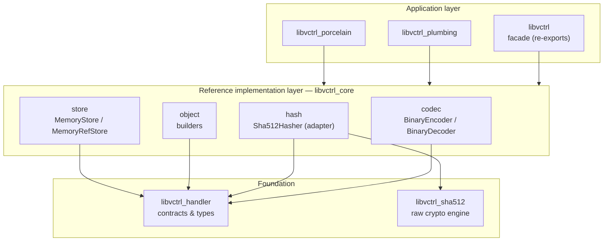
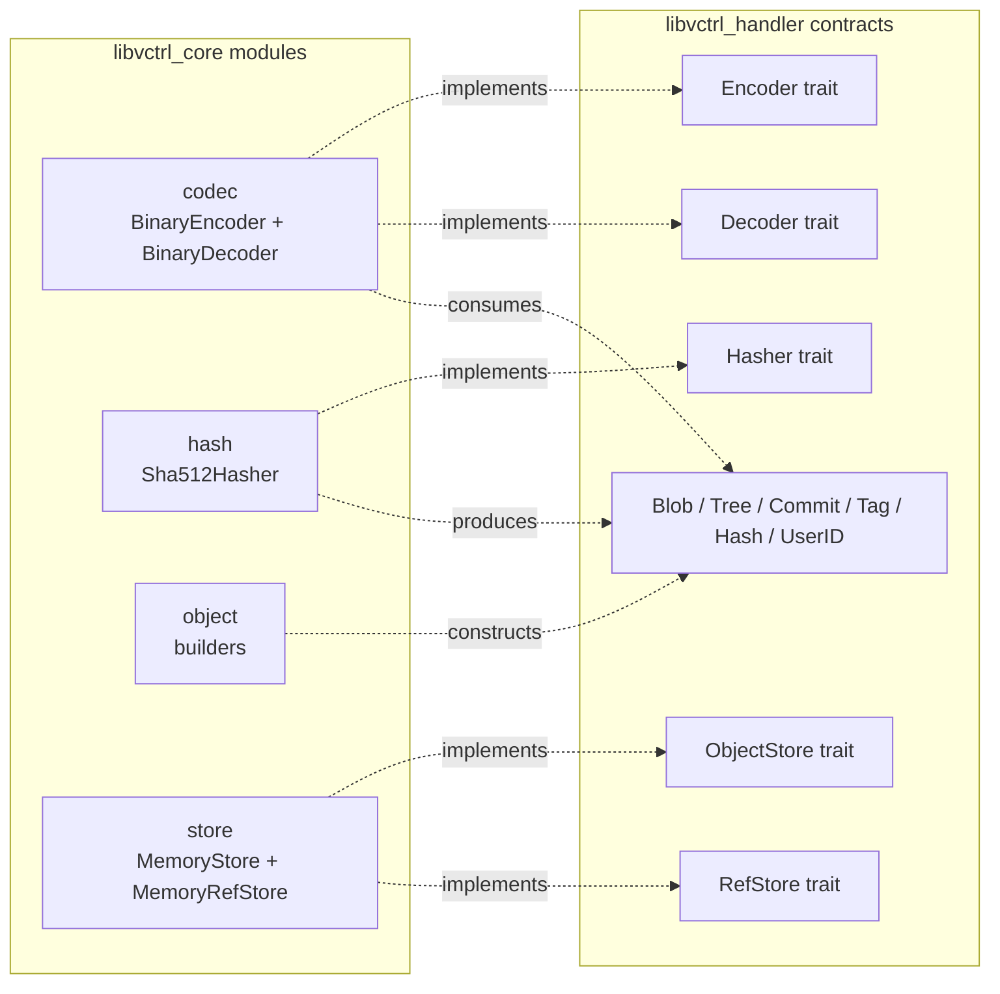
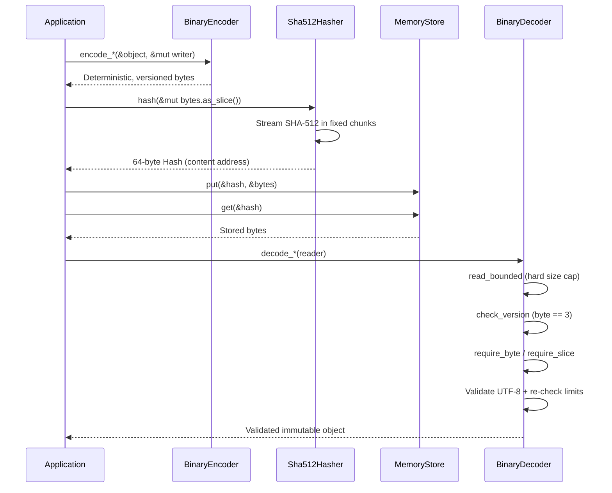
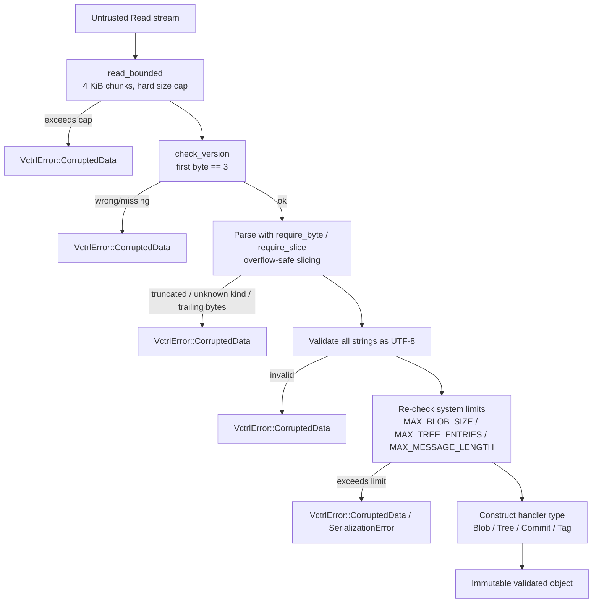
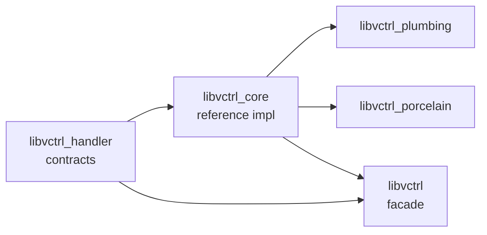

# libvctrl_core

Reference implementations of the `libvctrl` contracts: a deterministic binary codec, a
SHA-512 content-addressing hasher, fluent object builders, and in-memory storage backends.
`libvctrl_core` is the layer that turns the abstract `libvctrl_handler` traits and immutable
types into working, production-ready components.

- **Crate:** `libvctrl_core` 3.0.1 (library, `std`-only)
- **Language:** Rust, edition 2024 — MSRV **1.96.0**
- **License:** MIT
- **Repository:** https://github.com/mroczect/libvctrl
- **Documentation:** https://docs.rs/libvctrl_core

> Most users should depend on the **`libvctrl` facade** rather than this crate directly.
> The facade re-exports everything in `libvctrl_core` plus the contracts and the crypto
> primitives under a single, ergonomic namespace. Reach for `libvctrl_core` directly only
> when you need the codec, builders, or in-memory stores without pulling in the facade's
> `crypto` namespace alias.

---

## Overview

`libvctrl_handler` defines _what_ a version control object model looks like — the traits
(`Encoder`, `Decoder`, `Hasher`, `ObjectStore`, `RefStore`) and the immutable data types
(`Blob`, `Tree`, `TreeEntry`, `Commit`, `CommitMeta`, `Tag`, `Hash`, `UserID`).
`libvctrl_core` defines _how_ those contracts are realised:

- A **binary codec** that serialises objects into a deterministic, versioned byte stream
  and parses untrusted byte streams back into validated objects.
- A **SHA-512 hasher** that bridges the raw `libvctrl_sha512` digest engine to the handler
  `Hash` type used for content addressing.
- **Fluent builders** for constructing validated `Blob`, `Tree`, `TreeEntry`, `Commit`,
  and `Tag` objects.
- **In-memory stores** implementing `ObjectStore` and `RefStore` over `HashMap`.

The crate is `std`-only: it relies on `std::io`, `std::sync::Arc`, `HashMap`, `String`, and
`Vec`. There is no `no_std` build path. The crate exposes **no crate-level feature flags**;
all feature configuration (`sha384`, `opt_size`) happens at the facade or
`libvctrl_sha512` level.

---

## Architecture

`libvctrl_core` sits in the middle of a strictly layered, one-way dependency graph. The
contract layer (`libvctrl_handler`) depends only on the standard library. The reference
layer (`libvctrl_core`) depends on the contracts and on the raw crypto engine
(`libvctrl_sha512`). Above it sit the facade and the higher-level command crates.



Internally, each module implements a specific handler trait against the contract types:



### Codec round-trip

A typical interaction encodes an object, hashes the encoded bytes to obtain a content
address, stores the bytes, and later decodes them back. The decoder is the trust boundary:
it treats every input as untrusted and validates structure, UTF-8, and system limits before
constructing a handler type.



---

## Core Features

- **Deterministic serialization.** The same object always produces the same bytes:
  fixed version byte, little-endian integers, strict field order, no platform-specific
  layouts. Determinism is required for content addressing to be stable.
- **Defense-in-depth decoding.** `BinaryDecoder` bounds the input before parsing, checks
  every offset before slicing, validates all strings as UTF-8, and re-checks system limits
  after numeric conversion. No slice indexing occurs without a preceding bounds check.
- **DoS-resistant reads.** `read_bounded` uses a 4 KiB chunk buffer and refuses to allocate
  beyond a conservative per-object maximum, preventing allocation-based denial of service.
- **Versioned format.** Every encoded object begins with a version byte (`3`). The decoder
  rejects any input whose first byte does not match, allowing the format to evolve safely.
- **Thin hasher adapter.** `Sha512Hasher` is a zero-sized, stateless, thread-safe adapter
  that bridges the raw `libvctrl_sha512` engine to the handler `Hash` type, producing
  64-byte addresses matching `HASH_LENGTH`.
- **Fluent builders.** Construct validated `Blob`, `Tree`, `TreeEntry`, `Commit`, and `Tag`
  objects through ergonomic builder APIs.
- **In-memory stores.** `MemoryStore` and `MemoryRefStore` provide ready-to-use
  `ObjectStore` and `RefStore` implementations backed by `HashMap`.
- **Strict safety.** `#![forbid(unsafe_code)]` and a comprehensive set of denied Clippy and
  rustc documentation lints are inherited from the workspace.

---

## Technology Stack

- **Language:** Rust (edition 2024, MSRV 1.96.0)
- **Dependencies:**
  - `libvctrl_handler` 5.0.0 — contracts, types, constants, validation (path dependency)
  - `libvctrl_sha512` 3.0.0 — raw SHA-512 / HMAC / HKDF engine, **with default features**
    (SHA-384 enabled)
- **Dev-dependencies:** `proptest` 1.11.0
- **Lint policy:** workspace-inherited, `#![forbid(unsafe_code)]`, denied missing-docs,
  rust-2018-idioms, and a broad set of Clippy lints (including pedantic and nursery
  groups). See the repository for the authoritative lint configuration.
- **Feature flags:** none at the crate level.

> Note on the MSRV field: this crate's `Cargo.toml` does not yet declare
> `rust-version = "1.96"`. The workspace standard is Rust 1.96.0, and this README
> documents that as the MSRV. Adding `rust-version = "1.96"` to
> `libvctrl_core/Cargo.toml` is recommended in a future maintenance pass.

---

## Project Structure

```text
libvctrl_core/
├── Cargo.toml
└── src/
    ├── lib.rs
    ├── codec/
    │   ├── mod.rs
    │   ├── binary_encoder.rs
    │   └── binary_decoder.rs
    ├── hash/
    │   ├── mod.rs
    │   └── sha512.rs
    ├── object/
    │   ├── mod.rs
    │   ├── blob.rs
    │   ├── commit.rs
    │   ├── tag.rs
    │   └── tree.rs
    └── store/
        ├── mod.rs
        ├── memory.rs
        └── ref_store.rs
```

---

## Getting Started

### Prerequisites

- Rust toolchain **1.96.0** or newer (edition 2024 is required)
- Cargo

No system libraries or external services are required.

### Installation

For most users, depend on the facade instead:

```toml
[dependencies]
libvctrl = "2.1"
```

To depend on `libvctrl_core` directly (codec/builders/stores only, without the facade's
`crypto` namespace alias):

```toml
[dependencies]
libvctrl_core = "3.0"
```

Or via Cargo:

```bash
cargo add libvctrl_core
```

This will pull `libvctrl_handler` and `libvctrl_sha512` as transitive dependencies.

### Configuration

`libvctrl_core` exposes **no crate-level feature flags**. Feature configuration
(`sha384`, `opt_size`) is controlled at the `libvctrl` facade or `libvctrl_sha512` level.
Because this crate depends on `libvctrl_sha512` **with default features**, SHA-384 support
is enabled transitively. If you need to control the crypto feature set, use the facade,
which wires `libvctrl_sha512` with `default-features = false` and re-enables only what it
needs.

---

## Usage

### Encode, hash, store, and decode a Blob

```rust
use std::io::Cursor;
use libvctrl_handler::{Blob, Decoder, Encoder, Hasher, ObjectStore};
use libvctrl_core::codec::{BinaryEncoder, BinaryDecoder};
use libvctrl_core::hash::Sha512Hasher;
use libvctrl_core::store::MemoryStore;

fn main() -> Result<(), Box<dyn std::error::Error>> {
    // 1. Create a validated blob.
    let blob = Blob::new(b"hello world".to_vec())?;

    // 2. Encode into a deterministic, versioned byte stream.
    let mut encoded = Vec::new();
    BinaryEncoder.encode_blob(&blob, &mut encoded)?;

    // 3. Hash the encoded bytes to obtain a 64-byte content address.
    let hash = Sha512Hasher.hash(&mut encoded.as_slice())?;

    // 4. Store the encoded object in memory.
    let mut store = MemoryStore::new();
    store.put(&hash, &encoded)?;

    // 5. Retrieve and decode back into a validated object.
    let reader = store.get(&hash)?;
    let decoded = BinaryDecoder.decode_blob(reader)?;
    assert_eq!(decoded, blob);
    Ok(())
}
```

### Encode and decode a Tree

```rust
use std::io::Cursor;
use libvctrl_handler::{Encoder, Decoder, EntryKind, Hash, Tree, TreeEntry};
use libvctrl_core::codec::{BinaryEncoder, BinaryDecoder};

fn main() -> Result<(), Box<dyn std::error::Error>> {
    let hash = Hash::from_bytes(&[0u8; 64])?;
    let entry = TreeEntry::new("a.txt".to_owned(), EntryKind::Blob, hash)?;
    let tree = Tree::new(vec![entry])?;

    let mut encoded = Vec::new();
    BinaryEncoder.encode_tree(&tree, &mut encoded)?;

    let decoded = BinaryDecoder.decode_tree(Cursor::new(encoded.as_slice()))?;
    assert_eq!(decoded, tree);
    Ok(())
}
```

### Encode and decode a Commit

```rust
use std::io::Cursor;
use libvctrl_handler::{Commit, Decoder, Encoder, Hash, UserID};
use libvctrl_core::codec::{BinaryEncoder, BinaryDecoder};

fn main() -> Result<(), Box<dyn std::error::Error>> {
    let tree = Hash::from_bytes(&[1u8; 64])?;
    let author = UserID::new("Alice".to_owned(), "alice@example.com".to_owned())?;
    let committer = UserID::new("Bob".to_owned(), "bob@example.com".to_owned())?;
    let commit = Commit::new(tree, vec![], author, committer, "Initial commit".to_owned())?;

    let mut encoded = Vec::new();
    BinaryEncoder.encode_commit(&commit, &mut encoded)?;

    let decoded = BinaryDecoder.decode_commit(Cursor::new(encoded.as_slice()))?;
    assert_eq!(decoded, commit);
    Ok(())
}
```

### Hash a streaming input

```rust
use libvctrl_core::hash::Sha512Hasher;
use libvctrl_handler::Hasher;

fn main() -> Result<(), Box<dyn std::error::Error>> {
    let hash = Sha512Hasher.hash(b"hello world".as_ref())?;
    assert_eq!(hash.as_bytes().len(), 64);
    Ok(())
}
```

### Building objects with fluent builders

The `object` module provides ergonomic builders that wrap the handler constructors with
validation. The builder surface mirrors the facade re-exports
(`BlobBuilder`, `CommitBuilder`, `TagBuilder`, `TreeBuilder`, `TreeEntryBuilder`):

```rust
// Conceptual — see docs.rs/libvctrl_core for the exact builder API.
// use libvctrl_core::object::{BlobBuilder, CommitBuilder, TreeBuilder, TreeEntryBuilder};
// use libvctrl_handler::{EntryKind, Hash, UserID};
//
// let blob = BlobBuilder::new().data(b"content".to_vec()).build()?;
// let entry = TreeEntryBuilder::new("file.txt".to_owned(), EntryKind::Blob, hash).build()?;
// let tree  = TreeBuilder::new().entry(entry).build()?;
// let user  = UserID::new("Alice".to_owned(), "alice@example.com".to_owned())?;
// let commit = CommitBuilder::new()
//     .tree(tree_hash)
//     .author(user.clone())
//     .committer(user)
//     .message("Initial commit")
//     .build()?;
```

---

## API Reference / Core Modules

Full API documentation is published at <https://docs.rs/libvctrl_core>. The summary below
describes each module and, for the codec, the canonical binary format.

### `codec` — Binary codec

Implements the `Encoder` and `Decoder` traits. Two zero-sized types:

- **`BinaryEncoder`** — writes objects to any `std::io::Write` sink. Stateless; streams
  fields directly without allocating the entire payload upfront. All length conversions are
  checked with `try_from` so impossible lengths are reported as
  `VctrlError::SerializationError` rather than causing silent truncation.
- **`BinaryDecoder`** — reads objects from any `std::io::Read` source. The trust boundary
  for untrusted input.

The current format version is `VERSION = 3` (`pub const VERSION: u8 = 3`). The decoder
rejects any input whose first byte does not match `EXPECTED_VERSION = 3`.

#### Decoder validation pipeline

The decoder follows a defense-in-depth strategy. No slice indexing is performed without a
preceding bounds check.



#### Binary format layouts

All integers are little-endian. Strings are `u8` length-prefixed. Larger payloads use
`u32` or `u64` length prefixes. Every object begins with a one-byte version field (`3`).

**Blob**

| Offset | Size       | Field               |
| ------ | ---------- | ------------------- |
| 0      | 1          | Version byte        |
| 1      | 8          | `data_len` (u64 LE) |
| 9      | `data_len` | Raw blob data       |

**Tree**

| Offset | Size   | Field                        |
| ------ | ------ | ---------------------------- |
| 0      | 1      | Version byte                 |
| 1      | 4      | `entry_count` (u32 LE)       |
| 5      | varies | Repeated entries (see below) |

Each tree entry:

| Field       | Size       |
| ----------- | ---------- |
| `name_len`  | 1 (u8)     |
| `name`      | `name_len` |
| `kind_byte` | 1 (u8)     |
| `hash`      | 64         |

`EntryKind` discriminants:

| Byte | Kind       |
| ---- | ---------- |
| 0    | Blob       |
| 1    | Executable |
| 2    | Symlink    |
| 3    | Tree       |
| 4    | Submodule  |

**Commit**

| Field                  | Size        |
| ---------------------- | ----------- |
| Version                | 1           |
| Tree hash              | 64          |
| Parent count           | 2 (u16 LE)  |
| Parent hashes          | 64 * count  |
| Author name length     | 1           |
| Author name            | length      |
| Author email length    | 1           |
| Author email           | length      |
| Committer name length  | 1           |
| Committer name         | length      |
| Committer email length | 1           |
| Committer email        | length      |
| Message length         | 4 (u32 LE)  |
| Message                | length      |
| Timestamp              | 8 (i64 LE)  |
| Timezone offset        | 2 (i16 LE)  |
| Encoding length        | 1           |
| Encoding               | length or 0 |

**Tag**

| Field               | Size           |
| ------------------- | -------------- |
| Version             | 1              |
| Name length         | 1              |
| Name                | length         |
| Target hash         | 64             |
| Tagger presence     | 1              |
| Tagger name length  | 1 (if present) |
| Tagger name         | length         |
| Tagger email length | 1 (if present) |
| Tagger email        | length         |
| Message length      | 4 (u32 LE)     |
| Message             | length         |
| Timestamp           | 8 (i64 LE)     |
| Timezone offset     | 2 (i16 LE)     |
| Encoding length     | 1              |
| Encoding            | length or 0    |

#### Error mapping

The codec surfaces three `VctrlError` variants:

- `VctrlError::CorruptedData` — version mismatch, missing/truncated length prefix,
  length mismatch, unknown entry-kind byte, trailing bytes, invalid UTF-8, or input
  exceeding the bounded size cap. The dominant failure mode on the decode path.
- `VctrlError::SerializationError` — length overflow that cannot be represented in the
  prefix integer (e.g. a name longer than `u8::MAX`, a message longer than `u32::MAX`),
  or a message exceeding `MAX_MESSAGE_LENGTH`. The dominant failure mode on the encode
  path.
- `VctrlError::IoError` — underlying `Read`/`Write` failure, wrapped via
  `std::sync::Arc` so the error remains cloneable.

### `hash` — Content addressing

- **`Sha512Hasher`** — a zero-sized, stateless, thread-safe type implementing the `Hasher`
  trait. It is a **thin adapter** that bridges the raw `libvctrl_sha512` digest engine to
  the handler `Hash` type. The `hash` method reads from any `std::io::Read` in fixed-size
  chunks, feeds each chunk into the SHA-512 engine, and finalises into a 64-byte `Hash`
  whose length always matches `HASH_LENGTH`.

### `object` — Fluent builders

Builders for `Blob`, `Commit`, `Tag`, `Tree`, and `TreeEntry`. Each builder wraps the
corresponding handler constructor with validation and a fluent API:

- `BlobBuilder`
- `CommitBuilder`
- `TagBuilder`
- `TreeBuilder`
- `TreeEntryBuilder`

See <https://docs.rs/libvctrl_core> for the exact builder method surface. The builders are
also re-exported at the root of the `libvctrl` facade.

### `store` — In-memory storage

Two `HashMap`-backed implementations:

- **`MemoryStore`** — implements `ObjectStore`. Stores encoded object bytes keyed by `Hash`.
- **`MemoryRefStore`** — implements `RefStore`. Stores named references (e.g. branch and
  tag names) pointing at `Hash` values.

Both are intended for testing, prototyping, and ephemeral in-process VCS sessions. For
persistent or remote backends, implement `ObjectStore` and `RefStore` directly.

---

## Testing

Run the crate's test suite with Cargo:

```bash
cargo test
```

Property-based tests use `proptest` (a dev-dependency). To run the entire workspace test
suite from the repository root:

```bash
cargo test --workspace
```

To verify the strict lint policy is satisfied:

```bash
cargo clippy --workspace --all-targets -- -D warnings
cargo doc --workspace --no-deps
```

---

## Contributing

Contributions are welcome. The crate enforces `#![forbid(unsafe_code)]` and inherits a
strict, denied Clippy and documentation-lint policy from the workspace; all public items
must be documented.

For contribution guidelines, code style, and the full lint configuration, see the
repository's `CONTRIBUTING.md` and the workspace root `README.md`:

- Repository: https://github.com/mroczect/libvctrl

When contributing to `libvctrl_core`, keep the contract/implementation boundary clean: new
behaviour belongs here, new contracts belong in `libvctrl_handler`, and new user-facing
commands belong in `libvctrl_plumbing` or `libvctrl_porcelain`.

---

## Ecosystem

`libvctrl_core` is one layer of a larger workspace. The related crates are listed below;
each has its own documentation.

| Crate                | Role                                                     | Documentation                      |
| -------------------- | -------------------------------------------------------- | ---------------------------------- |
| `libvctrl`           | Facade: re-exports contracts, reference impl, and crypto | https://docs.rs/libvctrl           |
| `libvctrl_handler`   | Contract layer: traits, types, limits, validation        | https://docs.rs/libvctrl_handler   |
| `libvctrl_sha512`    | Zero-dependency SHA-512 / HMAC / HKDF primitives         | https://docs.rs/libvctrl_sha512    |
| `libvctrl_plumbing`  | Command-level VCS operations built on `libvctrl_core`    | https://docs.rs/libvctrl_plumbing  |
| `libvctrl_porcelain` | High-level, user-facing VCS operations                   | https://docs.rs/libvctrl_porcelain |

The dependency flow is strictly one-way: `handler` is the foundation, `core` implements the
contracts, the facade re-exports both, and `plumbing`/`porcelain` build on `core`.



---

## License

Licensed under the MIT License. See the repository for the full license text.
