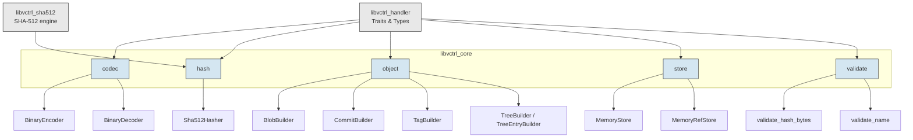

# libvctrl_core

## Overview

`libvctrl_core` is the **reference implementation crate** for the `libvctrl_handler` version control contracts. It provides concrete, production‑ready implementations of every abstract trait defined in `libvctrl_handler`, including storage backends, a binary serialization format, a SHA‑512 hasher, builder patterns for object construction, and validation utilities.

The crate serves three primary purposes:

1. **Proof of concept** – It validates the `libvctrl_handler` design by providing fully functional backends that fulfill all trait contracts.
2. **Batteries‑included** – Downstream applications can bootstrap a working VCS immediately using the built‑in in‑memory storage, binary codec, and SHA‑512 hashing without writing any backend code.
3. **Reference implementation** – It acts as an example for developers who wish to create their own storage, encoding, or hashing backends by studying the code and documentation.

All components are designed with strict safety requirements (`#![forbid(unsafe_code)]`) and comprehensive documentation.

---

## Architecture

The crate is organised into five public modules, each providing a concrete implementation of a `libvctrl_handler` trait or a related utility.



**Key design decisions:**

- **Separation of concerns** – Each module maps to a single responsibility (codec, hash, object building, storage, validation). This keeps the codebase maintainable and testable in isolation.
- **Delegation to audited cryptography** – The `Sha512Hasher` delegates the actual hashing to the `libvctrl_sha512` crate, a `#![no_std]` implementation of SHA‑512/HMAC/HKDF. This avoids re‑implementing cryptographic primitives.
- **Builder pattern for complex objects** – `Commit`, `Tag`, `Tree`, and `TreeEntry` have many fields. The builder pattern (`CommitBuilder`, `TagBuilder`, `TreeBuilder`, `TreeEntryBuilder`) provides a fluent, self‑documenting API that defers validation until the final `build()` step.
- **Wire format versioning** – The binary codec (`BinaryEncoder`/`BinaryDecoder`) prepends a version byte to every serialised payload, allowing format evolution without breaking existing data.

---

## Core Features

- **Binary codec** – Compact, deterministic little‑endian binary format for all object types. Versioned for forward/backward compatibility. Includes strict bounds checking, UTF‑8 validation, and size limits to prevent denial‑of‑service attacks.
- **SHA‑512 hasher** – Zero‑cost adapter (`Sha512Hasher`) that bridges `libvctrl_sha512` with the `Hasher` trait. Produces 64‑byte content‑addressable digests.
- **In‑memory storage** – `MemoryStore` and `MemoryRefStore` implement `ObjectStore` and `RefStore` using `HashMap`. Ideal for testing, caching, and ephemeral sessions.
- **Object builders** – Fluent APIs for constructing `Blob`, `Commit`, `Tag`, `Tree`, and `TreeEntry` objects. Required fields are enforced at build time; missing fields return clear errors.
- **Validation utilities** – Standalone functions `validate_name` (rejects empty, long, path traversal, and `.`/`..` names) and `validate_hash_bytes` (checks exact hash length) that can be used before constructing types.
- **Zero unsafe code** – The crate is fully `#![forbid(unsafe_code)]` and passes strict Clippy lints (`pedantic`, `nursery`, `cargo`).
- **Fully documented** – Every public item includes `# Purpose`, `# Design rationale`, and `# Examples` sections, making the crate suitable both for direct use and as a reference for backend implementors.

---

## Technology Stack

- **Language:** Rust (edition 2024)
- **Dependencies:**
  - `libvctrl_handler` (version 3.1.0) – Core VCS contracts.
  - `libvctrl_sha512` (version 2.0.0) – SHA‑512, HMAC, HKDF implementations.
- **Dev Dependencies:** `proptest` for property‑based testing.
- **License:** MIT
- **Repository:** [https://github.com/mroczect/libvctrl](https://github.com/mroczect/libvctrl)

---

## Project Structure

```text
libvctrl_core/
├── Cargo.toml
├── README.md
└── src/
    ├── lib.rs                  # Crate root, module declarations
    ├── codec/
    │   ├── mod.rs              # Re-exports BinaryEncoder, BinaryDecoder
    │   ├── binary_encoder.rs   # Binary serialization of VCS objects
    │   └── binary_decoder.rs   # Binary deserialization of VCS objects
    ├── hash/
    │   ├── mod.rs              # Re-exports Sha512Hasher
    │   └── sha512.rs           # SHA-512 hasher adapter
    ├── object/
    │   ├── mod.rs              # Re-exports all builders
    │   ├── blob.rs             # BlobBuilder
    │   ├── commit.rs           # CommitBuilder
    │   ├── tag.rs              # TagBuilder
    │   └── tree.rs             # TreeBuilder & TreeEntryBuilder
    ├── store/
    │   ├── mod.rs              # Re-exports MemoryStore, MemoryRefStore
    │   ├── memory.rs           # In-memory ObjectStore
    │   └── ref_store.rs        # In-memory RefStore
    └── validate/
        ├── mod.rs              # Module declarations
        ├── hash.rs             # validate_hash_bytes function
        └── name.rs             # validate_name function
```

---

## Getting Started

### Prerequisites

- Rust toolchain (stable) version **1.85** or later (supports edition 2024).
- The `libvctrl_handler` and `libvctrl_sha512` crates must be present in the workspace or available locally.

### Installation

Add the crate to your `Cargo.toml`. If you are building inside the `libvctrl` workspace, use a path dependency:

```toml
[dependencies]
libvctrl_core = { path = "../libvctrl_core", version = "1.1.0" }
```

If the crate is published, you can use the registry version:

```toml
[dependencies]
libvctrl_core = "1.1.0"
```

### Configuration

No environment variables or feature flags are needed. The crate relies solely on the dependencies listed above.

---

## Usage

### Encoding and decoding objects

The `BinaryEncoder` and `BinaryDecoder` provide a complete round‑trip for all VCS objects.

```rust
use libvctrl_handler::{Blob, Encoder, Decoder};
use libvctrl_core::codec::{BinaryEncoder, BinaryDecoder};

let original = Blob::new(b"Hello, world!".to_vec());

// Encode to binary
let encoder = BinaryEncoder;
let bytes = encoder.encode_blob(&original).unwrap();

// Decode back into a Blob
let decoder = BinaryDecoder;
let decoded = decoder.decode_blob(&bytes).unwrap();

assert_eq!(decoded, original);
```

### Hashing content

The `Sha512Hasher` computes a content‑addressable `Hash` from arbitrary bytes.

```rust
use libvctrl_handler::Hasher;
use libvctrl_core::hash::Sha512Hasher;

let hasher = Sha512Hasher;
let hash = hasher.hash(b"my data");
assert_eq!(hash.as_bytes().len(), 64);
```

### Using object builders

Builders provide a fluent, validated way to create complex objects.

```rust
use libvctrl_handler::{Hash, UserID, CommitMeta};
use libvctrl_core::object::CommitBuilder;

let tree = Hash::from_bytes(&[0xAA; 64]).unwrap();
let author = UserID::new("Alice".into(), "alice@example.com".into()).unwrap();
let committer = UserID::new("Bob".into(), "bob@example.com".into()).unwrap();
let meta = CommitMeta {
    timestamp: 1_700_000_000,
    timezone_offset: 120,
    encoding: Some("UTF-8".into()),
};

let commit = CommitBuilder::new()
    .tree(tree)
    .author(author)
    .committer(committer)
    .message("Initial commit")
    .meta(meta)
    .build()
    .unwrap();

assert_eq!(commit.message(), "Initial commit");
```

### In‑memory storage

`MemoryStore` and `MemoryRefStore` implement the `ObjectStore` and `RefStore` traits, respectively.

```rust
use libvctrl_handler::{Hash, ObjectStore};
use libvctrl_core::store::MemoryStore;

let mut store = MemoryStore::new();
let hash = Hash::from_bytes(&[0x00; 64]).unwrap();

store.put(&hash, b"serialized object").unwrap();
assert!(store.exists(&hash).unwrap());
assert_eq!(store.get(&hash).unwrap(), b"serialized object");

store.delete(&hash).unwrap();
assert!(!store.exists(&hash).unwrap());
```

Reference storage works similarly:

```rust
use libvctrl_handler::{Hash, RefStore};
use libvctrl_core::store::MemoryRefStore;

let mut refs = MemoryRefStore::new();
let hash = Hash::from_bytes(&[0x11; 64]).unwrap();

refs.set_ref("HEAD", &hash).unwrap();
assert_eq!(refs.get_ref("HEAD").unwrap(), hash);
```

### Validation helpers

Pre‑validate inputs before constructing types to fail early with clear messages.

```rust
use libvctrl_core::validate::name::validate_name;
use libvctrl_core::validate::hash::validate_hash_bytes;

assert!(validate_name("feature_x").is_ok());
assert!(validate_name("../bad").is_err());       // path traversal
assert!(validate_name("").is_err());             // empty
assert!(validate_name(".").is_err());            // reserved

let valid_hash = [0u8; 64];
assert!(validate_hash_bytes(&valid_hash).is_ok());
assert!(validate_hash_bytes(&[0u8; 32]).is_err());
```

---

## API Reference / Core Modules

### `codec`

Implementation of `Encoder` and `Decoder` traits using a compact binary format.

- **`BinaryEncoder`** – Serialises `Blob`, `Tree`, `Commit`, and `Tag` into a deterministic byte representation.
  - Fields are length‑prefixed; integers are little‑endian.
  - The first byte of every output is a version number (`2`).
  - Fails only if internal length limits are exceeded (e.g., more than 255 parents, name longer than 255 bytes).

- **`BinaryDecoder`** – Deserialises the binary format back into objects.
  - Verifies the version byte, checks bounds before every read, and validates UTF‑8.
  - Protects against resource exhaustion by comparing lengths against `MAX_BLOB_SIZE`, `MAX_MESSAGE_LENGTH`, and `MAX_TREE_ENTRIES`.
  - Returns `VctrlError::CorruptedData` for any structural violation.

### `hash`

- **`Sha512Hasher`** – Implements `Hasher` by delegating to `libvctrl_sha512::Hash::hash`. The resulting 64‑byte digest is wrapped in `libvctrl_handler::Hash`.

### `object`

Builders with fluent APIs that consume `self` and perform validation at `build()`.

| Builder            | Creates     | Required fields                            | Optional fields       |
| ------------------ | ----------- | ------------------------------------------ | --------------------- |
| `BlobBuilder`      | `Blob`      | data                                       | (none)                |
| `CommitBuilder`    | `Commit`    | tree, author, committer, message           | parents, meta         |
| `TagBuilder`       | `Tag`       | name, target                               | tagger, message, meta |
| `TreeBuilder`      | `Tree`      | entries (added via `entry` or `add_entry`) | (none)                |
| `TreeEntryBuilder` | `TreeEntry` | name, kind, hash                           | (none)                |

All builders implement `Default` and can be instantiated with `new()`.

### `store`

- **`MemoryStore`** – `ObjectStore` backed by `HashMap<Hash, Vec<u8>>`.
  - `put` overwrites existing objects.
  - `delete` is idempotent (no‑op if not found).
  - All methods are infallible but return `Result` to satisfy the trait.

- **`MemoryRefStore`** – `RefStore` backed by `HashMap<String, Hash>`.
  - Enforces name length limits in `set_ref` (non‑empty, ≤ `MAX_NAME_LENGTH`).
  - `delete_ref` is idempotent.
  - `list_refs` returns an unsorted list of all reference names.

### `validate`

Standalone functions for input sanitization.

- **`validate_name(name: &str) -> Result<(), VctrlError>`** – Rejects names that are empty, longer than `MAX_NAME_LENGTH`, contain `/`, or are exactly `.` or `..`.
- **`validate_hash_bytes(bytes: &[u8]) -> Result<(), VctrlError>`** – Ensures the byte slice is exactly `HASH_LENGTH` (64) bytes.

---

## Testing

Run the full test suite with:

```bash
cargo test
```

The crate includes:

- Unit tests for `MemoryStore` and `MemoryRefStore` (get, put, delete, overwrite, missing, empty/long names, list refs).
- Integration tests can be added in the `tests/` directory.
- Doctests for every public item are executed as part of `cargo test`.

To run property‑based tests (requires `proptest` dev‑dependency), use:

```bash
cargo test --tests
```

---

## Versioning & Stability

This project follows [Semantic Versioning 2.0.0](https://semver.org/).

- The public API is considered stable. Breaking changes (removing items, changing method signatures, altering binary format version byte or field order) will result in a major version increment.
- Additions (new builder methods, new validation functions, new error variants that do not invalidate existing matching) are not breaking.
- The wire format version byte (`VERSION = 2`) is independent of the crate version. If the binary format changes, the version byte will be bumped, and old decoders will reject data with an unsupported version error.

Consult the repository’s changelog before upgrading.

---

## Contributing

Contributions are welcome. Please open an issue or pull request on the [GitHub repository](https://github.com/mroczect/libvctrl). By contributing, you agree to license your work under the MIT license.

For major changes, please discuss your design in an issue first.

---

## License

MIT – see the [LICENSE](https://github.com/mroczect/libvctrl/blob/master/LICENSE) file in the repository.
