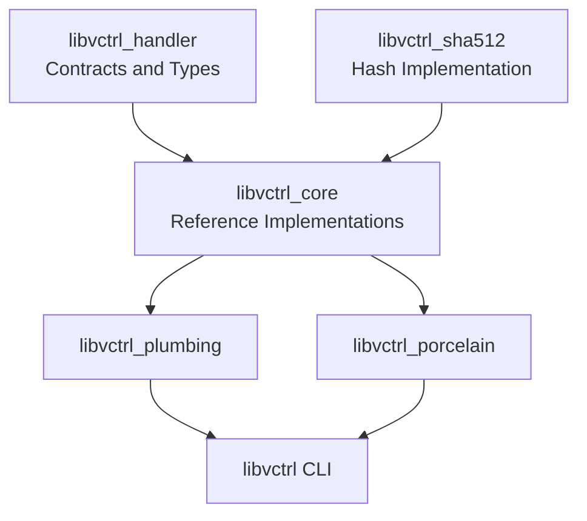
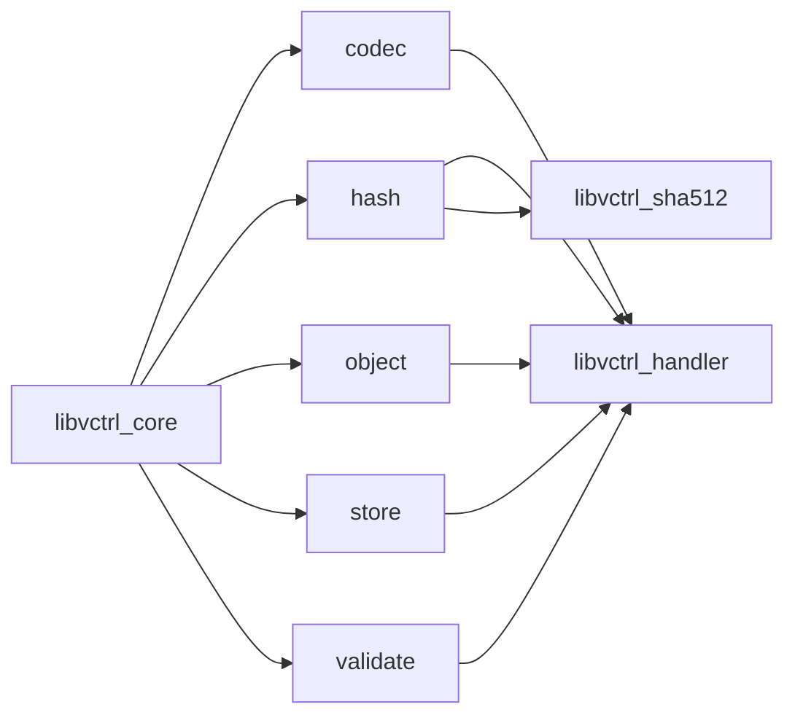
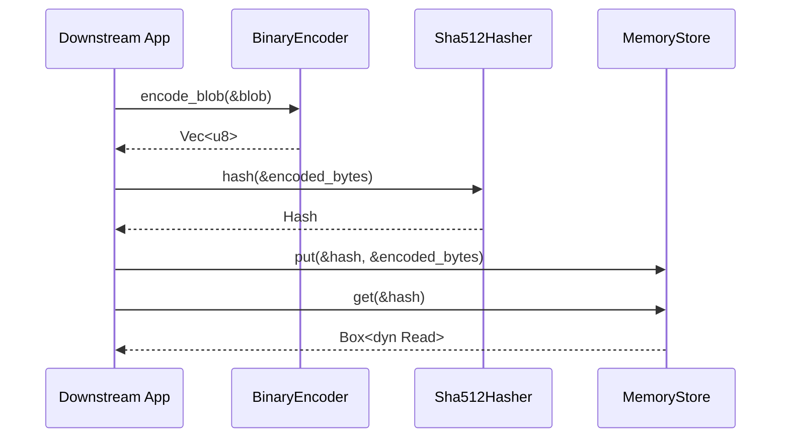
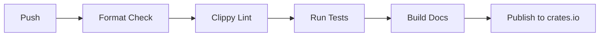

# libvctrl_core

**Version:** 2.0.1  
**Crate type:** Rust library (reference implementations)  
**Workspace:** libvcrtl

`libvctrl_core` is the **batteries-included reference implementation layer** for the abstract contracts defined in [`libvctrl_handler`](https://docs.rs/libvctrl_handler). It provides production-ready, safe implementations of hashing, binary serialization, in-memory storage, reference management, and builder utilities. By consuming `libvctrl_handler` as its first downstream crate, `libvctrl_core` validates the contracts and gives developers a complete, working VCS backend stack out of the box.

The crate enforces the same strict code quality standards as `libvctrl_handler`:

- `#![forbid(unsafe_code)]`
- `#![deny(clippy::all, clippy::pedantic, clippy::nursery, clippy::cargo)]`
- `#![deny(missing_docs)]`
- `#![deny(rust_2018_idioms, unreachable_pub, unused_crate_dependencies, unused_qualifications)]`

---

## Table of Contents

- [Overview](#overview)
- [System Architecture](#system-architecture)
- [Core Features](#core-features)
- [Technology Stack](#technology-stack)
- [Project Structure](#project-structure)
- [Getting Started](#getting-started)
  - [Prerequisites](#prerequisites)
  - [Installation](#installation)
  - [Configuration](#configuration)
- [Usage](#usage)
- [API Reference](#api-reference)
  - [Codec Module](#codec-module)
    - [BinaryEncoder](#binaryencoder)
    - [BinaryDecoder](#binarydecoder)
    - [Binary Format Specifications](#binary-format-specifications)
  - [Hash Module](#hash-module)
    - [Sha512Hasher](#sha512hasher)
  - [Object Module](#object-module)
    - [BlobBuilder](#blobbuilder)
    - [CommitBuilder](#commitbuilder)
    - [TagBuilder](#tagbuilder)
    - [TreeBuilder](#treebuilder)
    - [TreeEntryBuilder](#treeentrybuilder)
  - [Store Module](#store-module)
    - [MemoryStore](#memorystore)
    - [MemoryRefStore](#memoryrefstore)
  - [Validate Module](#validate-module)
    - [validate_hash_bytes](#validate_hash_bytes)
    - [validate_name](#validate_name)
- [Testing](#testing)
- [CI/CD Pipeline](#cicd-pipeline)
- [Deployment / Distribution](#deployment--distribution)
- [Security & Compliance](#security--compliance)
- [Contributing](#contributing)
- [License](#license)
- [Changelog](#changelog)

---

## Overview

`libvctrl_core` is the first concrete consumer of the `libvctrl_handler` traits. It transforms the abstract contracts into a runnable foundation for version control systems by providing:

- **Binary codec** for deterministic serialization and deserialization.
- **SHA-512 hasher** for content addressing.
- **In-memory object and reference stores** for ephemeral storage.
- **Builder patterns** for ergonomic object construction.
- **Validation utilities** for names and hashes.

Because `libvctrl_core` implements every key trait from `libvctrl_handler`, it also serves as a quality exemplar for downstream developers who need to write custom backends. All code is safe, strictly linted, heavily documented, and thoroughly tested.

This crate intentionally does not perform persistent disk I/O or network operations; it focuses on core VCS logic that can be embedded in larger systems.

---

## System Architecture

### Workspace Context

Within the `libvcrtl` workspace, `libvctrl_core` sits directly above `libvctrl_handler` and below higher-level crates like `libvctrl_plumbing` and `libvctrl_porcelain`.



`libvctrl_core` depends on:

- `libvctrl_handler` version 4.4.0 for all contracts and data types.
- `libvctrl_sha512` version 2.0.0 for the raw SHA-512 hash algorithm.

### Internal Module Architecture

The crate is organized by domain responsibility:



Each module isolates a single responsibility:

- **`codec`**: `BinaryEncoder` and `BinaryDecoder` for binary serialization.
- **`hash`**: `Sha512Hasher` bridging `libvctrl_sha512` to `Hasher`.
- **`object`**: Builder structs for ergonomic construction.
- **`store`**: In-memory `ObjectStore` and `RefStore` implementations.
- **`validate`**: Validation helpers for names and hashes.

### Object Lifecycle Data Flow

The following sequence shows how a `Blob` is encoded, hashed, stored, and retrieved using `libvctrl_core`.



---

## Core Features

- **Binary serialization/deserialization**  
  Compact, deterministic, little-endian binary format with versioning and strict bounds checks.

- **SHA-512 content addressing**  
  Produces 64-byte digests matching `HASH_LENGTH`, using an audited pure-Rust backend.

- **Streaming object reads**  
  `MemoryStore::get` returns `Box<dyn Read>`, enabling incremental consumption without large contiguous allocations.

- **In-memory reference store**  
  `MemoryRefStore` supports branch and tag management with deterministic sorted iteration.

- **Ergonomic builder patterns**  
  Fluent APIs for constructing blobs, commits, tags, trees, and tree entries.

- **Defensive validation**  
  Prevents path traversal, empty names, and invalid hash lengths.

- **Full POSIX tree fidelity**  
  Encoder and decoder support all five `EntryKind` variants: `Blob`, `Executable`, `Symlink`, `Tree`, `Submodule`.

- **Thread-safe and allocation-efficient**  
  All concrete types are `Send + Sync`; builders transfer ownership without cloning.

---

## Technology Stack

- **Language:** Rust (edition 2024)
- **Dependencies:**
  - `libvctrl_handler` 4.4.0 — contracts and types
  - `libvctrl_sha512` 2.0.0 — SHA-512 implementation
- **Dev dependencies:**
  - `proptest` 1.11.0 — property-based testing
- **Standard library:**
  - `std::collections::HashMap`
  - `std::io::{Cursor, Read}`
  - `std::str`
- **Lints:** Clippy all, pedantic, nursery, cargo (all denied)

---

## Project Structure

Within the `libvctrl_core` crate:

```text
libvctrl_core/
├── Cargo.toml
└── src/
    ├── lib.rs
    ├── codec/
    │   ├── mod.rs
    │   ├── binary_encoder.rs
    │   └── binary_decoder.rs
    ├── hash/
    │   ├── mod.rs
    │   └── sha512.rs
    ├── object/
    │   ├── mod.rs
    │   ├── blob.rs
    │   ├── commit.rs
    │   ├── tag.rs
    │   └── tree.rs
    ├── store/
    │   ├── mod.rs
    │   ├── memory.rs
    │   └── ref_store.rs
    └── validate/
        ├── mod.rs
        ├── hash.rs
        └── name.rs
```

---

## Getting Started

### Prerequisites

- Rust toolchain 1.96.0 or newer (edition 2024 required)
- Cargo
- No external services or system dependencies

### Installation

Add `libvctrl_core` to your `Cargo.toml`:

```toml
[dependencies]
libvctrl_core = "2.0.1"
```

Or use Cargo:

```sh
cargo add libvctrl_core
```

This will automatically pull the required `libvctrl_handler` and `libvctrl_sha512` dependencies.

### Configuration

No configuration is required. The crate is a pure library with no environment variables or runtime configuration.

---

## Usage

### Quick Start: Encode, Hash, Store, Retrieve

```rust
use libvctrl_handler::{Blob, Encoder, Hasher, ObjectStore};
use libvctrl_core::codec::BinaryEncoder;
use libvctrl_core::hash::Sha512Hasher;
use libvctrl_core::store::MemoryStore;
use std::io::Read;

// 1. Create content
let blob = Blob::new(b"my content".to_vec());

// 2. Encode to deterministic bytes
let encoder = BinaryEncoder;
let bytes = encoder.encode_blob(&blob).unwrap();

// 3. Hash the bytes to get a content address
let hasher = Sha512Hasher;
let hash = hasher.hash(&bytes).unwrap();

// 4. Store the encoded bytes in memory
let mut store = MemoryStore::new();
store.put(&hash, &bytes).unwrap();

// 5. Read back via streaming interface
let mut reader = store.get(&hash).unwrap();
let mut buf = Vec::new();
reader.read_to_end(&mut buf).unwrap();
assert_eq!(buf, bytes);
```

### Building a Commit Using Builders

```rust
use libvctrl_core::object::CommitBuilder;
use libvctrl_handler::{Hash, UserID};

let tree = Hash::from_bytes(&[0; 64]).unwrap();
let author = UserID::new("Alice".to_owned(), "alice@example.com".to_owned()).unwrap();
let committer = UserID::new("Bob".to_owned(), "bob@example.com".to_owned()).unwrap();

let commit = CommitBuilder::new()
    .tree(tree)
    .author(author)
    .committer(committer)
    .message("Initial commit")
    .build()
    .unwrap();

assert_eq!(commit.message(), "Initial commit");
```

---

## API Reference

All public items are exported from their respective modules. The recommended import paths are shown in each section.

### Codec Module

Module path: `libvctrl_core::codec`

Contains the binary encoder and decoder.

#### BinaryEncoder

```rust
pub struct BinaryEncoder;
```

Implements `libvctrl_handler::Encoder`.

| Method                                                                 | Description                                              |
| ---------------------------------------------------------------------- | -------------------------------------------------------- |
| `encode_blob(&self, blob: &Blob) -> Result<Vec<u8>, VctrlError>`       | Encodes a `Blob` into versioned, length-prefixed binary. |
| `encode_tree(&self, tree: &Tree) -> Result<Vec<u8>, VctrlError>`       | Encodes a `Tree` with entries, kinds, and hashes.        |
| `encode_commit(&self, commit: &Commit) -> Result<Vec<u8>, VctrlError>` | Encodes a `Commit` with metadata and parents.            |
| `encode_tag(&self, tag: &Tag) -> Result<Vec<u8>, VctrlError>`          | Encodes a `Tag` with optional tagger.                    |

**Example:**

```rust
use libvctrl_handler::{Blob, Encoder};
use libvctrl_core::codec::BinaryEncoder;

let encoder = BinaryEncoder;
let blob = Blob::new(b"hello".to_vec());
let bytes = encoder.encode_blob(&blob).unwrap();

assert_eq!(bytes[0], 2); // version byte
```

#### BinaryDecoder

```rust
pub struct BinaryDecoder;
```

Implements `libvctrl_handler::Decoder`.

| Method                                                            | Description                               |
| ----------------------------------------------------------------- | ----------------------------------------- |
| `decode_blob(&self, data: &[u8]) -> Result<Blob, VctrlError>`     | Parses a binary blob.                     |
| `decode_tree(&self, data: &[u8]) -> Result<Tree, VctrlError>`     | Parses a binary tree with sorted entries. |
| `decode_commit(&self, data: &[u8]) -> Result<Commit, VctrlError>` | Parses a binary commit with all fields.   |
| `decode_tag(&self, data: &[u8]) -> Result<Tag, VctrlError>`       | Parses a binary tag.                      |

**Example:**

```rust
use libvctrl_handler::{Blob, Encoder, Decoder};
use libvctrl_core::codec::{BinaryEncoder, BinaryDecoder};

let original = Blob::new(b"data".to_vec());
let bytes = BinaryEncoder.encode_blob(&original).unwrap();
let decoded = BinaryDecoder.decode_blob(&bytes).unwrap();
assert_eq!(decoded, original);
```

#### Binary Format Specifications

All payloads start with a version byte (`VERSION = 2`), followed by little-endian integers and length-prefixed strings.

**Blob format:**

| Offset | Size       | Field               |
| ------ | ---------- | ------------------- |
| 0      | 1          | Version             |
| 1      | 8          | `data_len` (u64 LE) |
| 9      | `data_len` | `data`              |

**Tree format:**

| Offset | Size   | Field                                                                     |
| ------ | ------ | ------------------------------------------------------------------------- |
| 0      | 1      | Version                                                                   |
| 1      | 4      | `entry_count` (u32 LE)                                                    |
| 5      | varies | Repeated entries: `name_len` (u8), `name`, `kind` (u8), `hash` (64 bytes) |

**Commit format:**

| Field                       | Size       |
| --------------------------- | ---------- |
| Version                     | 1          |
| Tree hash                   | 64         |
| Parent count                | 1          |
| Parent hashes               | 64 * count |
| Author name len + name      | 1 + len    |
| Author email len + email    | 1 + len    |
| Committer name len + name   | 1 + len    |
| Committer email len + email | 1 + len    |
| Message len                 | 4          |
| Message                     | len        |
| Timestamp                   | 8          |
| Timezone offset             | 2          |
| Encoding len                | 1          |
| Encoding (if len > 0)       | len        |

**Tag format:**

Similar to commit, but starts with name and target hash, then optional tagger.

The decoder enforces all system limits (`MAX_BLOB_SIZE`, `MAX_MESSAGE_LENGTH`, `MAX_TREE_ENTRIES`) and validates UTF-8 to prevent denial-of-service attacks.

---

### Hash Module

Module path: `libvctrl_core::hash`

#### Sha512Hasher

```rust
#[derive(Debug, Default, Clone)]
pub struct Sha512Hasher;
```

Implements `libvctrl_handler::Hasher`.

**Methods:**

- `hash(&self, data: &[u8]) -> Result<Hash, VctrlError>`

Computes a SHA-512 digest of the input using the `libvctrl_sha512` crate and wraps it in a `Hash`. The digest length is always 64 bytes, so conversion cannot fail.

**Example:**

```rust
use libvctrl_handler::Hasher;
use libvctrl_core::hash::Sha512Hasher;

let hasher = Sha512Hasher;
let hash = hasher.hash(b"hello world").unwrap();
assert_eq!(hash.as_bytes().len(), 64);
```

---

### Object Module

Module path: `libvctrl_core::object`

Contains builders for ergonomic object construction.

#### BlobBuilder

```rust
#[derive(Debug, Default)]
pub struct BlobBuilder { /* private */ }

impl BlobBuilder {
    pub const fn new() -> Self;
    pub fn with_data(self, data: Vec<u8>) -> Self;
    pub fn build(self) -> Blob;
}
```

**Example:**

```rust
use libvctrl_core::object::BlobBuilder;

let blob = BlobBuilder::new()
    .with_data(b"file content".to_vec())
    .build();

assert_eq!(blob.size(), 12);
```

#### CommitBuilder

```rust
#[derive(Debug, Default)]
pub struct CommitBuilder { /* private */ }

impl CommitBuilder {
    pub const fn new() -> Self;
    pub const fn tree(self, tree: Hash) -> Self;
    pub fn parent(self, parent: Hash) -> Self;
    pub fn author(self, author: UserID) -> Self;
    pub fn committer(self, committer: UserID) -> Self;
    pub fn message(self, msg: impl Into<String>) -> Self;
    pub fn meta(self, meta: CommitMeta) -> Self;
    pub fn build(self) -> Result<Commit, VctrlError>;
}
```

`build()` returns `VctrlError::Other` if any required field is missing.

**Example:**

```rust
use libvctrl_core::object::CommitBuilder;
use libvctrl_handler::{Hash, UserID};

let tree = Hash::from_bytes(&[0; 64]).unwrap();
let user = UserID::new("Alice".to_owned(), "a@b.com".to_owned()).unwrap();

let commit = CommitBuilder::new()
    .tree(tree)
    .author(user.clone())
    .committer(user)
    .message("Initial commit")
    .build()
    .unwrap();
```

#### TagBuilder

```rust
#[derive(Debug, Default)]
pub struct TagBuilder { /* private */ }

impl TagBuilder {
    pub const fn new() -> Self;
    pub fn name(self, name: impl Into<String>) -> Self;
    pub const fn target(self, target: Hash) -> Self;
    pub fn tagger(self, tagger: UserID) -> Self;
    pub fn message(self, msg: impl Into<String>) -> Self;
    pub fn meta(self, meta: CommitMeta) -> Self;
    pub fn build(self) -> Result<Tag, VctrlError>;
}
```

**Example:**

```rust
use libvctrl_core::object::TagBuilder;
use libvctrl_handler::Hash;

let target = Hash::from_bytes(&[0; 64]).unwrap();
let tag = TagBuilder::new()
    .name("v1.0.0")
    .target(target)
    .build()
    .unwrap();

assert_eq!(tag.name(), "v1.0.0");
```

#### TreeBuilder

```rust
#[derive(Debug, Default)]
pub struct TreeBuilder { /* private */ }

impl TreeBuilder {
    pub const fn new() -> Self;
    pub fn entry(self, entry: TreeEntry) -> Self;
    pub fn add_entry(self, name: String, kind: EntryKind, hash: Hash) -> Result<Self, VctrlError>;
    pub fn build(self) -> Result<Tree, VctrlError>;
}
```

`build()` delegates to `Tree::new`, enforcing sorted entry order.

**Example:**

```rust
use libvctrl_core::object::TreeBuilder;
use libvctrl_handler::{EntryKind, Hash};

let hash = Hash::from_bytes(&[0; 64]).unwrap();
let tree = TreeBuilder::new()
    .add_entry("a.txt".to_owned(), EntryKind::Blob, hash)?
    .add_entry("b.txt".to_owned(), EntryKind::Blob, hash)?
    .build()
    .unwrap();
# Ok::<(), libvctrl_handler::VctrlError>(())
```

#### TreeEntryBuilder

```rust
#[derive(Debug)]
pub struct TreeEntryBuilder { /* private */ }

impl TreeEntryBuilder {
    pub const fn new(name: String, kind: EntryKind, hash: Hash) -> Self;
    pub fn build(self) -> Result<TreeEntry, VctrlError>;
}
```

**Example:**

```rust
use libvctrl_core::object::TreeEntryBuilder;
use libvctrl_handler::{EntryKind, Hash};

let hash = Hash::from_bytes(&[0; 64]).unwrap();
let entry = TreeEntryBuilder::new("file.txt".to_owned(), EntryKind::Blob, hash)
    .build()
    .unwrap();
```

---

### Store Module

Module path: `libvctrl_core::store`

#### MemoryStore

```rust
#[derive(Debug, Default)]
pub struct MemoryStore { /* private */ }

impl MemoryStore {
    pub fn new() -> Self;
}

impl ObjectStore for MemoryStore {
    fn put(&mut self, hash: &Hash, data: &[u8]) -> Result<(), VctrlError>;
    fn get(&self, hash: &Hash) -> Result<Box<dyn Read + '_>, VctrlError>;
    fn delete(&mut self, hash: &Hash) -> Result<(), VctrlError>;
    fn exists(&self, hash: &Hash) -> Result<bool, VctrlError>;
}
```

Uses a `HashMap<Hash, Vec<u8>>` internally. `get` clones the stored bytes and wraps them in a `std::io::Cursor`, enabling streaming reads.

**Example:**

```rust
use libvctrl_core::store::MemoryStore;
use libvctrl_handler::{Hash, ObjectStore};
use std::io::Read;

let mut store = MemoryStore::new();
let hash = Hash::from_bytes(&[0; 64]).unwrap();
store.put(&hash, b"my data").unwrap();

let mut reader = store.get(&hash).unwrap();
let mut buf = Vec::new();
reader.read_to_end(&mut buf).unwrap();
assert_eq!(buf, b"my data");
```

#### MemoryRefStore

```rust
#[derive(Debug, Default)]
pub struct MemoryRefStore { /* private */ }

impl MemoryRefStore {
    pub fn new() -> Self;
}

impl RefStore for MemoryRefStore {
    type RefsIterator = std::vec::IntoIter<Result<String, VctrlError>>;

    fn set_ref(&mut self, name: &str, hash: &Hash) -> Result<(), VctrlError>;
    fn get_ref(&self, name: &str) -> Result<Hash, VctrlError>;
    fn delete_ref(&mut self, name: &str) -> Result<(), VctrlError>;
    fn list_refs(&self) -> Result<Self::RefsIterator, VctrlError>;
}
```

Enforces name length limits and returns sorted reference names.

**Example:**

```rust
use libvctrl_core::store::MemoryRefStore;
use libvctrl_handler::{Hash, RefStore};

let mut store = MemoryRefStore::new();
let hash = Hash::from_bytes(&[0; 64]).unwrap();
store.set_ref("refs/heads/main", &hash).unwrap();
assert_eq!(store.get_ref("refs/heads/main").unwrap(), hash);
```

---

### Validate Module

Module path: `libvctrl_core::validate`

#### validate_hash_bytes

```rust
pub const fn validate_hash_bytes(bytes: &[u8]) -> Result<(), VctrlError>;
```

Checks that a byte slice is exactly `HASH_LENGTH` (64) bytes long.

**Example:**

```rust
use libvctrl_core::validate::hash::validate_hash_bytes;
use libvctrl_handler::HASH_LENGTH;

let valid = [0u8; HASH_LENGTH];
assert!(validate_hash_bytes(&valid).is_ok());
```

#### validate_name

```rust
pub fn validate_name(name: &str) -> Result<(), VctrlError>;
```

Validates that a name is:

- Non-empty
- Not longer than `MAX_NAME_LENGTH`
- Does not contain `/`
- Is not `.` or `..`

**Example:**

```rust
use libvctrl_core::validate::name::validate_name;

assert!(validate_name("feature_branch").is_ok());
assert!(validate_name("../invalid").is_err());
```

---

## Testing

The crate includes unit tests and doctests. Run all tests with:

```sh
cargo test --all-features
```

Run only doctests:

```sh
cargo test --doc
```

Run property-based tests (using `proptest`):

```sh
cargo test --test proptest
```

Run Clippy with strict lints:

```sh
cargo clippy --all-targets --all-features -- -D warnings
```

---

## CI/CD Pipeline

No CI/CD pipeline is currently configured in the repository.

If one is added, it should include the following stages:



---

## Deployment / Distribution

The crate is intended to be published to crates.io.

Release process:

1. Update `version` in `Cargo.toml`.
2. Update `CHANGELOG.md`.
3. Run `cargo publish --dry-run`.
4. Run `cargo publish`.

After publication, documentation will be available at `https://docs.rs/libvctrl_core`.

---

## Security & Compliance

`libvctrl_core` is a foundational layer for version control systems and adheres to strict security practices:

- **No unsafe code:** `#![forbid(unsafe_code)]` guarantees memory safety.
- **DoS protection:** Binary decoder enforces `MAX_BLOB_SIZE`, `MAX_TREE_ENTRIES`, and `MAX_MESSAGE_LENGTH` before allocation.
- **Strict UTF-8 validation:** All decoded strings are checked for valid UTF-8.
- **Path traversal prevention:** `validate_name` rejects `/`, `.`, and `..`.
- **Deterministic serialization:** Binary format ensures reproducible hashes.
- **Streaming reads:** `MemoryStore::get` returns `Box<dyn Read>` to avoid loading large objects entirely into memory.
- **Audited cryptography:** `Sha512Hasher` delegates to `libvctrl_sha512`, which is pure Rust and auditable.

Downstream implementations must follow the guidelines in `SECURITY.md` at the workspace root.

---

## Contributing

Contributions are welcome. Follow the workspace `CONTRIBUTING.md`.

For this crate, ensure:

- All public items have documentation with doctests.
- No `unsafe` code.
- Run `cargo fmt`.
- Run `cargo clippy --all-targets --all-features -- -D warnings`.
- All tests pass with `cargo test --all-features`.

---

## License

This project is licensed under the MIT License. See the `LICENSE` file in the workspace root for details.
