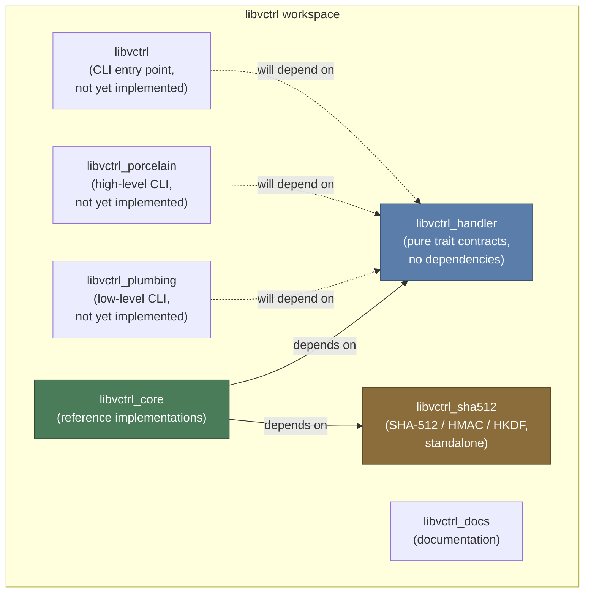
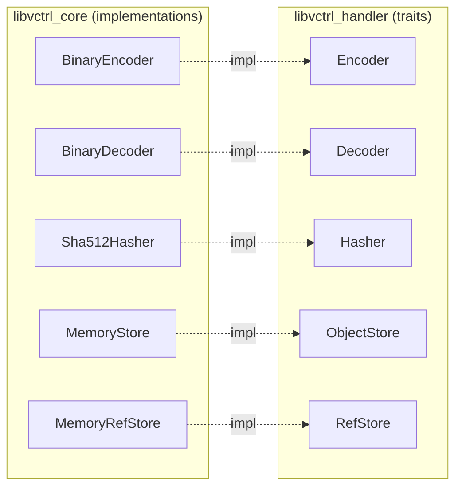

# libvctrl_core

## Overview

`libvctrl_core` is the reference implementation crate for the `libvctrl_handler` trait contracts. It provides production-ready, fully safe, and strictly linted concrete implementations of the abstract interfaces required to build a modular, content-addressable version control system.

This crate exists for three reasons:

- **Contract validation** -- If a trait in `libvctrl_handler` is too difficult or ambiguous to implement, the problem is discovered here first, before downstream consumers encounter it.
- **Batteries included** -- Developers get a working VCS backend stack (hashing, storage, encoding, validation) immediately, without writing boilerplate implementations.
- **Quality exemplar** -- All code forbids unsafe (`#![forbid(unsafe_code)]`), passes `clippy::pedantic` and `clippy::nursery`, is heavily tested, and extensively documented. It serves as the authoritative model for anyone writing custom backends.

## Architecture

`libvctrl_core` is one crate inside the `libvctrl` Cargo workspace. It depends on two sibling crates -- `libvctrl_handler` (the trait contracts) and `libvctrl_sha512` (a pure-Rust SHA-512 implementation) -- and implements their interfaces with concrete, production-ready types.

### Workspace Crate Dependency Graph



### Internal Module Architecture

Each module in `libvctrl_core` corresponds to a domain responsibility defined in `libvctrl_handler`. The following diagram illustrates the internal structure and the trait-to-implementation mapping:



### Object Lifecycle and Data Flow

The following sequence diagram shows the complete lifecycle of a VCS object as it is created, validated, hashed, encoded, and stored:

```mermaid
sequenceDiagram
    participant App as Application
    participant Obj as object module
    participant Val as validate module
    participant Hash as Sha512Hasher
    participant Enc as BinaryEncoder
    participant Store as MemoryStore

    App->>Obj: Construct Blob / Tree / Commit / Tag
    Obj->>Val: validate_name() / validate_hash_bytes()
    Val-->>Obj: Ok or VctrlError

    App->>Hash: hash(&binary_data)
    Hash-->>App: Hash (64-byte SHA-512 digest)

    App->>Enc: encode_blob(&blob)
    Enc-->>App: Vec&lt;u8&gt; (versioned binary payload)

    App->>Store: put(hash, &mut Read)
    Store-->>App: Ok(())

    Note over App,Store: Round-trip: Store.get(hash) -> BinaryDecoder.decode_*() -> original object
```

## Core Features

- **Binary Codec** -- Deterministic, versioned, little-endian binary wire format with length-prefixed variable-length fields. Supports full round-trip encode/decode for all four VCS object types (`Blob`, `Tree`, `Commit`, `Tag`).
- **Defensive Decoding** -- The `BinaryDecoder` is panic-free. Every slice access is bounds-checked. Malformed or truncated payloads return `VctrlError::CorruptedData` rather than crashing.
- **DoS-Resistant Allocation** -- Before allocating memory for variable-length fields (blob data, commit messages, tag messages), the decoder validates the requested length against system limits (`MAX_BLOB_SIZE`, `MAX_MESSAGE_LENGTH`, `MAX_TREE_ENTRIES`).
- **SHA-512 Content Addressing** -- `Sha512Hasher` delegates to the audited, pure-Rust `libvctrl_sha512` crate to produce 64-byte digests, providing a massive keyspace that makes accidental collisions practically impossible.
- **In-Memory Object Store** -- `MemoryStore` implements `ObjectStore` with `Box<dyn Read>` for lightweight testing, simulation, and prototyping without any filesystem or network dependency.
- **In-Memory Reference Store** -- `MemoryRefStore` implements `RefStore` with a `RefsIterator` for managing named references (branches, tags) in memory.
- **Object Builders** -- The `object` module provides constructors and builder logic for `Blob`, `Commit`, `Tag`, `Tree`, and `TreeEntry` domain objects.
- **Input Validation** -- The `validate` module enforces hash byte length (`validate_hash_bytes`) and name safety (`validate_name`), including path traversal attack prevention.
- **Strict UTF-8 Enforcement** -- All string fields in decoded payloads are validated with `str::from_utf8`. Invalid sequences result in a corruption error.
- **Wire Format Versioning** -- Every serialized payload begins with a version byte. Incompatible formats are rejected early by the decoder, enabling future breaking changes to the wire format without silent data corruption.
- **Zero Unsafe** -- The entire crate compiles with `#![forbid(unsafe_code)]` and passes `clippy::pedantic` plus `clippy::nursery`.

## Technology Stack

- **Language:** Rust (Edition 2024, minimum toolchain 1.85+)
- **Core Dependency:** `libvctrl_handler` v4.0.0 -- trait contracts (`Encoder`, `Decoder`, `Hasher`, `ObjectStore`, `RefStore`) and domain types (`Blob`, `Tree`, `Commit`, `Tag`, `Hash`, `VctrlError`, and limits)
- **Crypto Dependency:** `libvctrl_sha512` v2.0.0 -- pure-Rust SHA-512, HMAC, and HKDF implementation
- **Linting:** `#![forbid(unsafe_code)]`, `clippy::pedantic`, `clippy::nursery`
- **Testing:** `cargo test` with integration and unit tests covering all encode/decode round-trips, validation edge cases, and store operations

## Project Structure

```text
src/
├── codec/
│   ├── binary_decoder.rs    # BinaryDecoder: panic-free deserialization
│   ├── binary_encoder.rs    # BinaryEncoder: deterministic serialization
│   └── mod.rs               # Re-exports BinaryEncoder, BinaryDecoder
├── hash/
│   ├── mod.rs               # Re-exports Sha512Hasher
│   └── sha512.rs            # Sha512Hasher: SHA-512 Hasher trait impl
├── lib.rs                   # Crate root: module declarations, re-exports, docs
├── object/
│   ├── blob.rs              # Blob object builder/constructor
│   ├── commit.rs            # Commit object builder/constructor
│   ├── mod.rs               # Re-exports object types
│   ├── tag.rs               # Tag object builder/constructor
│   └── tree.rs              # Tree and TreeEntry object builders
├── store/
│   ├── memory.rs            # MemoryStore: in-memory ObjectStore impl
│   ├── mod.rs               # Re-exports store types
│   └── ref_store.rs         # MemoryRefStore: in-memory RefStore impl
└── validate/
    ├── hash.rs              # validate_hash_bytes: 64-byte hash enforcement
    ├── mod.rs               # Re-exports validation functions
    └── name.rs              # validate_name: length + path traversal prevention
```

### Module Responsibility Summary

| Module     | Purpose                                  | Key Types Implemented                        | Traits Satisfied          |
| ---------- | ---------------------------------------- | -------------------------------------------- | ------------------------- |
| `codec`    | Binary serialization and deserialization | `BinaryEncoder`, `BinaryDecoder`             | `Encoder`, `Decoder`      |
| `hash`     | Cryptographic content addressing         | `Sha512Hasher`                               | `Hasher`                  |
| `object`   | Domain object construction               | `Blob`, `Tree`, `TreeEntry`, `Commit`, `Tag` | N/A (builders)            |
| `store`    | Object and reference persistence         | `MemoryStore`, `MemoryRefStore`              | `ObjectStore`, `RefStore` |
| `validate` | Input sanitization and safety checks     | `validate_hash_bytes`, `validate_name`       | N/A (free functions)      |

## Getting Started

### Prerequisites

- **Rust toolchain** -- Stable Rust 1.85 or later (Edition 2024 is required).
- **Cargo** -- Included with the Rust toolchain.
- **Access to crates.io** -- For resolving `libvctrl_handler` and `libvctrl_sha512` dependencies.

Install the toolchain if not already present:

```bash
rustup install stable
rustup default stable
rustup update stable
```

Verify the version:

```bash
rustc --version
# Expect: rustc 1.85.0 (or later)
```

### Installation

Add `libvctrl_core` to your `Cargo.toml`:

```toml
[dependencies]
libvctrl_core = "4.0"
```

If you are working inside the `libvctrl` workspace, the dependency is already configured via the workspace `Cargo.toml`. Clone and build:

```bash
git clone <repository-url> libvctrl
cd libvctrl
cargo build -p libvctrl_core
```

### Configuration

There are no feature flags, environment variables, or runtime configuration files required by `libvctrl_core` at this time. All modules are compiled by default.

The relevant system limits are defined in `libvctrl_handler` and consumed by this crate:

| Constant             | Purpose                                                                           |
| -------------------- | --------------------------------------------------------------------------------- |
| `MAX_BLOB_SIZE`      | Maximum allowed blob data length in bytes. Prevents DoS via oversized allocation. |
| `MAX_MESSAGE_LENGTH` | Maximum allowed commit/tag message length in bytes.                               |
| `MAX_TREE_ENTRIES`   | Maximum allowed number of entries in a single `Tree` object.                      |
| `HASH_LENGTH`        | Expected hash digest length (64 bytes for SHA-512).                               |

## Usage

### Encoding and Decoding Objects

All four VCS object types follow the same encode/decode pattern. The `BinaryEncoder` serializes objects into a versioned binary payload, and the `BinaryDecoder` deserializes them back.

```rust
use libvctrl_handler::{Blob, Encoder, Decoder};
use libvctrl_core::codec::{BinaryEncoder, BinaryDecoder};

// Construct a Blob
let blob = Blob::new(b"file content here".to_vec());

// Encode to binary
let encoder = BinaryEncoder;
let bytes = encoder.encode_blob(&blob).expect("encoding failed");

// Decode back to a Blob
let decoder = BinaryDecoder;
let decoded = decoder.decode_blob(&bytes).expect("decoding failed");

assert_eq!(decoded, blob);
```

### Hashing Objects

```rust
use libvctrl_handler::Hasher;
use libvctrl_core::hash::Sha512Hasher;

let hasher = Sha512Hasher;
let digest = hasher.hash(b"content to address");

// The digest is a 64-byte Hash value
assert_eq!(digest.as_bytes().len(), 64);
```

### Using the In-Memory Store

```rust
use libvctrl_handler::{Hasher, ObjectStore};
use libvctrl_core::hash::Sha512Hasher;
use libvctrl_core::store::MemoryStore;
use std::io::Cursor;

let store = MemoryStore::new();
let hasher = Sha512Hasher;

// Compute the content hash
let data = b"stored content";
let hash = hasher.hash(data);

// Put the object into the store
let mut reader = Cursor::new(data.to_vec());
store.put(&hash, &mut reader).expect("put failed");

// Retrieve the object
let mut retrieved = store.get(&hash).expect("get failed");
let mut buf = Vec::new();
retrieved.read_to_end(&mut buf).expect("read failed");
assert_eq!(buf, data);
```

### Validating Names

```rust
use libvctrl_core::validate::validate_name;

// Valid name
assert!(validate_name("src/main.rs").is_ok());

// Path traversal attack is rejected
assert!(validate_name("../../etc/passwd").is_err());
```

## API Reference / Core Modules

### codec::BinaryEncoder

A stateless unit struct implementing the `Encoder` trait. Serializes VCS objects into a compact, versioned, little-endian binary format.

| Method          | Input     | Output Format                                                                |
| --------------- | --------- | ---------------------------------------------------------------------------- |
| `encode_blob`   | `&Blob`   | `VERSION(1B) + data_len(8B u64 LE) + data`                                   |
| `encode_tree`   | `&Tree`   | `VERSION(1B) + entry_count(4B u32 LE) + [entries]`                           |
| `encode_commit` | `&Commit` | `VERSION(1B) + tree_hash(64B) + parent_count(1B) + ... + message + metadata` |
| `encode_tag`    | `&Tag`    | `VERSION(1B) + name + target_hash(64B) + tagger? + message + metadata`       |

The wire format version is `2` (public constant `codec::binary_encoder::VERSION`).

### codec::BinaryDecoder

A stateless unit struct implementing the `Decoder` trait. Performs panic-free, bounds-checked deserialization of binary payloads produced by `BinaryEncoder`.

| Method          | Input   | Error Conditions                                                                                        |
| --------------- | ------- | ------------------------------------------------------------------------------------------------------- |
| `decode_blob`   | `&[u8]` | Truncated data, version mismatch, blob exceeds `MAX_BLOB_SIZE`, length mismatch                         |
| `decode_tree`   | `&[u8]` | Truncated data, version mismatch, entry count exceeds `MAX_TREE_ENTRIES`, invalid UTF-8, malformed hash |
| `decode_commit` | `&[u8]` | Truncated data, version mismatch, message exceeds `MAX_MESSAGE_LENGTH`, invalid UTF-8                   |
| `decode_tag`    | `&[u8]` | Truncated data, version mismatch, invalid tagger presence byte, invalid UTF-8, message exceeds limit    |

### hash::Sha512Hasher

A zero-sized type implementing the `Hasher` trait. Produces 64-byte SHA-512 digests by delegating to `libvctrl_sha512`.

| Method | Input   | Output                  |
| ------ | ------- | ----------------------- |
| `hash` | `&[u8]` | `Hash` (64-byte digest) |

### store::MemoryStore

An in-memory implementation of `ObjectStore`. Stores objects as `Vec<u8>` keyed by `Hash`. Suitable for testing and prototyping.

| Method                      | Description                                |
| --------------------------- | ------------------------------------------ |
| `new()`                     | Creates an empty store                     |
| `put(&Hash, &mut dyn Read)` | Stores an object under the given hash      |
| `get(&Hash)`                | Retrieves a `Box<dyn Read>` for the object |

### store::MemoryRefStore

An in-memory implementation of `RefStore`. Manages named references (branches, tags) as `Hash` values.

| Method             | Description                                  |
| ------------------ | -------------------------------------------- |
| `new()`            | Creates an empty reference store             |
| `resolve(&str)`    | Resolves a reference name to its `Hash`      |
| `set(&str, &Hash)` | Sets a reference name to point to a hash     |
| `iter()`           | Returns a `RefsIterator` over all references |

### validate

| Function              | Signature                           | Purpose                                                                                                   |
| --------------------- | ----------------------------------- | --------------------------------------------------------------------------------------------------------- |
| `validate_hash_bytes` | `(&[u8]) -> Result<(), VctrlError>` | Ensures the slice is exactly 64 bytes (HASH_LENGTH)                                                       |
| `validate_name`       | `(&str) -> Result<(), VctrlError>`  | Ensures the name is non-empty, within length limits, and does not contain path traversal sequences (`..`) |

### Binary Wire Format Specification

All payloads share a common structure: a leading version byte followed by type-specific fields. Integers are little-endian. Variable-length data is length-prefixed.

**Blob**

```text
Offset  Size    Field
0       1       VERSION (u8, always 2)
1       8       data_len (u64 LE)
9       N       data (N = data_len bytes)
```

**Tree**

```text
Offset  Size    Field
0       1       VERSION (u8, always 2)
1       4       entry_count (u32 LE)
5       ...     entries (repeated entry_count times):
                  1       name_len (u8)
                  N       name (UTF-8, N = name_len)
                  1       kind (0=Blob, 1=Executable, 2=Symlink, 3=Tree, 4=Submodule)
                  64      hash
```

**Commit**

```text
Offset  Size    Field
0       1       VERSION (u8, always 2)
1       64      tree_hash
65      1       parent_count (u8)
66      P*64    parent_hashes
..      1       author_name_len (u8)
..      N       author_name (UTF-8)
..      1       author_email_len (u8)
..      N       author_email (UTF-8)
..      1       committer_name_len (u8)
..      N       committer_name (UTF-8)
..      1       committer_email_len (u8)
..      N       committer_email (UTF-8)
..      4       msg_len (u32 LE)
..      N       message (UTF-8, N = msg_len)
..      8       timestamp (i64 LE)
..      2       timezone_offset (i16 LE)
..      1       encoding_len (u8)
..      N       encoding (UTF-8, N = encoding_len; 0 means None)
```

**Tag**

```text
Offset  Size    Field
0       1       VERSION (u8, always 2)
1       1       name_len (u8)
2       N       name (UTF-8, N = name_len)
..      64      target_hash
..      1       has_tagger (0 or 1)
..      [if has_tagger == 1:]
          1       tagger_name_len (u8)
          N       tagger_name (UTF-8)
          1       tagger_email_len (u8)
          N       tagger_email (UTF-8)
..      4       msg_len (u32 LE)
..      N       message (UTF-8, N = msg_len)
..      8       timestamp (i64 LE)
..      2       timezone_offset (i16 LE)
..      1       encoding_len (u8)
..      N       encoding (UTF-8, N = encoding_len; 0 means None)
```

## Testing

All tests are run via the standard Cargo test harness:

```bash
# Run all tests for this crate
cargo test -p libvctrl_core

# Run with output for individual tests
cargo test -p libvctrl_core -- --nocapture

# Run only encode/decode round-trip tests
cargo test -p libvctrl_core round_trip
```

The test suite covers:

- **Encode/decode round-trips** for all four object types (`Blob`, `Tree`, `Commit`, `Tag`).
- **Corrupted data rejection** -- truncated payloads, wrong version bytes, invalid UTF-8, malformed hashes.
- **DoS limit enforcement** -- blobs exceeding `MAX_BLOB_SIZE`, messages exceeding `MAX_MESSAGE_LENGTH`, trees exceeding `MAX_TREE_ENTRIES`.
- **Validation edge cases** -- empty names, overly long names, path traversal attempts, incorrect hash lengths.
- **Store operations** -- put/get round-trips in `MemoryStore`, reference resolution in `MemoryRefStore`.

## Contributing

Contributions are welcome. Please adhere to the following standards:

1. **No unsafe code.** The crate forbids it at the compiler level. Do not attempt to add `unsafe` blocks.
2. **Clippy compliance.** All contributions must pass `cargo clippy -- -D warnings` with the project's lint configuration (`clippy::pedantic`, `clippy::nursery`).
3. **Documentation.** Every public item must have a doc comment explaining its purpose, design rationale, and error conditions. Module-level doc comments must include at least one example.
4. **Tests.** Every new feature or bug fix must include tests that cover both the happy path and failure modes (corrupted data, limit enforcement, invalid input).
5. **Format.** Run `cargo fmt` before committing. CI will reject unformatted code.
6. **Wire format stability.** Changes to the binary wire format must bump the `VERSION` constant in both `binary_encoder.rs` and `binary_decoder.rs`. Never change the encoding of an existing version.
7. **Workspace consistency.** This crate lives in the `libvctrl` workspace. Ensure that changes to `libvctrl_core` do not break the contract signatures in `libvctrl_handler`. If a contract change is needed, update `libvctrl_handler` first and version both crates together.

### CI Checklist

Before opening a pull request, verify locally:

```bash
cargo fmt --check -p libvctrl_core
cargo clippy -p libvctrl_core -- -D warnings
cargo test -p libvctrl_core
cargo doc -p libvctrl_core --no-deps
```
