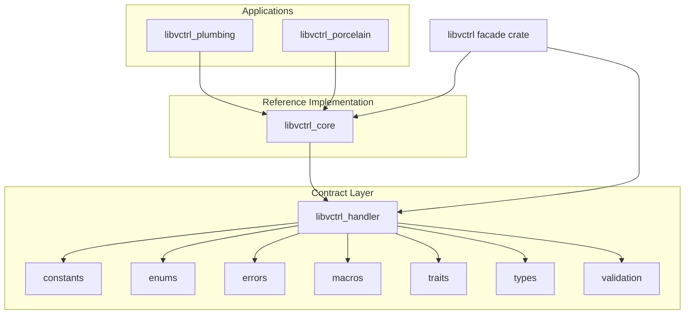
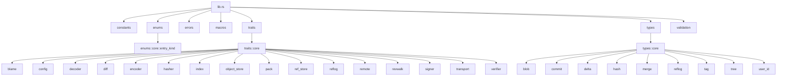

# libvctrl_handler

**A rigorously typed, trait-driven Git object framework in Rust**

_Constitution (handler), reference implementation (core), and plumbing commands_

---

## Overview

`libvctrl` is a modular framework for building version control systems, structured around a strict separation between **contracts** and **implementations**. This repository contains the foundational contract layer, packaged as the crate `libvctrl_handler`.

The handler crate defines:

- A complete set of **traits** for every major VCS operation: object storage, encoding, decoding, hashing, indexing, reference management, reflogs, remote transport, packing, signing, verification, revision walking, diffing, blame, and configuration.
- **Data types** representing Git objects (`Blob`, `Tree`, `Commit`, `Tag`) and supporting structures (`Hash`, `UserID`, `TreeEntry`, deltas, merges, reflog entries).
- **Constants** enforcing safe size and count limits.
- **Validation functions** that define the security boundary for names, references, tree entries, and hashes.
- A unified **error type** (`VctrlError`) that all trait implementations must use.

`libvctrl_handler` contains **no concrete implementations**. It is the "constitution" upon which all other crates in the `libvctrl` ecosystem are built. The reference implementation `libvctrl_core` provides working implementations of the traits (in-memory object store, binary encoder/decoder, SHA-512 hasher, etc.). Higher-level crates `libvctrl_plumbing` and `libvctrl_porcelain` build on top of `libvctrl_core`.

The primary facade crate is `libvctrl`, which re-exports the handler types and the reference implementation so integrators can use the whole framework with a single dependency.

---

## Architecture

The architecture enforces a one-way dependency flow:

- **Handler (contract layer)** — this crate — depends only on the Rust standard library.
- **Core (reference implementation)** depends on the handler and provides concrete implementations.
- **Plumbing/Porcelain** depend on the core and provide command-level or high-level VCS operations.

The following diagram illustrates the crate dependency structure:



Within the handler crate, the module organization is as follows:



---

## Core Features

- **Trait-only contracts** — Every VCS subsystem is expressed as a `trait` with clear method signatures, error returns, and `Send + Sync` bounds. Implementations are decoupled from consumers.
- **Git-compatible data types** — `Blob`, `Tree`, `TreeEntry`, `Commit`, `Tag`, `UserID`, and their supporting types mirror the Git object model and enforce Git-like invariants.
- **Fixed-size hash** — `Hash` is a newtype over `[u8; 64]` (SHA-512 length), with hexadecimal parsing, display, and ordering.
- **Validation as a security boundary** — Dedicated functions validate names, references, tree entry names, and hash lengths. Implementation crates must call these functions, never duplicate the logic.
- **Comprehensive error hierarchy** — `VctrlError` covers invalid lengths, missing objects, corrupted data, I/O failures, serialization issues, tree structure errors, duplicate parents, size limit breaches, and invalid blame ranges.
- **Strict compile-time guarantees** — The crate uses `#![forbid(unsafe_code)]`, `#![deny(missing_docs)]`, and a suite of Clippy lints to ensure safe, well-documented, idiomatic code.

---

## Technology Stack

- **Language:** Rust (edition 2024)
- **Standard library only:** No external dependencies. The handler crate uses only `std` types (`std::io`, `std::collections::HashSet`, `std::path`, etc.).
- **Frameworks/Libraries:** None. This crate is a pure contract definition.
- **Toolchain:** Requires Rust 1.85 or newer (for edition 2024 support).

---

## Project Structure

The source tree of `libvctrl_handler` is organized as follows:

```text
libvctrl_handler/
├── Cargo.toml
└── src/
    ├── lib.rs
    ├── constants.rs
    ├── enums/
    │   ├── mod.rs
    │   └── core/
    │       ├── mod.rs
    │       └── entry_kind.rs
    ├── errors.rs
    ├── macros.rs
    ├── traits/
    │   ├── mod.rs
    │   └── core/
    │       ├── mod.rs
    │       ├── blame.rs
    │       ├── config.rs
    │       ├── decoder.rs
    │       ├── diff.rs
    │       ├── encoder.rs
    │       ├── hasher.rs
    │       ├── index.rs
    │       ├── object_store.rs
    │       ├── pack.rs
    │       ├── ref_store.rs
    │       ├── reflog.rs
    │       ├── remote.rs
    │       ├── revwalk.rs
    │       ├── signer.rs
    │       ├── transport.rs
    │       └── verifier.rs
    ├── types/
    │   ├── mod.rs
    │   └── core/
    │       ├── mod.rs
    │       ├── blob.rs
    │       ├── commit.rs
    │       ├── delta.rs
    │       ├── hash.rs
    │       ├── merge.rs
    │       ├── reflog.rs
    │       ├── tag.rs
    │       ├── tree.rs
    │       └── user_id.rs
    └── validation/
        ├── mod.rs
        ├── hash.rs
        └── name.rs
```

---

## Getting Started

### Prerequisites

- **Rust 1.85 or newer** — required for the 2024 edition.
- **Cargo** — the Rust package manager.
- No system-level dependencies are required; the handler crate is pure Rust.

### Installation

For most integrators, the recommended entry point is the `libvctrl` facade crate, which re-exports both the handler contracts and the reference implementation:

```toml
[dependencies]
libvctrl = "4.4"
```

If you are developing an implementation crate and need to depend directly on the contract layer:

```toml
[dependencies]
libvctrl_handler = "4.4"
```

To use the handler from a local checkout or a Git repository:

```toml
[dependencies]
libvctrl_handler = { git = "https://github.com/mroczect/libvctrl", branch = "master" }
```

### Configuration

The handler crate itself requires no configuration or environment variables. All size and count limits are defined as constants in `libvctrl_handler::constants` and are enforced by the validation functions and type constructors.

However, the `ConfigStore` trait defines an abstraction for reading and writing configuration values. The reference implementation and higher-level crates may use this trait to handle user configuration.

---

## Usage

The handler crate is not meant to be used directly by end users; it is consumed by implementors and integrators. The following examples illustrate how the contracts are used.

### Implementing a trait

Implementations must satisfy the trait's method signatures and return `VctrlError` on failure. The following example shows a minimal in-memory object store:

```rust
use libvctrl_handler::{ObjectStore, Hash, VctrlError};
use std::collections::HashMap;
use std::io::{self, Read};

pub struct MemoryStore {
    objects: HashMap<Hash, Vec<u8>>,
}

impl MemoryStore {
    pub fn new() -> Self {
        Self { objects: HashMap::new() }
    }
}

impl ObjectStore for MemoryStore {
    fn put(&mut self, hash: &Hash, data: &[u8]) -> Result<(), VctrlError> {
        self.objects.insert(*hash, data.to_vec());
        Ok(())
    }

    fn get(&self, hash: &Hash) -> Result<Box<dyn Read + Send + '_>, VctrlError> {
        match self.objects.get(hash) {
            Some(data) => Ok(Box::new(io::Cursor::new(data.clone()))),
            None => Err(VctrlError::ObjectNotFound(*hash)),
        }
    }

    fn delete(&mut self, hash: &Hash) -> Result<(), VctrlError> {
        self.objects.remove(hash).map(|_| ()).ok_or(VctrlError::ObjectNotFound(*hash))
    }

    fn exists(&self, hash: &Hash) -> Result<bool, VctrlError> {
        Ok(self.objects.contains_key(hash))
    }
}
```

### Constructing a validated data type

Data types enforce validation in their constructors. For example, creating a `Commit` with metadata:

```rust
use libvctrl_handler::{Commit, CommitMeta, UserID, Hash};
use libvctrl_handler::VctrlError;

fn create_commit(tree_hash: Hash, parent: Hash, author: UserID, committer: UserID) -> Result<Commit, VctrlError> {
    let meta = CommitMeta::new(
        1_700_000_000,      // timestamp
        0,                  // timezone offset (UTC)
        Some("UTF-8".into()),
    )?;

    Commit::with_meta(
        tree_hash,
        vec![parent],
        author,
        committer,
        "Initial commit".to_string(),
        meta,
    )
}
```

### Encoder/Decoder roundtrip

The `Encoder` and `Decoder` traits define how objects are serialized and deserialized. Implementations must adhere to the binary format contract:

```rust
use libvctrl_handler::{Encoder, Decoder, Commit, VctrlError};
use std::io::{Cursor, Read, Write};

fn roundtrip_commit<D: Decoder, E: Encoder>(
    decoder: &D,
    encoder: &E,
    commit: &Commit,
) -> Result<Commit, VctrlError> {
    let mut buffer = Vec::new();
    encoder.encode_commit(commit, &mut buffer)?;

    let mut reader = Cursor::new(buffer);
    decoder.decode_commit(reader)
}
```

---

## API Reference / Core Modules

This section documents the public API of the handler crate.

### `constants`

Defines size and count limits and Git entry mode bits.

| Constant             | Value               | Description                                         |
| -------------------- | ------------------- | --------------------------------------------------- |
| `HASH_LENGTH`        | `64`                | Length of a hash in bytes (SHA-512).                |
| `MAX_NAME_LENGTH`    | `255`               | Maximum length for names, in bytes.                 |
| `MAX_BLOB_SIZE`      | `100 * 1024 * 1024` | Maximum blob size in bytes (100 MiB).               |
| `MAX_TREE_ENTRIES`   | `100_000`           | Maximum number of entries in a tree.                |
| `MAX_MESSAGE_LENGTH` | `1024 * 1024`       | Maximum commit/tag message length in bytes (1 MiB). |
| `MAX_PARENT_COUNT`   | `65535`             | Maximum number of parent commits.                   |

`constants::entry_mode` provides Git mode bits:

| Mode         | Value (octal) | Description       |
| ------------ | ------------- | ----------------- |
| `BLOB`       | `0o100_644`   | Regular file.     |
| `EXECUTABLE` | `0o100_755`   | Executable file.  |
| `SYMLINK`    | `0o120_000`   | Symbolic link.    |
| `TREE`       | `0o40_000`    | Directory (tree). |
| `SUBMODULE`  | `0o160_000`   | Submodule commit. |

### `enums::EntryKind`

Represents the kind of an entry in a Git tree.

| Variant      | Mode         | Description       |
| ------------ | ------------ | ----------------- |
| `Blob`       | `BLOB`       | Regular file.     |
| `Executable` | `EXECUTABLE` | Executable file.  |
| `Symlink`    | `SYMLINK`    | Symbolic link.    |
| `Tree`       | `TREE`       | Directory.        |
| `Submodule`  | `SUBMODULE`  | Submodule commit. |

Methods: `mode()` returns the mode bits; `from_mode(mode: u32) -> Option<Self>` converts raw mode bits.

### `errors::VctrlError`

The unified error type for all operations.

| Variant                        | Description                                                     |
| ------------------------------ | --------------------------------------------------------------- |
| `InvalidHashLength(usize)`     | Hash length did not match expected 64 bytes.                    |
| `InvalidName(String)`          | Name invalid (empty, too long, or contains control characters). |
| `InvalidEmail(String)`         | Email invalid.                                                  |
| `ObjectNotFound(Hash)`         | Object not found.                                               |
| `RefNotFound(String)`          | Reference not found.                                            |
| `CorruptedData(String)`        | Data corrupted or malformed.                                    |
| `IoError(Arc<std::io::Error>)` | I/O error.                                                      |
| `SerializationError(String)`   | Serialization/deserialization error.                            |
| `Other(String)`                | Any other error.                                                |
| `InvalidTreeStructure(String)` | Tree structure invalid (unsorted entries, duplicates).          |
| `InvalidTimezoneOffset(i16)`   | Timezone offset out of range (-1440 to 1440).                   |
| `DuplicateParent`              | Commit contains duplicate parent hashes.                        |
| `ExceededMaxSize(String)`      | Size or count limit exceeded.                                   |
| `InvalidBlameRange`            | Invalid blame range (zero line count).                          |

`VctrlError` implements `Display`, `Error`, `PartialEq`, and `Eq`. It also provides `from_io(e: std::io::Error) -> Self` for canonical I/O error conversion.

### `macros`

- **`vctrl_error_other!`** — Constructs a `VctrlError::Other` from a format string and arguments.

```rust
let err = vctrl_error_other!("Failed to parse {}", "object");
```

### `traits::core`

The following traits are defined. All are `Send + Sync`.

#### `Blame`

Computes blame information for files.

```rust
fn blame_file(&self, path: &str) -> Result<Vec<BlameEntry>, VctrlError>;
```

`BlameEntry` represents a line range attributed to a commit.

#### `ConfigStore`

Reads and writes configuration values.

```rust
fn get_string(&self, section: &str, key: &str) -> Result<Option<String>, VctrlError>;
fn set_string(&mut self, section: &str, key: &str, value: &str) -> Result<(), VctrlError>;
fn get_bool(&self, section: &str, key: &str) -> Result<Option<bool>, VctrlError>;
fn set_bool(&mut self, section: &str, key: &str, value: bool) -> Result<(), VctrlError>;
fn remove(&mut self, section: &str, key: &str) -> Result<(), VctrlError>;
fn exists(&self, section: &str, key: &str) -> Result<bool, VctrlError>;
```

#### `Decoder`

Decodes raw Git object bytes into structured types.

```rust
fn decode_blob<R: Read + Send>(&self, reader: R) -> Result<Blob, VctrlError>;
fn decode_tree<R: Read + Send>(&self, reader: R) -> Result<Tree, VctrlError>;
fn decode_commit<R: Read + Send>(&self, reader: R) -> Result<Commit, VctrlError>;
fn decode_tag<R: Read + Send>(&self, reader: R) -> Result<Tag, VctrlError>;
```

#### `TreeDiffer`

Computes differences between two trees.

```rust
type TreeId: Send + Sync;
fn diff_trees(&self, old: &Self::TreeId, new: &Self::TreeId) -> Result<TreeDelta, VctrlError>;
```

#### `Encoder`

Encodes structured Git objects into raw bytes.

```rust
fn encode_blob<W: Write + Send>(&self, blob: &Blob, writer: &mut W) -> Result<(), VctrlError>;
fn encode_tree<W: Write + Send>(&self, tree: &Tree, writer: &mut W) -> Result<(), VctrlError>;
fn encode_commit<W: Write + Send>(&self, commit: &Commit, writer: &mut W) -> Result<(), VctrlError>;
fn encode_tag<W: Write + Send>(&self, tag: &Tag, writer: &mut W) -> Result<(), VctrlError>;
```

#### `Hasher`

Computes hash values.

```rust
fn hash<R: Read + Send>(&self, reader: R) -> Result<Hash, VctrlError>;
```

#### `Index`

Manages a Git index (staging area).

```rust
type Entry: Send + Sync;
type Path: Send + Sync;
type TreeId: Send + Sync;

fn add(&mut self, entry: Self::Entry) -> Result<(), VctrlError>;
fn remove(&mut self, path: &Self::Path) -> Result<(), VctrlError>;
fn clear(&mut self) -> Result<(), VctrlError>;
fn get(&self, path: &Self::Path) -> Result<Option<Self::Entry>, VctrlError>;
fn contains(&self, path: &Self::Path) -> Result<bool, VctrlError>;
fn len(&self) -> Result<usize, VctrlError>;
fn is_empty(&self) -> Result<bool, VctrlError>;
fn entries(&self) -> Result<Vec<Self::Entry>, VctrlError>;
fn write_tree(&self) -> Result<Self::TreeId, VctrlError>;
fn read_tree(&mut self, tree: &Self::TreeId) -> Result<(), VctrlError>;
```

#### `ObjectStore`

Stores and retrieves Git objects.

```rust
fn put(&mut self, hash: &Hash, data: &[u8]) -> Result<(), VctrlError>;
fn get(&self, hash: &Hash) -> Result<Box<dyn Read + Send + '_>, VctrlError>;
fn delete(&mut self, hash: &Hash) -> Result<(), VctrlError>;
fn exists(&self, hash: &Hash) -> Result<bool, VctrlError>;
```

#### `PackWriter` / `PackReader`

Write and read Git pack files.

```rust
// PackWriter
type ObjectId: Send + Sync;
fn write_object(&mut self, id: &Self::ObjectId, data: &[u8]) -> Result<(), VctrlError>;
fn finish(&mut self) -> Result<(), VctrlError>;

// PackReader
type ObjectId: Send + Sync;
fn read_object(&self, id: &Self::ObjectId) -> Result<Box<dyn Read + Send + '_>, VctrlError>;
```

#### `RefStore`

Manages Git references (branches, tags, etc.).

```rust
type RefsIterator: Iterator<Item = Result<String, VctrlError>> + Send;

fn set_ref(&mut self, name: &str, hash: &Hash) -> Result<(), VctrlError>;
fn get_ref(&self, name: &str) -> Result<Hash, VctrlError>;
fn delete_ref(&mut self, name: &str) -> Result<(), VctrlError>;
fn list_refs(&self) -> Result<Self::RefsIterator, VctrlError>;
```

#### `ReflogStore`

Manages reflogs.

```rust
type RefName: Send + Sync;

fn append(
    &mut self,
    reference: &Self::RefName,
    old_hash: Option<Hash>,
    new_hash: Option<Hash>,
    reason: &str,
    timestamp: i64,
    timezone_offset: i16,
) -> Result<(), VctrlError>;

fn entries(&self, reference: &Self::RefName) -> Result<Vec<ReflogEntry>, VctrlError>;
```

#### `Remote`

Interacts with remote repositories.

```rust
type RefSpec: Send + Sync;
type RemoteRef: Send + Sync;

fn list_refs(&self) -> Result<Vec<Self::RemoteRef>, VctrlError>;
fn fetch(&mut self, refspecs: &[Self::RefSpec]) -> Result<(), VctrlError>;
fn push(&mut self, refspecs: &[Self::RefSpec]) -> Result<(), VctrlError>;
```

#### `RevWalk`

Walks commit history.

```rust
type CommitId: Send + Sync;
fn walk(&self, start: &Self::CommitId) -> Result<RevWalkIterator<'_, Self::CommitId>, VctrlError>;
```

#### `Signer`

Signs data.

```rust
fn sign(&mut self, key_id: &str, data: &[u8]) -> Result<Vec<u8>, VctrlError>;
```

#### `Transport`

Transports Git objects.

```rust
fn fetch_object(&self, hash: &Hash) -> Result<Box<dyn Read + Send + '_>, VctrlError>;
fn push_object(&mut self, hash: &Hash, data: &[u8]) -> Result<(), VctrlError>;
```

#### `Verifier`

Verifies signatures.

```rust
fn verify(&self, key_id: &str, data: &[u8], signature: &[u8]) -> Result<bool, VctrlError>;
```

### `types::core`

The following data types are defined:

#### `Hash`

Fixed-size hash of 64 bytes (SHA-512 length).

- `from_bytes(bytes: &[u8]) -> Result<Self, VctrlError>` — validates length.
- `as_bytes() -> &[u8; 64]` — raw bytes.
- Implements `From<[u8; 64]>`, `TryFrom<&[u8]>`, `AsRef<[u8]>`, `FromStr` (hex string), `Display` (hex), `Debug` (truncated), `PartialOrd`, `Ord`.

#### `Blob`

Represents a Git blob (file content).

- `new(data: Vec<u8>) -> Result<Self, VctrlError>` — enforces `MAX_BLOB_SIZE`.
- `data() -> &[u8]`, `size() -> usize`, `is_empty() -> bool`.

#### `TreeEntry`

Represents a single entry in a tree.

- `new(name: String, kind: EntryKind, hash: Hash) -> Result<Self, VctrlError>` — validates tree entry name.
- Accessors: `name()`, `kind()`, `hash()`.

#### `Tree`

Represents a Git tree (directory listing). Entries are always sorted according to Git ordering rules (tree entries are compared as if their name has a trailing `/`). Duplicate names are rejected.

- `new(entries: Vec<TreeEntry>) -> Result<Self, VctrlError>` — sorts and validates.
- Accessors: `entries() -> &[TreeEntry]`, `len()`, `is_empty()`, `get(name: &str) -> Option<&TreeEntry>`.

#### `UserID`

Represents a user identity (author or committer).

- `new(name: String, email: String) -> Result<Self, VctrlError>` — validates name and email.
- Accessors: `name()`, `email()`.

#### `CommitMeta`

Metadata associated with a commit or tag.

- `new(timestamp: i64, timezone_offset: i16, encoding: Option<String>) -> Result<Self, VctrlError>` — validates timezone offset.
- Accessors: `timestamp()`, `timezone_offset()`, `encoding()`.

#### `Commit`

Represents a Git commit object.

- `new(tree, parents, author, committer, message)` or `with_meta(...)` — validates parent count, message length, and duplicate parents.
- Accessors: `tree()`, `parents()`, `author()`, `committer()`, `message()`, `meta()`.

#### `Tag`

Represents a Git tag object.

- `new(name, target, tagger, message)` or `with_meta(...)` — validates reference name and message length.
- Accessors: `name()`, `target()`, `tagger()`, `message()`, `meta()`.

#### `ChangeKind`

Enum describing the kind of change: `Added`, `Deleted`, `Modified`, `TypeChange`, `Renamed`, `Copied`.

#### `FileDelta`

Represents a single file delta between two trees. Provides constructor methods: `added`, `deleted`, `modified`, `type_change`, `renamed`, `copied`. Accessors for path, old path, old hash, new hash, kind, and convenience `is_*` methods.

#### `TreeDelta`

A collection of `FileDelta`. Supports `len`, `is_empty`, `iter`, `changes`, `IntoIterator`.

#### `Conflict`

Represents a merge conflict: path, ancestor blob hash, our blob hash, their blob hash.

#### `MergeResult`

Enum: `Success(Hash)` or `Conflicts(Vec<Conflict>)`. Provides `is_success`, `is_conflicts`, `conflicts`.

#### `ReflogEntry`

A single reflog entry: old id, new id, reason, timestamp, timezone offset. Constructor validates timezone offset.

### `validation`

Validation functions that define the security boundary.

- `validate_hash_bytes(bytes: &[u8]) -> Result<(), VctrlError>` — ensures exactly 64 bytes.
- `validate_name(name: &str) -> Result<(), VctrlError>` — basic name validation.
- `validate_ref_name(name: &str) -> Result<(), VctrlError>` — strict Git reference name validation.
- `validate_tree_entry_name(name: &str) -> Result<(), VctrlError>` — strict tree entry name validation.

---

## Validation Contract

Validation is the single source of truth for security-critical rules. It is encapsulated in `libvctrl_handler::validation` and must be used by all implementation crates. Duplicating validation logic in `libvctrl_core` or elsewhere is forbidden.

### Reference Names (`validate_ref_name`)

Enforces Git-strict rules with additional security hardening.

**Forbidden substrings:**

- `..` (path traversal)
- `~`, `^`, `:`, `?`, `*`, `[`, `\`, space, `@{`, `//`
- `<`, `>`, `|`, `"`

**Forbidden patterns:**

- Leading `.` (hidden paths)
- Leading `/` (absolute paths)
- Trailing `/`
- Trailing `.`
- Extension `.lock` (case-insensitive)

**Additional constraints:**

- Length must be between 1 and 255 bytes.
- No ASCII control characters.

### Tree Entry Names (`validate_tree_entry_name`)

Stricter than reference names because tree entries map directly to filesystem entries.

**Forbidden:**

- `/` and `\` (path separators)
- Exact names `.` and `..`
- Length 0 or > 255 bytes
- ASCII control characters

### Hash Length (`validate_hash_bytes`)

- Exactly 64 bytes, corresponding to SHA-512 output length.

### Architectural Rule

> `libvctrl_core` and all implementation crates MUST call
> `libvctrl_handler::validate_*` — never duplicate validation logic.

This rule prevents divergent validation implementations, which could lead to security vulnerabilities or interoperability issues. All type constructors in `libvctrl_handler::types` already call the appropriate validation functions, so any object created through the public API is guaranteed to be valid.

---

## Testing

The handler crate includes a small set of unit tests, primarily for tree ordering and duplicate rejection, located in `src/types/core/tree.rs`.

To run the tests:

```bash
cargo test
```

When developing an implementation crate, you should write additional tests that exercise your concrete implementations against the trait contracts. The handler's validation functions can be used as property-based test oracles.

---

## Contributing

Contributions to `libvctrl` are welcome. Before submitting a pull request, please ensure:

1. **Contract stability** — Any change to traits or types must be backward-compatible or clearly justified. The handler crate is a foundation; breaking changes propagate to all downstream crates.
2. **Validation rules** — If you modify validation functions, update the Validation Contract section of this README and the test suite accordingly.
3. **No unsafe code** — The crate uses `#![forbid(unsafe_code)]`. Do not introduce unsafe blocks.
4. **Documentation** — All public items must have doc comments due to `#![deny(missing_docs)]`. Ensure new code is documented at the same standard.
5. **Lint compliance** — Run `cargo clippy` with the project's lint configuration and fix all warnings.
6. **Tests** — Add unit tests for new logic and run `cargo test` to verify no regressions.

For significant architectural changes, open an issue first to discuss the design with the maintainers.
