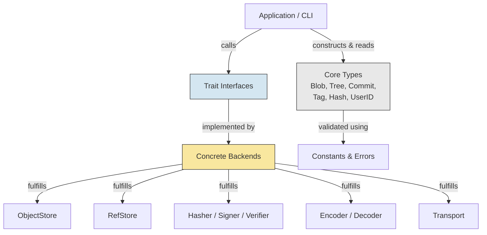

# libvctrl_handler

## Overview

`libvctrl_handler` is a foundational Rust library that defines the essential **data types** and **abstract contracts** (traits) required to build a modular, content-addressable version control system (VCS). It contains no concrete implementations — instead, it provides a precise specification layer upon which any backend (filesystem, cloud, in‑memory, etc.) can be built.

The crate enables:

- **Consistent object modeling** – Blob, Tree, Commit, Tag, Hash, and UserID with built‑in validation.
- **Pluggable backends** – Traits for object storage, reference management, hashing, serialization, signing, and network transport.
- **Forward compatibility** – `#[non_exhaustive]` enums and carefully designed error types allow evolution without breaking consumers.

This crate is a workspace member of the `libvctrl` project and serves as the core specification used by other tools and implementations.

---

## Architecture

The library cleanly separates **data structures** from **behaviour contracts**. Applications and backend implementations interact through the trait interfaces, while all core types are immutable value objects validated at construction time.



**Key design decisions:**

- **Content‑addressable identity** – The `Hash` type is a fixed 64‑byte array (suitable for SHA‑256/512) that identifies every object.
- **Validation on construction** – Names, tree entry ordering, and hash lengths are checked eagerly; invalid states are unrepresentable.
- **No‑implementation traits** – All I/O, cryptography, and format details are left to external crates.
- **`#[non_exhaustive]`** – Enums like `VctrlError` and `EntryKind` allow adding variants without breaking downstream code.

---

## Core Features

- **Standard VCS object model**  
  Blob (file content), Tree (directory listing), Commit (snapshot with metadata), Tag (named reference), and UserID.

- **Abstract storage layer**  
  `ObjectStore` for content‑addressed objects, `RefStore` for named references (branches/tags), both returning `Result<_, VctrlError>`.

- **Serialization contracts**  
  `Encoder` and `Decoder` traits for converting between the in‑memory types and on‑disk/network formats.

- **Cryptography abstraction**  
  `Hasher` for computing content hashes, `Signer` and `Verifier` for cryptographic signatures.

- **Network transport interface**  
  `Transport` with `fetch_object` and `push_object` methods, enabling remote synchronization.

- **Robust error handling**  
  Exhaustive, `Display`+`Error`‑implementing error enum covering every failure scenario.

- **Zero external dependencies**  
  Only the Rust standard library is used, keeping the compilation footprint minimal.

- **Semantic versioning & stability**  
  Strict adherence to SemVer; breaking changes are clearly communicated.

---

## Technology Stack

- **Language:** Rust (edition 2024)
- **Frameworks/Libraries:** Standard library only; no external dependencies
- **License:** MIT
- **Repository:** [https://github.com/mroczect/libvctrl](https://github.com/mroczect/libvctrl)

---

## Project Structure

The library is organized into a minimal set of public modules, each with a clear responsibility.

```text
libvctrl_handler/
├── Cargo.toml
├── README.md
├── CHANGELOG.md
├── src/
│   ├── constants.rs      # Compile-time limits and entry modes
│   ├── enums.rs          # EntryKind (Blob / Tree)
│   ├── errors.rs         # VctrlError enum with Display & Error impl
│   ├── lib.rs            # Crate root, public re-exports
│   ├── macros.rs         # Convenience macro (vctrl_error_other!)
│   ├── traits.rs         # Core abstraction traits
│   └── types/            # Core data types
│       ├── mod.rs        # Name validation helper
│       ├── blob.rs       # Blob type
│       ├── commit.rs     # Commit and CommitMeta types
│       ├── hash.rs       # Hash type (fixed 64-byte array)
│       ├── tag.rs        # Tag type
│       ├── tree.rs       # Tree and TreeEntry types
│       └── user_id.rs    # UserID type
└── tests/
    ├── hash_validation.rs
    └── type_validation.rs
```

---

## Getting Started

### Prerequisites

- Rust toolchain (stable) version 1.85 or later (supports edition 2024).  
  Install via [rustup](https://rustup.rs).

### Installation

Add `libvctrl_handler` to your `Cargo.toml`:

```toml
[dependencies]
libvctrl_handler = "3.0.1"
```

Alternatively, reference the Git repository directly:

```toml
[dependencies]
libvctrl_handler = { git = "https://github.com/mroczect/libvctrl", branch = "master" }
```

### Configuration

No environment variables or feature flags are required. The crate compiles with the Rust standard library.

---

## Usage

### Constructing Core Types

All types are validated at construction. The following example demonstrates creating a `TreeEntry` and a `Commit`.

```rust
use libvctrl_handler::*;

// Create a valid Hash (64 bytes)
let hash = Hash::from_bytes(&[0xAB; HASH_LENGTH]).unwrap();

// Build a TreeEntry (name must be non‑empty and <= 255 bytes)
let entry = TreeEntry::new("README.md".into(), EntryKind::Blob, hash)
    .expect("name is valid");

// Build a UserID
let author = UserID::new("Alice".into(), "alice@example.com".into())
    .expect("valid name and email");

// Construct a Commit (parents may be empty for a root commit)
let commit = Commit::new(
    hash,          // tree hash
    vec![],        // no parents
    author.clone(),
    author,
    "Initial commit".into(),
);
```

### Implementing a Trait (Example: In‑Memory ObjectStore)

The real power of this library is implementing the provided traits for your own backend.

```rust
use std::collections::HashMap;
use libvctrl_handler::{ObjectStore, VctrlError, Hash};

struct MemoryStore {
    objects: HashMap<Hash, Vec<u8>>,
}

impl MemoryStore {
    fn new() -> Self {
        Self { objects: HashMap::new() }
    }
}

impl ObjectStore for MemoryStore {
    fn put(&mut self, hash: &Hash, data: &[u8]) -> Result<(), VctrlError> {
        self.objects.insert(*hash, data.to_vec());
        Ok(())
    }

    fn get(&self, hash: &Hash) -> Result<Vec<u8>, VctrlError> {
        self.objects.get(hash)
            .cloned()
            .ok_or_else(|| VctrlError::ObjectNotFound(*hash))
    }

    fn delete(&mut self, hash: &Hash) -> Result<(), VctrlError> {
        self.objects.remove(hash);
        Ok(())
    }

    fn exists(&self, hash: &Hash) -> Result<bool, VctrlError> {
        Ok(self.objects.contains_key(hash))
    }
}
```

Now your application can use any type that implements `ObjectStore` without being tied to a specific storage engine.

---

## API Reference / Core Modules

### `constants`

Defines system‑wide limits and Unix‑style entry modes.

| Constant                 | Value    | Description               |
| ------------------------ | -------- | ------------------------- |
| `HASH_LENGTH`            | 64       | Length of a Hash in bytes |
| `MAX_NAME_LENGTH`        | 255      | Maximum file/ref name     |
| `MAX_BLOB_SIZE`          | 100 MiB  | Largest allowed blob      |
| `MAX_TREE_ENTRIES`       | 100,000  | Max entries per tree      |
| `MAX_MESSAGE_LENGTH`     | 1 MiB    | Max commit/tag message    |
| `entry_mode::BLOB`       | 0o100644 | Regular file              |
| `entry_mode::EXECUTABLE` | 0o100755 | Executable file           |
| `entry_mode::SYMLINK`    | 0o120000 | Symbolic link             |
| `entry_mode::TREE`       | 0o040000 | Sub‑directory             |
| `entry_mode::SUBMODULE`  | 0o160000 | Git submodule             |

### `enums`

- **`EntryKind`** – Distinguishes between `Blob` and `Tree` entries. Marked `#[non_exhaustive]`.

### `errors`

- **`VctrlError`** – Exhaustive error enum covering invalid hashes, names, missing objects, I/O, serialization, and a generic `Other` variant. Implements `Display` and `std::error::Error`.

### `macros`

- **`vctrl_error_other!(...)`** – Convenience macro for creating `VctrlError::Other` with a formatted string.

### `traits`

All traits are public and intended to be implemented by downstream crates.

- **`ObjectStore`** – CRUD operations for content‑addressed objects.
- **`RefStore`** – Named reference management (branches, tags).
- **`Hasher`** – Computes a `Hash` from raw bytes.
- **`Encoder` / `Decoder`** – Bidirectional conversion between types and wire/storage formats.
- **`Signer` / `Verifier`** – Cryptographic signing and verification.
- **`Transport`** – Fetch/push objects over a network.

### Types (`types/`)

- **`Blob`** – Wraps arbitrary `Vec<u8>` data.
- **`Tree`** – A sorted list of `TreeEntry` items; order is enforced during construction.
- **`TreeEntry`** – A name, `EntryKind`, and a target `Hash`.
- **`Commit`** – Snapshots a tree, lists parent commits, and records author/committer and a message. Metadata (timestamp, timezone, encoding) can be set separately.
- **`CommitMeta`** – Helper struct for optional timestamp and encoding details.
- **`Tag`** – Annotated or lightweight reference to any object.
- **`Hash`** – Fixed 64‑byte array, copy‑friendly, with `Display` and `Debug` formatting.
- **`UserID`** – A name and email pair with validation.

---

## Testing

Run the included unit tests with:

```bash
cargo test
```

The test suite validates:

- Hash creation, display, and copy semantics.
- Tree entry and name length checks.
- UserID and Tag construction rules.
- Error type behaviour.

All tests pass on Rust stable 1.85+.

---

## Versioning & Stability

This project adheres to [Semantic Versioning 2.0.0](https://semver.org/).

- **Breaking changes** include:
  - Adding new required trait methods.
  - Modifying existing type signatures or removing public items.
  - Changing the semantics of existing constants or error variants.
- **Additions** such as new trait default methods, new `#[non_exhaustive]` enum variants, or new error variants do **not** constitute a breaking change.
- The `#[non_exhaustive]` attribute on `VctrlError` and `EntryKind` ensures that consumers match using `_` wildcards and will not break when new variants are introduced.

Always consult the [CHANGELOG](./CHANGELOG.md) before upgrading.

---

## Contributing

Contributions are welcome. Please open an issue or pull request on the [GitHub repository](https://github.com/mroczect/libvctrl).  
By participating, you agree that your contributions will be licensed under the MIT license.

For significant changes, please first discuss the proposed modification via an issue to ensure alignment with the project’s goals.

---

## License

MIT – see the [LICENSE](https://github.com/mroczect/libvctrl/blob/master/LICENSE) file in the repository.
