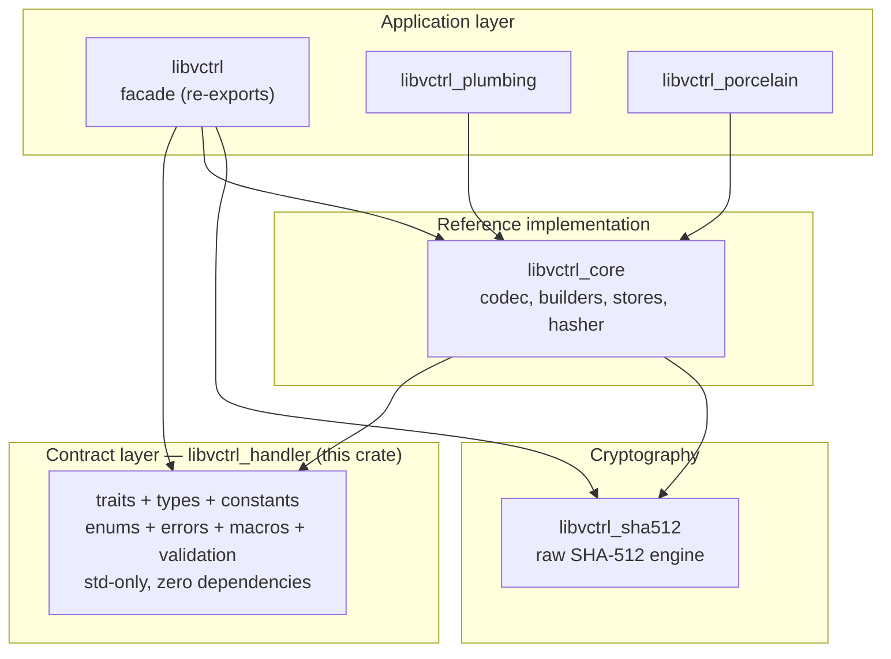
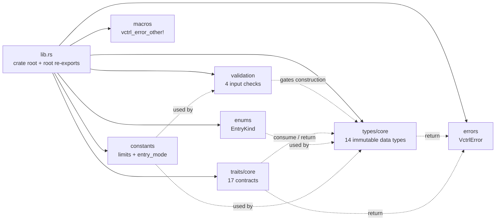
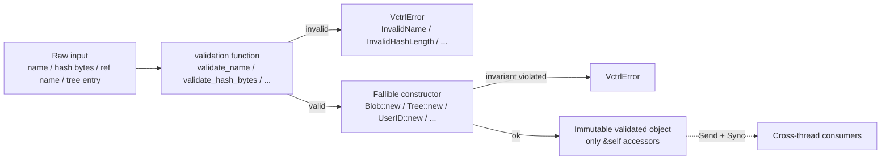
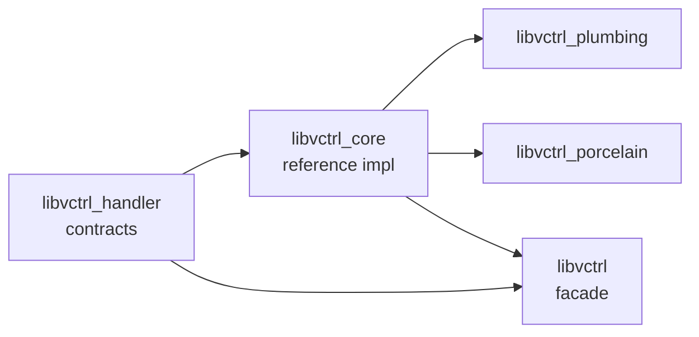

# libvctrl_handler

Fundamental contracts for building a version control system — no implementations, only
traits, types, and validation. `libvctrl_handler` is the "constitution" layer of the
`libvctrl` ecosystem: it defines _what_ a VCS object model looks like without prescribing
_how_ it is stored, serialised, signed, or transported. Every other crate in the workspace
implements or consumes these contracts.

- **Crate:** `libvctrl_handler` 5.0.1 (library, `std`-only, zero external dependencies)
- **Language:** Rust, edition 2024 — MSRV **1.96.0**
- **License:** MIT
- **Repository:** https://github.com/mroczect/libvctrl
- **Documentation:** https://docs.rs/libvctrl_handler

> Most users should depend on the **`libvctrl` facade**, which re-exports this crate
> alongside the reference implementation and the crypto primitives. Reach for
> `libvctrl_handler` directly only when you are implementing a custom backend or need the
> contract surface without the reference implementation.

---

## Overview

`libvctrl_handler` is a pure contracts crate. It contains no concrete implementations —
no storage backends, no serializers, no hashing engines. Instead it provides:

- **Traits** defining every major VCS operation: object storage, encoding, decoding,
  hashing, indexing, reference management, reflogs, remote transport, packing, signing,
  verification, revision walking, diffing, blame, and configuration.
- **Immutable data types** representing Git objects (`Blob`, `Tree`, `Commit`, `Tag`) and
  supporting structures (`Hash`, `UserID`, `TreeEntry`, `CommitMeta`, deltas, merges,
  reflog entries).
- **Constants** enforcing safe size and count limits to prevent resource exhaustion.
- **Validation functions** that define the security boundary for names, references, tree
  entries, and hashes.
- A unified **error type** (`VctrlError`) that all trait implementations must return.

The crate depends only on the Rust standard library. It is `std`-only and exposes no
crate-level feature flags. There is no `no_std` build path at present.

---

## Architecture

`libvctrl_handler` is the foundation of a strictly layered, one-way dependency graph. It
sits at the bottom; the reference implementation (`libvctrl_core`) implements its traits;
the facade (`libvctrl`) re-exports both; and the command crates (`libvctrl_plumbing`,
`libvctrl_porcelain`) build on top.



### Internal module organization

The crate is separated into seven modules, each with a single responsibility. The crate
root (`lib.rs`) re-exports the most commonly used items for ergonomic access.



### Invalid states are unrepresentable

A core design idiom is that all public data types are constructed via **fallible
constructors** that enforce invariants at construction time. Once built, objects are
immutable and expose only `&self` accessors. This pushes validation to the boundary of the
system and guarantees that invalid objects cannot exist at runtime.



---

## Core Features

- **Pure contracts.** No implementations — only traits, types, constants, and
  validation. Backend authors implement the traits; tool authors depend on the types.
- **Invalid states unrepresentable.** All data types use fallible constructors that reject
  malformed input at construction time; objects are immutable thereafter.
- **Resource-exhaustion prevention.** Hard `MAX_*` limits act as fail-fast circuit
  breakers during construction, bounding memory allocation against malicious input.
- **Strong typing over raw integers.** Git mode bits are represented by the `EntryKind`
  enum with `const fn` conversions to and from raw `u32` modes, preventing invalid
  combinations at compile time.
- **Forward-compatible enums and errors.** `EntryKind` and `VctrlError` are
  `#[non_exhaustive]`, allowing new variants without breaking API compatibility.
- **Thread-safe contracts.** Traits carry `Send + Sync` bounds so backends can be shared
  across threads; `&mut self` is required only for write operations.
- **Cloneable I/O errors.** `std::io::Error` is wrapped in `Arc` inside `VctrlError` so
  the error remains `Clone` despite `io::Error` not being `Clone`.
- **Compile-time computation.** `const fn` is used where possible (`EntryKind::mode`,
  `from_mode`) to shift work to compile time.
- **Strict safety.** `#![forbid(unsafe_code)]` and a comprehensive set of denied Clippy
  and documentation lints are inherited from the workspace.

---

## Technology Stack

- **Language:** Rust (edition 2024, MSRV 1.96.0)
- **Dependencies:** none (standard library only)
- **Dev-dependencies:** `proptest` 1.11.0
- **Lint policy:** workspace-inherited, `#![forbid(unsafe_code)]`, denied `missing_docs`,
  `rust_2018_idioms`, and a broad set of Clippy lints (including `pedantic` and `nursery`
  groups). See the repository for the authoritative lint configuration.
- **Feature flags:** none.

> Note on the MSRV field: this crate's `Cargo.toml` does not yet declare
> `rust-version = "1.96"`. The workspace standard is Rust 1.96.0, and this README
> documents that as the MSRV. Adding `rust-version = "1.96"` to
> `libvctrl_handler/Cargo.toml` is recommended in a future maintenance pass.

---

## Project Structure

```text
libvctrl_handler/
├── Cargo.toml
└── src/
    ├── lib.rs
    ├── constants.rs
    ├── errors.rs
    ├── macros.rs
    ├── enums/
    │   ├── mod.rs
    │   └── core/
    │       ├── mod.rs
    │       └── entry_kind.rs
    ├── traits/
    │   ├── mod.rs
    │   └── core/
    │       ├── mod.rs
    │       ├── blame.rs
    │       ├── config.rs
    │       ├── decoder.rs
    │       ├── diff.rs
    │       ├── encoder.rs
    │       ├── hasher.rs
    │       ├── index.rs
    │       ├── object_store.rs
    │       ├── pack.rs
    │       ├── ref_store.rs
    │       ├── reflog.rs
    │       ├── remote.rs
    │       ├── revwalk.rs
    │       ├── signer.rs
    │       ├── transport.rs
    │       └── verifier.rs
    ├── types/
    │   ├── mod.rs
    │   └── core/
    │       └── ... (data type definitions)
    └── validation/
        ├── mod.rs
        ├── hash.rs
        └── name.rs
```

---

## Getting Started

### Prerequisites

- Rust toolchain **1.96.0** or newer (edition 2024 is required)
- Cargo

No system libraries or external services are required.

### Installation

For most users, depend on the facade instead:

```toml
[dependencies]
libvctrl = "2.1"
```

To depend on `libvctrl_handler` directly (contracts only, no reference implementation):

```toml
[dependencies]
libvctrl_handler = "5.0"
```

Or via Cargo:

```bash
cargo add libvctrl_handler
```

Because the crate has no external dependencies, adding it is essentially zero-weight
beyond the standard library.

### Configuration

`libvctrl_handler` exposes **no crate-level feature flags** and requires **no runtime
configuration**. The contract surface is fixed; behavioural configuration (such as the
`sha384` / `opt_size` crypto features) lives at the facade or `libvctrl_sha512` level.

---

## Usage

### Create a Hash and inspect an EntryKind

```rust
use libvctrl_handler::{EntryKind, Hash};

// Hash requires exactly 64 bytes (SHA-512).
let raw_bytes = [0_u8; 64];
let hash = Hash::from_bytes(&raw_bytes);
assert!(hash.is_ok());

// Git object modes are accessible via the strongly-typed EntryKind enum.
let blob_mode = EntryKind::Blob.mode();
assert_eq!(blob_mode, 0o100_644);
```

### Convert between EntryKind and raw mode bits

```rust
use libvctrl_handler::enums::EntryKind;

// Enum -> raw mode (const fn, usable in const contexts).
assert_eq!(EntryKind::Executable.mode(), 0o100_755);

// Raw mode -> Enum (graceful on invalid input).
assert_eq!(EntryKind::from_mode(0o120_000), Some(EntryKind::Symlink));
assert_eq!(EntryKind::from_mode(0o000_000), None);
```

### Construct ad-hoc errors with the macro

```rust
use libvctrl_handler::{VctrlError, vctrl_error_other};

let err = vctrl_error_other!("missing configuration file: {} (code {})", "config.toml", 404);
assert_eq!(
    err.to_string(),
    "missing configuration file: config.toml (code 404)"
);
```

### Wrap an I/O error

```rust
use libvctrl_handler::VctrlError;
use std::io::{self, ErrorKind};

let io_err = io::Error::new(ErrorKind::NotFound, "file missing");
let vctrl_err = VctrlError::from_io(io_err);

// The error is cloneable despite wrapping std::io::Error.
let cloned = vctrl_err.clone();
assert_eq!(vctrl_err, cloned);
```

### Implement a trait for a custom backend

The traits are designed to be implemented by backend authors. The `Blame` trait
illustrates the idiom: `Send + Sync` bounds for thread safety, `&self` for read
operations, and `VctrlError` as the unified failure type.

```rust
use libvctrl_handler::traits::core::blame::{Blame, BlameEntry};
use libvctrl_handler::{Hash, VctrlError};

struct MockRepo;

impl Blame for MockRepo {
    fn blame_file(&self, path: &str) -> Result<Vec<BlameEntry>, VctrlError> {
        let hash = Hash::from_bytes(&[0_u8; 64])?;
        let entry = BlameEntry::new(hash, 1, 10, path.to_string(), None)?;
        Ok(vec![entry])
    }
}

let repo = MockRepo;
let entries = repo.blame_file("src/main.rs").unwrap();
assert_eq!(entries.len(), 1);
```

---

## API Reference / Core Modules

Full API documentation is published at <https://docs.rs/libvctrl_handler>. The summary
below describes each module and its public surface.

### `constants` — Limits and protocol values

Centralises all magic numbers so that limits are uniformly enforced at the type
construction level. Two categories: resource-exhaustion circuit breakers and Git protocol
constants.

| Constant             | Value          | Purpose                                                  |
| -------------------- | -------------- | -------------------------------------------------------- |
| `HASH_LENGTH`        | `64`           | SHA-512 hash length in bytes; enables fixed-size arrays. |
| `MAX_NAME_LENGTH`    | `255`          | Upper bound on file/directory/reference names (bytes).   |
| `MAX_BLOB_SIZE`      | `100 * 1024^2` | Maximum blob size (100 MiB); DoS circuit breaker.        |
| `MAX_TREE_ENTRIES`   | `100_000`      | Maximum entries per tree; bounds parse/diff cost.        |
| `MAX_MESSAGE_LENGTH` | `1024 * 1024`  | Maximum commit/tag message length (1 MiB).               |
| `MAX_PARENT_COUNT`   | `0xFFFF`       | Maximum parent commits (u16 range).                      |

The `entry_mode` submodule exposes the Git protocol mode bits:

| Constant     | Value       | Meaning          |
| ------------ | ----------- | ---------------- |
| `BLOB`       | `0o100_644` | Regular file     |
| `EXECUTABLE` | `0o100_755` | Executable file  |
| `SYMLINK`    | `0o120_000` | Symbolic link    |
| `TREE`       | `0o40_000`  | Directory (tree) |
| `SUBMODULE`  | `0o160_000` | Submodule commit |

### `enums` — Strongly-typed protocol kinds

- **`EntryKind`** — a `#[non_exhaustive]` enum (`Blob`, `Executable`, `Symlink`, `Tree`,
  `Submodule`) classifying tree entries. Provides `const fn mode() -> u32` and
  `const fn from_mode(u32) -> Option<Self>` for lossless conversion to and from raw Git
  mode bits. Consumers must include a `_` catch-all when matching.

### `errors` — Unified error type

- **`VctrlError`** — a `#[non_exhaustive]`, `Clone + Debug + PartialEq + Eq` enum that all
  fallible operations across the ecosystem return. Implements `Display` and `std::error::Error`.
  I/O errors are stored as `Arc<std::io::Error>` to make the error `Clone`. A manual
  `PartialEq` compares `io::Error::kind()` and string representation.

| Variant                        | Meaning                                                      |
| ------------------------------ | ------------------------------------------------------------ |
| `CorruptedData(String)`        | Data was corrupted or malformed.                             |
| `DuplicateParent`              | A commit contains duplicate parent hashes.                   |
| `ExceededMaxSize(String)`      | A size or count limit was exceeded.                          |
| `InvalidBlameRange`            | An invalid blame range was specified (zero start or count).  |
| `InvalidEmail(String)`         | An email address was invalid.                                |
| `InvalidHashLength(usize)`     | Hash length did not match `HASH_LENGTH`.                     |
| `InvalidName(String)`          | A name was empty, too long, or contained control characters. |
| `InvalidTimezoneOffset(i16)`   | Timezone offset outside `-1440..=1440`.                      |
| `InvalidTreeStructure(String)` | Tree entries unsorted or duplicated.                         |
| `IoError(Arc<io::Error>)`      | An I/O error occurred.                                       |
| `ObjectNotFound(Hash)`         | An object with the given hash was not found.                 |
| `Other(String)`                | Any error not covered by the above.                          |
| `RefNotFound(String)`          | A reference with the given name was not found.               |
| `SerializationError(String)`   | A serialization/deserialization error occurred.              |

`VctrlError::from_io(io::Error)` is the canonical constructor for I/O failures.

### `macros` — Error-construction helpers

- **`vctrl_error_other!`** — an exported declarative macro that wraps `format!` into
  `VctrlError::Other`. Uses `$crate` for absolute path resolution so the macro remains
  correct even when imported via glob from another crate.

### `traits` — The 17 backend contracts

All traits live under `traits::core` and are re-exported at the crate root. They are
grouped by domain:

**Serialization and content addressing**

| Trait     | Purpose                                                       |
| --------- | ------------------------------------------------------------- |
| `Encoder` | Serialise objects (`Blob`, `Tree`, `Commit`, `Tag`) to bytes. |
| `Decoder` | Parse bytes back into validated objects; the trust boundary.  |
| `Hasher`  | Compute a content-address `Hash` from a byte stream.          |

**Object and reference storage**

| Trait         | Purpose                                                      |
| ------------- | ------------------------------------------------------------ |
| `ObjectStore` | Store and retrieve encoded object bytes keyed by `Hash`.     |
| `RefStore`    | Manage named references (branches, tags) pointing at hashes. |
| `ReflogStore` | Append and read reflog entries for a reference.              |
| `Index`       | Manage the staged index of path-to-hash mappings.            |

**History traversal and analysis**

| Trait        | Purpose                                                             |
| ------------ | ------------------------------------------------------------------- |
| `RevWalk`    | Traverse the commit graph from a set of heads.                      |
| `Blame`      | Attribute file line ranges to commits (`BlameEntry`).               |
| `TreeDiffer` | Compute tree-level deltas (`TreeDelta`, `FileDelta`, `ChangeKind`). |

**Remote and packfile**

| Trait        | Purpose                                               |
| ------------ | ----------------------------------------------------- |
| `Transport`  | Abstract network transport for remote operations.     |
| `Remote`     | Manage remote configuration and endpoint interaction. |
| `PackReader` | Decode Git packfile streams into objects.             |
| `PackWriter` | Encode objects into Git packfile streams.             |

**Cryptographic integrity**

| Trait      | Purpose                                        |
| ---------- | ---------------------------------------------- |
| `Signer`   | Produce cryptographic signatures over objects. |
| `Verifier` | Verify cryptographic signatures over objects.  |

**Configuration**

| Trait         | Purpose                                                                                                           |
| ------------- | ----------------------------------------------------------------------------------------------------------------- |
| `ConfigStore` | Read and write sectioned configuration values (`Option`-returning reads for sparse keys; `&mut self` for writes). |

All traits require `Send + Sync`. Write operations take `&mut self`; read operations take
`&self`. `BlameEntry` is the companion struct for `Blame`, constructed via a fallible
`new()` that rejects zero start lines or counts.

### `types` — The 14 immutable data types

All types live under `types/core` and are re-exported at the crate root. Each is immutable
after construction and built through a fallible constructor.

| Type          | Purpose                                                                    |
| ------------- | -------------------------------------------------------------------------- |
| `Blob`        | A file's raw content, bounded by `MAX_BLOB_SIZE`.                          |
| `Tree`        | A sorted collection of `TreeEntry` objects, bounded by `MAX_TREE_ENTRIES`. |
| `TreeEntry`   | A single directory entry: name, `EntryKind`, and target `Hash`.            |
| `Commit`      | A commit object: tree hash, parents, author/committer, message, metadata.  |
| `CommitMeta`  | Timestamp, timezone offset, and optional encoding for a commit.            |
| `Tag`         | An annotated tag: name, target hash, optional tagger, message, metadata.   |
| `Hash`        | A fixed 64-byte SHA-512 content address (`Copy`, `Send`, `Sync`).          |
| `UserID`      | A name and email pair with validation.                                     |
| `ReflogEntry` | A single reflog record (old/new hash, committer, message).                 |
| `ChangeKind`  | The kind of change in a diff (added, modified, deleted, etc.).             |
| `FileDelta`   | A per-file change between two trees.                                       |
| `TreeDelta`   | An aggregate tree-level diff.                                              |
| `Conflict`    | A merge conflict representation.                                           |
| `MergeResult` | The outcome of a merge operation.                                          |

### `validation` — Input checks

Pure functions that define the security boundary for raw inputs, intended to be applied
_before_ attempting object construction so that malformed data fails fast.

| Function                   | Validates                                                                           |
| -------------------------- | ----------------------------------------------------------------------------------- |
| `validate_hash_bytes`      | That a byte slice is exactly `HASH_LENGTH` bytes.                                   |
| `validate_name`            | That a name is non-empty, within `MAX_NAME_LENGTH`, and free of control characters. |
| `validate_ref_name`        | That a reference name is structurally valid (e.g. `refs/heads/main`).               |
| `validate_tree_entry_name` | That a tree entry name is a valid path component.                                   |

---

## Testing

Run the crate's test suite with Cargo:

```bash
cargo test
```

Property-based tests use `proptest` (a dev-dependency). Because the crate defines only
contracts and immutable types, its tests focus on construction invariants, validation
rejection of malformed input, and round-trip properties of `EntryKind` mode conversion.
To run the entire workspace test suite from the repository root:

```bash
cargo test --workspace
```

To verify the strict lint policy is satisfied:

```bash
cargo clippy --workspace --all-targets -- -D warnings
cargo doc --workspace --no-deps
```

---

## Contributing

Contributions are welcome. The crate enforces `#![forbid(unsafe_code)]` and inherits a
strict, denied Clippy and documentation-lint policy from the workspace; all public items
must be documented.

For contribution guidelines, code style, and the full lint configuration, see the
repository's `CONTRIBUTING.md` and the workspace root `README.md`:

- Repository: https://github.com/mroczect/libvctrl

When contributing to `libvctrl_handler`, preserve the contracts-only invariant: no
concrete implementations belong here. New behaviours belong in `libvctrl_core`; new
contracts and types belong here; new user-facing commands belong in `libvctrl_plumbing`
or `libvctrl_porcelain`.

---

## Ecosystem

`libvctrl_handler` is the foundation of a larger workspace. The related crates are listed
below; each has its own documentation.

| Crate                | Role                                                     | Documentation                      |
| -------------------- | -------------------------------------------------------- | ---------------------------------- |
| `libvctrl`           | Facade: re-exports contracts, reference impl, and crypto | https://docs.rs/libvctrl           |
| `libvctrl_core`      | Reference implementations of these contracts             | https://docs.rs/libvctrl_core      |
| `libvctrl_sha512`    | Zero-dependency SHA-512 / HMAC / HKDF primitives         | https://docs.rs/libvctrl_sha512    |
| `libvctrl_plumbing`  | Command-level VCS operations built on `libvctrl_core`    | https://docs.rs/libvctrl_plumbing  |
| `libvctrl_porcelain` | High-level, user-facing VCS operations                   | https://docs.rs/libvctrl_porcelain |

The dependency flow is strictly one-way: `libvctrl_handler` is the foundation,
`libvctrl_core` implements its contracts, the facade re-exports both, and
`libvctrl_plumbing` / `libvctrl_porcelain` build on `libvctrl_core`.



---

## License

Licensed under the MIT License. See the repository for the full license text.
