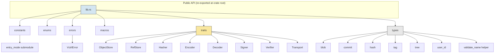
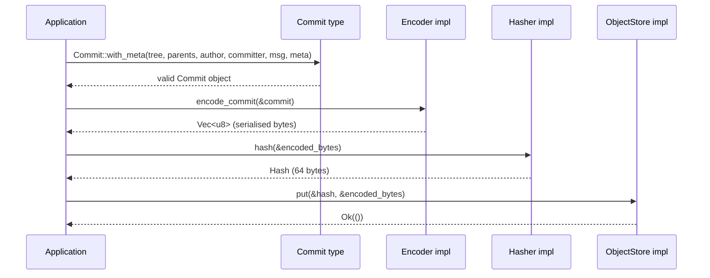

# libvctrl_handler

## Overview

`libvctrl_handler` is the foundational **contracts crate** for building a modular, content‑addressable version control system (VCS). It provides the essential **data types** and **abstract traits** that define _what_ a VCS object model looks like, without prescribing _how_ it is stored, serialised, or transported.

The crate is a workspace member of the `libvctrl` project. It contains no concrete implementations — only pure structures and interfaces. Backend authors implement the traits to produce filesystem, in‑memory, cloud, or other storage backends, while tool authors build CLIs, GUIs, and automation on top of the stable type system.

Key properties:

- **Strict separation of data and behaviour** – Immutable value objects live in `types`; all operations are expressed through traits in `traits`.
- **Zero dependencies** – Uses only the Rust standard library; no external crates are required.
- **Forward‑compatible** – `#[non_exhaustive]` on error and enum types, `const fn` constructors where possible, and a clean error hierarchy.
- **Documented as a specification** – Every public item includes a `# Purpose`, `# Design rationale`, and `# Examples` section, enabling the crate to serve as both a reference and a contract.

---

## Architecture

The crate is organised into a small number of public modules, each with a single responsibility.



**Design decisions:**

- **Types are pure data** – Structs like `Blob`, `Commit`, `Tree`, and `Hash` own their data and expose only getters. They are constructed through fallible `new` methods that validate invariants (name length, tree entry ordering, hash length).
- **Traits are the extension points** – Every backend capability (storage, hashing, serialisation, networking, signing) is represented by a trait. Implementations are swapped at compile time; no dynamic dispatch is required.
- **Single error type** – The `VctrlError` enum covers all failure modes. It implements `std::error::Error`, `Display`, `Clone`, and `PartialEq` so it can be used in any error‑handling strategy.
- **Validation on construction** – Invalid states (empty names, unsorted tree entries, wrong hash length) are rejected eagerly, making downstream code simpler and safer.

### Example: Constructing and storing a commit

The following sequence illustrates how a new commit flows through the system when a concrete backend is attached.



---

## Core Features

- **Standard VCS object model**  
  `Blob` (file content), `Tree` (directory listing), `Commit` (snapshot with metadata), `Tag` (named pointer), `UserID` (identity).
- **Content‑addressable identity**  
  `Hash` type is a fixed 64‑byte array with `Display` (hex) and `Debug` (abbreviated) formatting. `from_bytes` validation ensures every hash is exactly 64 bytes.
- **Abstract storage layer**  
  `ObjectStore` for content‑addressed objects, `RefStore` for named references (branches, tags). Both traits return `Result<_, VctrlError>`.
- **Serialisation contracts**  
  `Encoder` and `Decoder` traits for converting between the in‑memory types and on‑disk/network formats.
- **Cryptography abstraction**  
  `Hasher` for computing content hashes; `Signer` and `Verifier` for digital signatures.
- **Network transport interface**  
  `Transport` with `fetch_object` and `push_object` methods.
- **Strict input validation**  
  Names (files, references, users) are checked for emptiness and length. Tree entries must be sorted and unique. `Hash` construction verifies the byte length.
- **Comprehensive documentation**  
  All public items include a `# Purpose`, `# Design rationale`, and runnable `# Examples` sections.
- **Zero external dependencies**  
  Only the Rust standard library; `#![forbid(unsafe_code)]` ensures memory safety without `unsafe`.
- **Semantic versioning**  
  The crate follows SemVer; breaking changes are clearly communicated.

---

## Technology Stack

- **Language:** Rust (edition 2024)
- **Frameworks/Libraries:** None (pure standard library)
- **License:** MIT
- **Repository:** [https://github.com/mroczect/libvctrl](https://github.com/mroczect/libvctrl)

---

## Project Structure

```text
libvctrl_handler/
├── Cargo.toml
├── README.md
├── src/
│   ├── lib.rs              # Crate root, re-exports
│   ├── constants.rs        # System limits and entry mode bits
│   ├── enums.rs            # EntryKind enum
│   ├── errors.rs           # VctrlError type
│   ├── macros.rs           # vctrl_error_other! helper
│   ├── traits.rs           # Core abstraction traits
│   └── types/
│       ├── mod.rs          # Module-level docs and validate_name helper
│       ├── blob.rs         # Blob type
│       ├── commit.rs       # Commit and CommitMeta types
│       ├── hash.rs         # Hash type
│       ├── tag.rs          # Tag type
│       ├── tree.rs         # Tree and TreeEntry types
│       └── user_id.rs      # UserID type
└── tests/
    ├── hash_validation.rs
    └── type_validation.rs
```

---

## Getting Started

### Prerequisites

- Rust toolchain (stable) version **1.85** or later (supports edition 2024).  
  Install via [rustup](https://rustup.rs).

### Installation

Add the crate to your `Cargo.toml`:

```toml
[dependencies]
libvctrl_handler = "3.1.0"
```

Or reference the Git repository directly:

```toml
[dependencies]
libvctrl_handler = { git = "https://github.com/mroczect/libvctrl", branch = "master" }
```

### Configuration

No environment variables or feature flags are required. The crate uses only the Rust standard library and compiles on all tier‑1 targets.

---

## Usage

### Creating core types

All types enforce their invariants at construction time.

```rust
use libvctrl_handler::*;

// Construct a valid Hash (64 bytes)
let hash = Hash::from_bytes(&[0xAB; HASH_LENGTH]).unwrap();

// Build a TreeEntry (name must be non‑empty and ≤ 255 bytes)
let entry = TreeEntry::new("README.md".into(), EntryKind::Blob, hash)
    .expect("name is valid");

// Build a UserID
let author = UserID::new("Alice".into(), "alice@example.com".into())
    .expect("valid name and email");

// Construct a Commit (root commit with no parents)
let commit = Commit::new(
    hash,          // tree
    vec![],        // no parents
    author.clone(),
    author,
    "Initial commit".into(),
);
```

### Implementing a storage backend

The traits are designed to be implemented by concrete backends. Below is an in‑memory example for `ObjectStore`.

```rust
use std::collections::HashMap;
use std::io::Read;
use libvctrl_handler::{ObjectStore, VctrlError, Hash};

struct MemoryStore {
    objects: HashMap<Hash, Vec<u8>>,
}

impl MemoryStore {
    fn new() -> Self {
        Self { objects: HashMap::new() }
    }
}

impl ObjectStore for MemoryStore {
    fn put(&mut self, hash: &Hash, data: &[u8]) -> Result<(), VctrlError> {
        self.objects.insert(*hash, data.to_vec());
        Ok(())
    }

    fn get(&self, hash: &Hash) -> Result<Box<dyn Read + '_>, VctrlError> {
        self.objects.get(hash)
            .cloned()
            .map(|v| Box::new(std::io::Cursor::new(v)) as Box<dyn Read>)
            .ok_or_else(|| VctrlError::ObjectNotFound(*hash))
    }

    fn delete(&mut self, hash: &Hash) -> Result<(), VctrlError> {
        self.objects.remove(hash);
        Ok(())
    }

    fn exists(&self, hash: &Hash) -> Result<bool, VctrlError> {
        Ok(self.objects.contains_key(hash))
    }
}

// Read back an object using the streaming getter
let mut store = MemoryStore::new();
let hash = Hash::from_bytes(&[0xAB; 64]).unwrap();
store.put(&hash, b"content").unwrap();

let mut reader = store.get(&hash).unwrap();
let mut buf = Vec::new();
reader.read_to_end(&mut buf).unwrap();
assert_eq!(buf, b"content");
```

Any code that depends on `ObjectStore` can now use `MemoryStore` without modification.

---

## API Reference / Core Modules

### `constants`

System‑wide limits and Unix‑style file mode bits.

| Constant                 | Type  | Value       | Description                         |
| ------------------------ | ----- | ----------- | ----------------------------------- |
| `HASH_LENGTH`            | usize | 64          | Length of a `Hash` in bytes.        |
| `MAX_NAME_LENGTH`        | u64   | 255         | Maximum byte length for names.      |
| `MAX_BLOB_SIZE`          | u64   | 100 MiB     | Maximum byte size of a single blob. |
| `MAX_TREE_ENTRIES`       | u64   | 100,000     | Maximum entries in a tree.          |
| `MAX_MESSAGE_LENGTH`     | u64   | 1 MiB       | Maximum commit/tag message length.  |
| `entry_mode::BLOB`       | u32   | `0o100_644` | Regular file mode.                  |
| `entry_mode::EXECUTABLE` | u32   | `0o100_755` | Executable file mode.               |
| `entry_mode::SYMLINK`    | u32   | `0o120_000` | Symbolic link mode.                 |
| `entry_mode::TREE`       | u32   | `0o040_000` | Sub‑directory mode.                 |
| `entry_mode::SUBMODULE`  | u32   | `0o160_000` | Submodule mode.                     |

### `enums`

- **`EntryKind`** – `Blob`, `Executable`, `Symlink`, `Tree`, `Submodule`. Marked `#[non_exhaustive]` and derives `Copy`, `Clone`, `Hash`, `Eq`.

### `errors`

- **`VctrlError`** – Exhaustive error enum covering invalid hash length, invalid names, missing objects/refs, corrupted data, I/O errors, serialisation failures, and a catch‑all `Other`. Implements `Display`, `std::error::Error`, `Clone`, and `PartialEq`.

### `macros`

- **`vctrl_error_other!(format_args...)`** – Creates a `VctrlError::Other` with a formatted message.

### `traits`

| Trait         | Purpose                                                                       |
| ------------- | ----------------------------------------------------------------------------- |
| `ObjectStore` | Content‑addressed object CRUD. `get` returns `Box<dyn Read>`.                 |
| `RefStore`    | Named reference management (branches, tags). `list_refs` returns an iterator. |
| `Hasher`      | Compute a `Hash` from arbitrary bytes.                                        |
| `Encoder`     | Serialise `Blob`, `Tree`, `Commit`, `Tag` into bytes.                         |
| `Decoder`     | Deserialise bytes back into `Blob`, `Tree`, `Commit`, `Tag`.                  |
| `Signer`      | Produce a cryptographic signature for arbitrary data (uses `&mut self`).      |
| `Verifier`    | Verify a signature against data.                                              |
| `Transport`   | Fetch and push objects over a network or IPC.                                 |

Each trait method is documented with its own `# Errors` and `# Examples` sections. See the source for full specifications.

### `types`

| Type         | Description                                                                                  |
| ------------ | -------------------------------------------------------------------------------------------- |
| `Blob`       | Wraps `Vec<u8>`; provides `data()`, `size()`, `is_empty()`.                                  |
| `Tree`       | Sorted list of `TreeEntry` items; validates ordering.                                        |
| `TreeEntry`  | A name, an `EntryKind`, and a `Hash`.                                                        |
| `Commit`     | Points to a `Tree`, lists parents, records author/committer, message, and optional metadata. |
| `CommitMeta` | Plain data struct for timestamp, timezone offset, and encoding.                              |
| `Tag`        | Annotated tag with name, target, optional tagger, message, and metadata.                     |
| `Hash`       | Fixed 64‑byte array; `from_bytes` validates length; `Display` as hex.                        |
| `UserID`     | A name and email pair; both validated (non‑empty name, non‑empty email).                     |

All types are `Clone`, `Debug`, `PartialEq`, and `Eq`. The `Hash` type additionally implements `Copy`, `Hash`, `PartialOrd`, and `Ord`.

---

## Testing

Run the crate’s test suite with:

```bash
cargo test
```

The tests cover:

- `Hash` construction, display, debug formatting, ordering, and `HashSet` usage.
- `TreeEntry`, `UserID`, `Tag`, and `Blob` validation rules.
- `VctrlError` display, debug, and `std::error::Error` compatibility.
- Constant value assertions.

All public documentation examples are also compiled and executed as doctests.

---

## Versioning & Stability

This project adheres to [Semantic Versioning 2.0.0](https://semver.org/).

- The public API is considered stable. Any breaking change (removing or renaming a public item, altering a method signature, changing constant values, or modifying documented behaviour) will result in a major version bump.
- Adding new trait methods with default implementations, new `#[non_exhaustive]` enum variants, or new error variants is **not** a breaking change.
- The `#[non_exhaustive]` attribute on `VctrlError` and `EntryKind` allows the crate to evolve without forcing downstream code to update immediately.
- Consult the [CHANGELOG](./CHANGELOG.md) for release‑by‑release details.

---

## Contributing

Contributions are welcome. Please open an issue or pull request on the [GitHub repository](https://github.com/mroczect/libvctrl). By submitting a contribution, you agree that it will be licensed under the same MIT license.

For significant changes, please start a discussion via an issue to align on design before implementing.

---

## License

MIT – see the [LICENSE](https://github.com/mroczect/libvctrl/blob/master/LICENSE) file in the repository.
