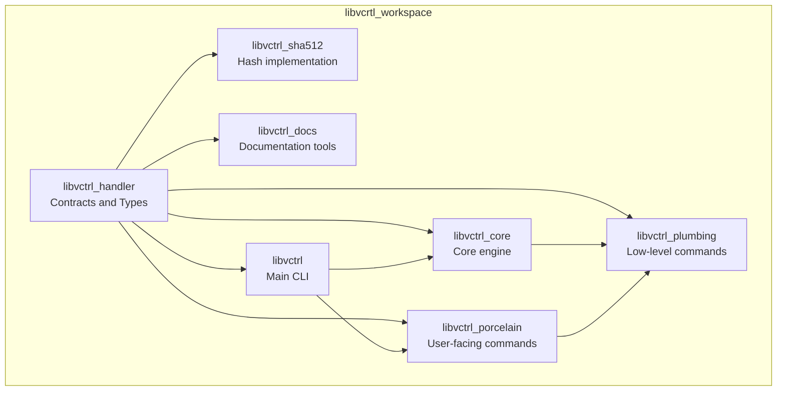
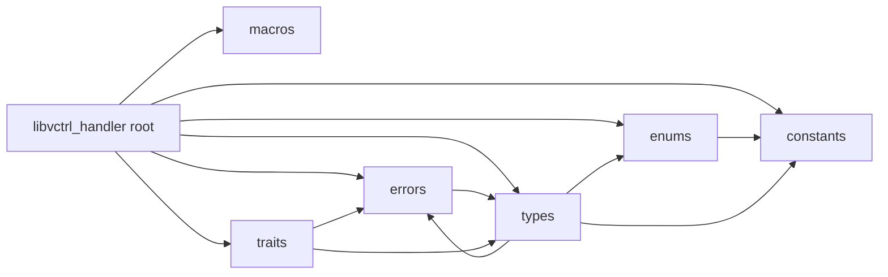
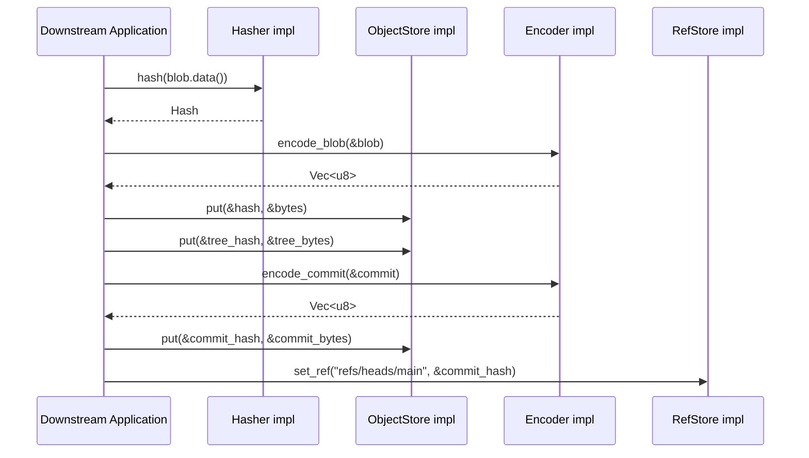
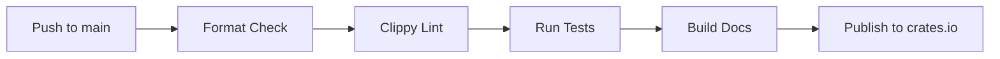

# libvctrl_handler

**Version:** 4.4.1
**Crate type:** Rust library (contracts only)  
**Workspace:** libvcrtl

`libvctrl_handler` is the foundational contracts crate for the `libvcrtl` version control system. It defines the immutable data types, behavior traits, error model, and system-wide constants that all other workspace crates consume and implement.

The crate contains **no concrete storage, hashing, serialization, networking, or signing implementations**. Instead, it provides a precise, well-documented abstraction layer that enforces correct, secure, and interoperable behavior across the entire version control stack.

---

## Table of Contents

- [Overview](#overview)
- [System Architecture](#system-architecture)
- [Core Features](#core-features)
- [Technology Stack](#technology-stack)
- [Project Structure](#project-structure)
- [Getting Started](#getting-started)
  - [Prerequisites](#prerequisites)
  - [Installation](#installation)
  - [Configuration](#configuration)
- [Usage](#usage)
- [API Reference](#api-reference)
  - [Modules](#modules)
  - [Constants](#constants)
  - [Enums](#enums)
  - [Errors](#errors)
  - [Traits](#traits)
  - [Types](#types)
  - [Macros](#macros)
- [Testing](#testing)
- [CI/CD Pipeline](#cicd-pipeline)
- [Deployment / Distribution](#deployment--distribution)
- [Security & Compliance](#security--compliance)
- [Contributing](#contributing)
- [License](#license)
- [Changelog](#changelog)

---

## Overview

`libvctrl_handler` is the contract layer of the `libvcrtl` version control system. It serves as the single source of truth for:

- Domain objects: `Blob`, `Tree`, `TreeEntry`, `Commit`, `CommitMeta`, `Tag`, `Hash`, `UserID`
- Logical object kinds: `EntryKind`
- System limits: `HASH_LENGTH`, `MAX_NAME_LENGTH`, `MAX_BLOB_SIZE`, `MAX_TREE_ENTRIES`, `MAX_MESSAGE_LENGTH`
- Behavior interfaces: `ObjectStore`, `RefStore`, `Hasher`, `Encoder`, `Decoder`, `Signer`, `Verifier`, `Transport`
- Unified error type: `VctrlError`
- Validation helpers for names, tree entries, hashes, and sorted tree ordering

Because the crate is implementation-free, downstream crates can freely combine different storage backends, cryptographic algorithms, serialization formats, and transport mechanisms without modifying the core domain model.

The crate enforces extremely strict code quality standards:

- `#![forbid(unsafe_code)]`
- `#![deny(missing_docs)]`
- `#![deny(clippy::all, clippy::pedantic, clippy::cargo)]`
- `#![warn(clippy::nursery)]`
- All public items carry extensive doctests

---

## System Architecture

### Workspace Context

`libvctrl_handler` is one crate inside the `libvcrtl` workspace. It sits at the bottom of the dependency graph as the contracts crate. All higher-level crates depend on it.



`libvctrl_handler` defines **what** a version control object is and **what operations** a backend must support. It never defines **how** those operations are performed.

### Internal Module Architecture

The crate is split into six public modules:



- **`constants`**: Centralizes all numeric limits, hash length, and raw Unix mode bits.
- **`enums`**: Defines `EntryKind`, the logical object discriminator.
- **`errors`**: Defines `VctrlError`, the unified error type.
- **`macros`**: Exports helper macros for error construction and internal comparisons.
- **`types`**: Defines immutable domain structs and validation helpers.
- **`traits`**: Defines all behavior contracts.

### Object and Data Flow

The following sequence illustrates how concrete implementations of the crate contracts might interact when storing a blob and creating a commit.



---

## Core Features

- **Immutable domain model:** All core types are constructed once and cannot be mutated, preserving content-addressing invariants.
- **Unified error handling:** Every fallible operation returns `VctrlError`, with support for source-error chaining and comparison.
- **Streaming object reads:** `ObjectStore::get` returns `Box<dyn Read>`, avoiding large contiguous allocations.
- **Sorted tree enforcement:** Tree entries must be lexicographically sorted and duplicate-free, guaranteeing deterministic hashing.
- **Strict validation:** Hash lengths, name lengths, email presence, tree entry names, and tree ordering are validated at construction time.
- **Separation of data and behavior:** Data structs never contain implementation logic; behavior is defined entirely through traits.
- **Compile-time safety:** `#![forbid(unsafe_code)]` ensures the crate contains no unsafe Rust.
- **Comprehensive documentation:** All public items are fully documented and include runnable doctests.
- **Non-exhaustive API evolution:** `EntryKind` and `VctrlError` are `#[non_exhaustive]`, allowing backward-compatible additions.

---

## Technology Stack

- **Language:** Rust (edition 2018 or later; workspace uses Rust 1.96.0)
- **Standard library only:** No external dependencies for the contracts themselves.
- **Traits:** `std::io::Read` for streaming object reads
- **Error handling:** `std::error::Error` integration
- **Macros:** `macro_rules!` for internal and public helper macros
- **Documentation:** Rustdoc with embedded doctests

---

## Project Structure

The workspace layout is as follows:

```text
libvcrtl/
├── Cargo.toml
├── Cargo.lock
├── CONTRIBUTING.md
├── CODE_OF_CONDUCT.md
├── LICENSE
├── SECURITY.md
├── Makefile
├── scripts/
├── libvctrl/
├── libvctrl_core/
├── libvctrl_docs/
├── libvctrl_handler/
│   ├── Cargo.toml
│   └── src/
│       ├── lib.rs
│       ├── constants.rs
│       ├── errors.rs
│       ├── macros.rs
│       ├── enums/
│       │   ├── mod.rs
│       │   └── core/
│       │       ├── mod.rs
│       │       └── entry_kind.rs
│       ├── traits/
│       │   ├── mod.rs
│       │   └── core/
│       │       ├── mod.rs
│       │       ├── object_store.rs
│       │       ├── ref_store.rs
│       │       ├── hasher.rs
│       │       ├── encoder.rs
│       │       ├── decoder.rs
│       │       ├── signer.rs
│       │       ├── verifier.rs
│       │       └── transport.rs
│       └── types/
│           ├── mod.rs
│           └── core/
│               ├── mod.rs
│               ├── blob.rs
│               ├── tree.rs
│               ├── commit.rs
│               ├── tag.rs
│               ├── hash.rs
│               └── user_id.rs
├── libvctrl_plumbing/
├── libvctrl_porcelain/
└── libvctrl_sha512/
```

The `libvctrl_handler/src` tree is:

```text
src/
├── constants.rs
├── enums/
│   ├── core/
│   │   ├── mod.rs
│   │   └── entry_kind.rs
│   └── mod.rs
├── errors.rs
├── lib.rs
├── macros.rs
├── traits/
│   ├── core/
│   │   ├── mod.rs
│   │   ├── decoder.rs
│   │   ├── encoder.rs
│   │   ├── hasher.rs
│   │   ├── object_store.rs
│   │   ├── ref_store.rs
│   │   ├── signer.rs
│   │   ├── transport.rs
│   │   └── verifier.rs
│   └── mod.rs
└── types/
    ├── core/
    │   ├── mod.rs
    │   ├── blob.rs
    │   ├── commit.rs
    │   ├── hash.rs
    │   ├── tag.rs
    │   ├── tree.rs
    │   └── user_id.rs
    └── mod.rs
```

---

## Getting Started

### Prerequisites

- Rust toolchain `1.96.0` or newer
- Cargo
- No external services are required to build or document this crate

Because `libvctrl_handler` is a pure contracts crate, it has no runtime dependencies beyond the Rust standard library.

### Installation

Add `libvctrl_handler` to your `Cargo.toml`:

```toml
[dependencies]
libvctrl_handler = "4.4.0"
```

Or use Cargo:

```sh
cargo add libvctrl_handler
```

When the crate is published to crates.io, you can also view rendered API documentation at `https://docs.rs/libvctrl_handler`.

### Configuration

No configuration is required. The crate defines only abstract contracts and immutable data types. Downstream crates must choose or implement concrete backends for the exported traits:

- `ObjectStore`
- `RefStore`
- `Hasher`
- `Encoder`
- `Decoder`
- `Signer`
- `Verifier`
- `Transport`

---

## Usage

### Basic Object Construction

```rust
use libvctrl_handler::{Blob, Hash, UserID, Commit, Tree, Tag, EntryKind};

let blob = Blob::new(b"Hello, world!".to_vec());

let hash = Hash::from_bytes(&[0x42; 64]).unwrap();

let user = UserID::new("Alice".to_owned(), "alice@example.com".to_owned()).unwrap();

let tree = Tree::new(vec![]).unwrap();

let commit = Commit::new(hash, vec![], user.clone(), user, "Initial commit".to_owned());

let tag = Tag::new("v1.0.0".to_owned(), hash, None, String::new()).unwrap();

let kind = EntryKind::Blob;
```

### Implementing a Trait

All behavior contracts are simple Rust traits. For example, a minimal `Hasher`:

```rust
use libvctrl_handler::{Hasher, Hash, VctrlError};

struct DummyHasher;

impl Hasher for DummyHasher {
    fn hash(&self, _data: &[u8]) -> Result<Hash, VctrlError> {
        Hash::from_bytes(&[0; 64])
    }
}
```

The complete API reference below provides full implementations for every trait.

---

## API Reference

All public items are re-exported at the crate root. You can use either:

```rust
use libvctrl_handler::Blob;
```

or

```rust
use libvctrl_handler::types::core::Blob;
```

The crate root re-exports are the recommended interface.

### Modules

The crate contains six public modules.

#### `constants`

Centralizes all system-wide magic numbers and structural limits.

```rust
use libvctrl_handler::constants::{HASH_LENGTH, MAX_BLOB_SIZE};

assert_eq!(HASH_LENGTH, 64);
assert_eq!(MAX_BLOB_SIZE, 100 * 1024 * 1024);
```

Submodule: `entry_mode` holds raw Unix mode bits.

#### `enums`

Defines `EntryKind`, the logical object discriminator.

```rust
use libvctrl_handler::enums::EntryKind;

assert_ne!(EntryKind::Blob, EntryKind::Tree);
```

#### `errors`

Defines `VctrlError`, the unified error type returned by all fallible operations.

```rust
use libvctrl_handler::errors::VctrlError;

let err = VctrlError::Other("something failed".to_owned());
```

#### `macros`

Exports helper macros for ergonomic error construction.

```rust
use libvctrl_handler::vctrl_error_other;

let err = vctrl_error_other!("HTTP {}", 500);
```

#### `traits`

Contains all behavior contracts, each in its own submodule under `traits::core`.

```rust
use libvctrl_handler::traits::core::hasher::Hasher;
```

All traits are also re-exported at the crate root:

```rust
use libvctrl_handler::{ObjectStore, RefStore, Hasher, Encoder, Decoder, Signer, Verifier, Transport};
```

#### `types`

Contains all immutable domain data structures and internal validation helpers.

```rust
use libvctrl_handler::types::{Blob, Tree, Commit, Tag, Hash, UserID, TreeEntry, CommitMeta};
```

---

### Constants

All constants are defined in `constants.rs` and re-exported at the crate root.

#### `HASH_LENGTH`

```rust
pub const HASH_LENGTH: usize = 64;
```

The expected length of a `Hash` in bytes. This is 64 bytes, equivalent to 512 bits, aligning with SHA-512 or BLAKE3 extended output.

**Example:**

```rust
use libvctrl_handler::{constants::HASH_LENGTH, Hash};

let hash = Hash::from_bytes(&[0; HASH_LENGTH]).unwrap();
assert_eq!(hash.as_bytes().len(), HASH_LENGTH);
```

#### `MAX_NAME_LENGTH`

```rust
pub const MAX_NAME_LENGTH: u64 = 255;
```

Maximum byte length for names such as branches, tags, and file entries. This matches common filesystem filename limits.

#### `MAX_BLOB_SIZE`

```rust
pub const MAX_BLOB_SIZE: u64 = 100 * 1024 * 1024;
```

Maximum allowed size in bytes for a single `Blob`. The 100 MiB limit prevents memory exhaustion during hashing and encoding while still supporting large binary assets.

#### `MAX_TREE_ENTRIES`

```rust
pub const MAX_TREE_ENTRIES: u64 = 100_000;
```

Maximum number of entries allowed in a single `Tree`.

#### `MAX_MESSAGE_LENGTH`

```rust
pub const MAX_MESSAGE_LENGTH: u64 = 1024 * 1024;
```

Maximum byte length for commit or tag messages. The 1 MiB limit allows detailed messages while preventing abuse via excessive payloads.

#### `entry_mode`

Submodule containing raw Unix filesystem mode bits used in serialized tree formats.

```rust
pub mod entry_mode {
    pub const BLOB: u32 = 0o100_644;
    pub const EXECUTABLE: u32 = 0o100_755;
    pub const SYMLINK: u32 = 0o120_000;
    pub const TREE: u32 = 0o040_000;
    pub const SUBMODULE: u32 = 0o160_000;
}
```

These constants represent the serialized format. They are separate from the logical `EntryKind` enum, allowing different backends to map their own mode systems to a uniform set of kinds.

---

### Enums

#### `EntryKind`

```rust
#[non_exhaustive]
#[derive(Clone, Copy, Debug, PartialEq, Eq, Hash)]
pub enum EntryKind {
    Blob,
    Executable,
    Symlink,
    Tree,
    Submodule,
}
```

Represents the logical kind of an entry in a version control tree.

**Variants:**

| Variant      | Description                                                                                                            |
| ------------ | ---------------------------------------------------------------------------------------------------------------------- |
| `Blob`       | Regular, non-executable file content.                                                                                  |
| `Executable` | Executable file content. The underlying data is still a `Blob`, but the executable flag is stored at tree-entry level. |
| `Symlink`    | Symbolic link. The blob content is the target path.                                                                    |
| `Tree`       | Subdirectory. Points to another `Tree` object.                                                                         |
| `Submodule`  | Submodule reference. Points to a commit in a separate repository.                                                      |

**Design rationale:**

- `#[non_exhaustive]` ensures downstream code cannot exhaustively match without a wildcard arm, allowing future variants to be added without breaking API compatibility.
- `Copy` and `Clone` keep the enum lightweight.
- `Hash`, `PartialEq`, and `Eq` allow use as keys in collections.

**Example:**

```rust
use libvctrl_handler::EntryKind;

fn describe(kind: EntryKind) -> &'static str {
    match kind {
        EntryKind::Blob => "regular file",
        EntryKind::Executable => "executable file",
        EntryKind::Symlink => "symbolic link",
        EntryKind::Tree => "directory",
        EntryKind::Submodule => "submodule",
        _ => "unknown", // required because of #[non_exhaustive]
    }
}
```

---

### Errors

#### `VctrlError`

```rust
#[non_exhaustive]
#[derive(Debug)]
pub enum VctrlError {
    InvalidHashLength(usize),
    InvalidName(String),
    InvalidEmail(String),
    ObjectNotFound(Hash),
    RefNotFound(String),
    CorruptedData(String),
    IoError(std::io::Error),
    SerializationError(String),
    Other(String),
}
```

The unified error type returned by all fallible operations in the crate.

**Variants:**

| Variant                      | Trigger                                                               |
| ---------------------------- | --------------------------------------------------------------------- |
| `InvalidHashLength(usize)`   | Constructing a `Hash` from a byte slice of wrong length.              |
| `InvalidName(String)`        | Empty or excessively long names in branches, tags, tree entries, etc. |
| `InvalidEmail(String)`       | Empty email address in `UserID`.                                      |
| `ObjectNotFound(Hash)`       | Requested object not present in an `ObjectStore`.                     |
| `RefNotFound(String)`        | Requested reference not present in a `RefStore`.                      |
| `CorruptedData(String)`      | Malformed serialized data.                                            |
| `IoError(std::io::Error)`    | Wraps an underlying I/O error.                                        |
| `SerializationError(String)` | Errors from encoding or decoding.                                     |
| `Other(String)`              | Catch-all for miscellaneous errors.                                   |

**Implemented traits:**

- `Display`: Human-readable messages with contextual details.
- `Error`: `source()` returns the wrapped I/O error only for `IoError`.
- `Clone`: Manual implementation preserves I/O error kind and message without requiring `std::io::Error` to be `Clone`.
- `PartialEq` / `Eq`: Allows comparisons by variant and payload. For `IoError`, equality is based on error kind and display message.

**Example:**

```rust
use libvctrl_handler::{VctrlError, Hash};
use std::error::Error;

let io = std::io::Error::new(std::io::ErrorKind::NotFound, "file missing");
let err = VctrlError::IoError(io);
assert!(err.source().is_some());

let hash = Hash::from_bytes(&[0; 64]).unwrap();
let not_found = VctrlError::ObjectNotFound(hash);
assert!(not_found.to_string().starts_with("Object not found:"));
```

---

### Traits

All traits are defined under `traits::core` and re-exported at the crate root.

#### `ObjectStore`

Content-addressable object database.

```rust
pub trait ObjectStore {
    fn put(&mut self, hash: &Hash, data: &[u8]) -> Result<(), VctrlError>;
    fn get(&self, hash: &Hash) -> Result<Box<dyn Read + '_>, VctrlError>;
    fn delete(&mut self, hash: &Hash) -> Result<(), VctrlError>;
    fn exists(&self, hash: &Hash) -> Result<bool, VctrlError>;
}
```

- `put`: Stores raw serialized object bytes under a hash.
- `get`: Retrieves an object as a streaming `Read`. This avoids large contiguous allocations.
- `delete`: Removes an object.
- `exists`: Checks presence without retrieving the full object.

**Example in-memory implementation:**

```rust
use libvctrl_handler::{Hash, ObjectStore, VctrlError};
use std::collections::HashMap;
use std::io::Read;

#[derive(Default)]
struct InMemoryStore(HashMap<Hash, Vec<u8>>);

impl ObjectStore for InMemoryStore {
    fn put(&mut self, hash: &Hash, data: &[u8]) -> Result<(), VctrlError> {
        self.0.insert(*hash, data.to_vec());
        Ok(())
    }

    fn get(&self, hash: &Hash) -> Result<Box<dyn Read + '_>, VctrlError> {
        self.0
            .get(hash)
            .cloned()
            .map(|v| Box::new(std::io::Cursor::new(v)) as Box<dyn Read>)
            .ok_or_else(|| VctrlError::ObjectNotFound(*hash))
    }

    fn delete(&mut self, hash: &Hash) -> Result<(), VctrlError> {
        self.0.remove(hash);
        Ok(())
    }

    fn exists(&self, hash: &Hash) -> Result<bool, VctrlError> {
        Ok(self.0.contains_key(hash))
    }
}
```

#### `RefStore`

Named reference management (branches, tags, HEAD).

```rust
pub trait RefStore {
    type RefsIterator: Iterator<Item = Result<String, VctrlError>>;

    fn set_ref(&mut self, name: &str, hash: &Hash) -> Result<(), VctrlError>;
    fn get_ref(&self, name: &str) -> Result<Hash, VctrlError>;
    fn delete_ref(&mut self, name: &str) -> Result<(), VctrlError>;
    fn list_refs(&self) -> Result<Self::RefsIterator, VctrlError>;
}
```

**Example in-memory implementation:**

```rust
use libvctrl_handler::{Hash, RefStore, VctrlError};
use std::collections::HashMap;

#[derive(Default)]
struct InMemoryRefs(HashMap<String, Hash>);

impl RefStore for InMemoryRefs {
    type RefsIterator = std::vec::IntoIter<Result<String, VctrlError>>;

    fn set_ref(&mut self, name: &str, hash: &Hash) -> Result<(), VctrlError> {
        self.0.insert(name.to_owned(), *hash);
        Ok(())
    }

    fn get_ref(&self, name: &str) -> Result<Hash, VctrlError> {
        self.0.get(name).copied().ok_or_else(|| VctrlError::RefNotFound(name.to_owned()))
    }

    fn delete_ref(&mut self, name: &str) -> Result<(), VctrlError> {
        self.0.remove(name);
        Ok(())
    }

    fn list_refs(&self) -> Result<Self::RefsIterator, VctrlError> {
        let mut names: Vec<_> = self.0.keys().cloned().collect();
        names.sort();
        Ok(names.into_iter().map(Ok).collect::<Vec<_>>().into_iter())
    }
}
```

#### `Hasher`

Cryptographic content hashing.

```rust
pub trait Hasher {
    fn hash(&self, data: &[u8]) -> Result<Hash, VctrlError>;
}
```

**Example dummy hasher:**

```rust
use libvctrl_handler::{Hasher, Hash, VctrlError};

struct DummyHasher;

impl Hasher for DummyHasher {
    fn hash(&self, _data: &[u8]) -> Result<Hash, VctrlError> {
        Hash::from_bytes(&[0; 64])
    }
}
```

#### `Encoder`

Serialization of version control objects into byte vectors.

```rust
pub trait Encoder {
    fn encode_blob(&self, blob: &Blob) -> Result<Vec<u8>, VctrlError>;
    fn encode_tree(&self, tree: &Tree) -> Result<Vec<u8>, VctrlError>;
    fn encode_commit(&self, commit: &Commit) -> Result<Vec<u8>, VctrlError>;
    fn encode_tag(&self, tag: &Tag) -> Result<Vec<u8>, VctrlError>;
}
```

**Example dummy encoder:**

```rust
use libvctrl_handler::{Blob, Commit, Encoder, Tag, Tree, VctrlError};

struct DummyEncoder;

impl Encoder for DummyEncoder {
    fn encode_blob(&self, blob: &Blob) -> Result<Vec<u8>, VctrlError> {
        Ok(blob.data().to_vec())
    }
    fn encode_tree(&self, _tree: &Tree) -> Result<Vec<u8>, VctrlError> {
        Ok(vec![])
    }
    fn encode_commit(&self, _commit: &Commit) -> Result<Vec<u8>, VctrlError> {
        Ok(vec![])
    }
    fn encode_tag(&self, _tag: &Tag) -> Result<Vec<u8>, VctrlError> {
        Ok(vec![])
    }
}
```

#### `Decoder`

Deserialization of version control objects from byte slices.

```rust
pub trait Decoder {
    fn decode_blob(&self, data: &[u8]) -> Result<Blob, VctrlError>;
    fn decode_tree(&self, data: &[u8]) -> Result<Tree, VctrlError>;
    fn decode_commit(&self, data: &[u8]) -> Result<Commit, VctrlError>;
    fn decode_tag(&self, data: &[u8]) -> Result<Tag, VctrlError>;
}
```

**Example dummy decoder:**

```rust
use libvctrl_handler::{Blob, Commit, Decoder, Hash, Tag, Tree, UserID, VctrlError};

struct DummyDecoder;

impl Decoder for DummyDecoder {
    fn decode_blob(&self, data: &[u8]) -> Result<Blob, VctrlError> {
        Ok(Blob::new(data.to_vec()))
    }
    fn decode_tree(&self, _data: &[u8]) -> Result<Tree, VctrlError> {
        Tree::new(vec![])
    }
    fn decode_commit(&self, _data: &[u8]) -> Result<Commit, VctrlError> {
        let tree = Hash::from_bytes(&[0; 64])?;
        let user = UserID::new("a".to_owned(), "b".to_owned())?;
        Ok(Commit::new(tree, vec![], user.clone(), user, String::new()))
    }
    fn decode_tag(&self, _data: &[u8]) -> Result<Tag, VctrlError> {
        let target = Hash::from_bytes(&[0; 64])?;
        Tag::new("tag".to_owned(), target, None, String::new())
    }
}
```

#### `Signer`

Cryptographic signing of data.

```rust
pub trait Signer {
    fn sign(&mut self, data: &[u8]) -> Result<Vec<u8>, VctrlError>;
}
```

**Example dummy signer:**

```rust
use libvctrl_handler::{Signer, VctrlError};

struct DummySigner;

impl Signer for DummySigner {
    fn sign(&mut self, data: &[u8]) -> Result<Vec<u8>, VctrlError> {
        Ok(data.to_vec())
    }
}
```

#### `Verifier`

Cryptographic signature verification.

```rust
pub trait Verifier {
    fn verify(&self, data: &[u8], signature: &[u8]) -> Result<bool, VctrlError>;
}
```

**Example dummy verifier:**

```rust
use libvctrl_handler::{Verifier, VctrlError};

struct DummyVerifier;

impl Verifier for DummyVerifier {
    fn verify(&self, data: &[u8], signature: &[u8]) -> Result<bool, VctrlError> {
        Ok(data == signature)
    }
}
```

#### `Transport`

Remote object synchronization.

```rust
pub trait Transport {
    fn fetch_object(&self, hash: &Hash) -> Result<Vec<u8>, VctrlError>;
    fn push_object(&mut self, hash: &Hash, data: &[u8]) -> Result<(), VctrlError>;
}
```

**Example in-memory transport:**

```rust
use libvctrl_handler::{Hash, Transport, VctrlError};
use std::collections::HashMap;

#[derive(Default)]
struct InMemoryTransport(HashMap<Hash, Vec<u8>>);

impl Transport for InMemoryTransport {
    fn fetch_object(&self, hash: &Hash) -> Result<Vec<u8>, VctrlError> {
        self.0.get(hash).cloned().ok_or_else(|| VctrlError::ObjectNotFound(*hash))
    }

    fn push_object(&mut self, hash: &Hash, data: &[u8]) -> Result<(), VctrlError> {
        self.0.insert(*hash, data.to_vec());
        Ok(())
    }
}
```

---

### Types

All domain types are immutable after construction and validate their inputs.

#### `Blob`

```rust
#[derive(Clone, Debug, PartialEq, Eq)]
pub struct Blob { /* private fields */ }

impl Blob {
    pub fn new(data: Vec<u8>) -> Self;
    pub fn data(&self) -> &[u8];
    pub const fn size(&self) -> usize;
    pub const fn is_empty(&self) -> bool;
}
```

A binary large object holding raw byte content. It owns its data and provides read-only access. Blobs are content-addressed, so mutation is intentionally impossible.

**Example:**

```rust
use libvctrl_handler::Blob;

let blob = Blob::new(b"hello".to_vec());
assert_eq!(blob.data(), b"hello");
assert_eq!(blob.size(), 5);
assert!(!blob.is_empty());
```

#### `TreeEntry`

```rust
#[derive(Clone, Debug, PartialEq, Eq)]
pub struct TreeEntry { /* private fields */ }

impl TreeEntry {
    pub fn new(name: String, kind: EntryKind, hash: Hash) -> Result<Self, VctrlError>;
    pub fn name(&self) -> &str;
    pub const fn kind(&self) -> EntryKind;
    pub const fn hash(&self) -> &Hash;
}
```

A single entry in a `Tree`. The name must be non-empty, not exceed `MAX_NAME_LENGTH`, and cannot contain `/`, `.`, or `..` as a component.

**Example:**

```rust
use libvctrl_handler::{TreeEntry, EntryKind, Hash};

let hash = Hash::from_bytes(&[0; 64]).unwrap();
let entry = TreeEntry::new("README.md".to_owned(), EntryKind::Blob, hash).unwrap();
assert_eq!(entry.kind(), EntryKind::Blob);
```

#### `Tree`

```rust
#[derive(Clone, Debug, PartialEq, Eq)]
pub struct Tree { /* private fields */ }

impl Tree {
    pub fn new(entries: Vec<TreeEntry>) -> Result<Self, VctrlError>;
    pub fn entries(&self) -> &[TreeEntry];
}
```

A sorted list of tree entries representing a directory snapshot. Entries must be strictly sorted lexicographically by name. Duplicate names or unsorted entries cause `VctrlError::InvalidName`.

**Example:**

```rust
use libvctrl_handler::{Tree, TreeEntry, EntryKind, Hash};

let hash = Hash::from_bytes(&[0; 64]).unwrap();
let entries = vec![
    TreeEntry::new("a".to_owned(), EntryKind::Blob, hash).unwrap(),
    TreeEntry::new("b".to_owned(), EntryKind::Blob, hash).unwrap(),
];
let tree = Tree::new(entries).unwrap();
assert_eq!(tree.entries().len(), 2);
```

#### `CommitMeta`

```rust
#[derive(Clone, Debug, PartialEq, Eq, Default)]
pub struct CommitMeta {
    pub timestamp: i64,
    pub timezone_offset: i16,
    pub encoding: Option<String>,
}
```

Optional metadata for a commit or tag.

**Example:**

```rust
use libvctrl_handler::CommitMeta;

let meta = CommitMeta {
    timestamp: 1_700_000_000,
    timezone_offset: 360,
    encoding: Some("utf-8".to_owned()),
};
```

#### `Commit`

```rust
#[derive(Clone, Debug, PartialEq, Eq)]
pub struct Commit { /* private fields */ }

impl Commit {
    pub fn new(
        tree: Hash,
        parents: Vec<Hash>,
        author: UserID,
        committer: UserID,
        message: String,
    ) -> Self;

    pub fn with_meta(
        tree: Hash,
        parents: Vec<Hash>,
        author: UserID,
        committer: UserID,
        message: String,
        meta: CommitMeta,
    ) -> Self;

    pub const fn tree(&self) -> &Hash;
    pub fn parents(&self) -> &[Hash];
    pub const fn author(&self) -> &UserID;
    pub const fn committer(&self) -> &UserID;
    pub fn message(&self) -> &str;
    pub const fn timestamp(&self) -> i64;
    pub const fn timezone_offset(&self) -> i16;
    pub fn encoding(&self) -> Option<&str>;
}
```

A commit object representing a point in version history.

- `new` creates a commit with zeroed timestamp/offset and no encoding.
- `with_meta` accepts full metadata.

**Example:**

```rust
use libvctrl_handler::{Commit, CommitMeta, Hash, UserID};

let tree = Hash::from_bytes(&[0; 64]).unwrap();
let author = UserID::new("Alice".to_owned(), "alice@example.com".to_owned()).unwrap();
let committer = UserID::new("Bob".to_owned(), "bob@example.com".to_owned()).unwrap();

let meta = CommitMeta {
    timestamp: 1_700_000_000,
    timezone_offset: -300,
    encoding: Some("utf-8".to_owned()),
};

let commit = Commit::with_meta(
    tree,
    vec![],
    author.clone(),
    committer,
    "Initial commit".to_owned(),
    meta,
);

assert_eq!(commit.message(), "Initial commit");
assert_eq!(commit.encoding(), Some("utf-8"));
```

#### `Tag`

```rust
#[derive(Clone, Debug, PartialEq, Eq)]
pub struct Tag { /* private fields */ }

impl Tag {
    pub fn new(
        name: String,
        target: Hash,
        tagger: Option<UserID>,
        message: String,
    ) -> Result<Self, VctrlError>;

    pub fn with_meta(
        name: String,
        target: Hash,
        tagger: Option<UserID>,
        message: String,
        meta: CommitMeta,
    ) -> Result<Self, VctrlError>;

    pub fn name(&self) -> &str;
    pub const fn target(&self) -> &Hash;
    pub const fn tagger(&self) -> Option<&UserID>;
    pub fn message(&self) -> &str;
    pub const fn timestamp(&self) -> i64;
    pub const fn timezone_offset(&self) -> i16;
    pub fn encoding(&self) -> Option<&str>;
}
```

A named reference to a specific object, commonly a commit.

**Example:**

```rust
use libvctrl_handler::{Tag, Hash, UserID, CommitMeta};

let target = Hash::from_bytes(&[0x42; 64]).unwrap();
let tagger = UserID::new("Alice".to_owned(), "alice@example.com".to_owned()).unwrap();
let meta = CommitMeta {
    timestamp: 1_700_000_000,
    timezone_offset: 0,
    encoding: None,
};

let tag = Tag::with_meta(
    "v1.0.0".to_owned(),
    target,
    Some(tagger),
    "Stable release".to_owned(),
    meta,
).unwrap();

assert_eq!(tag.name(), "v1.0.0");
assert_eq!(tag.message(), "Stable release");
```

#### `Hash`

```rust
#[derive(Clone, Copy, PartialEq, Eq, Hash, PartialOrd, Ord)]
pub struct Hash([u8; HASH_LENGTH]);

impl Hash {
    pub const fn from_bytes(bytes: &[u8]) -> Result<Self, VctrlError>;
    pub const fn as_bytes(&self) -> &[u8; HASH_LENGTH];
}
```

A fixed-size 64-byte hash used for content addressing. Stored inline for stack allocation and `Copy`.

**Formatting:**

- `Display` produces the full 128-character lowercase hexadecimal string.
- `Debug` shows the first 8 bytes in hexadecimal followed by an ellipsis.

**Example:**

```rust
use libvctrl_handler::Hash;

let hash = Hash::from_bytes(&[0xAB; 64]).unwrap();
assert_eq!(hash.as_bytes().len(), 64);

let hex = format!("{}", hash);
assert_eq!(hex.len(), 128);

let debug = format!("{:?}", hash);
assert!(debug.starts_with("Hash(abababababababab"));
```

#### `UserID`

```rust
#[derive(Clone, Debug, PartialEq, Eq)]
pub struct UserID { /* private fields */ }

impl UserID {
    pub fn new(name: String, email: String) -> Result<Self, VctrlError>;
    pub fn name(&self) -> &str;
    pub fn email(&self) -> &str;
}
```

A validated user identity consisting of a name and an email address.

Validation rules:

- `name` must be non-empty and not exceed `MAX_NAME_LENGTH`.
- `email` must be non-empty.

**Example:**

```rust
use libvctrl_handler::UserID;

let user = UserID::new("Alice".to_owned(), "alice@example.com".to_owned()).unwrap();
assert_eq!(user.name(), "Alice");
assert_eq!(user.email(), "alice@example.com");
```

---

### Macros

#### `vctrl_error_other!`

```rust
#[macro_export]
macro_rules! vctrl_error_other {
    ($($arg:tt)*) => {
        $crate::VctrlError::Other(format!($($arg)*))
    };
}
```

Creates a `VctrlError::Other` variant with a formatted message.

**Example:**

```rust
use libvctrl_handler::vctrl_error_other;

let err = vctrl_error_other!("failed to open '{}': {}", "config.toml", "permission denied");
assert_eq!(err.to_string(), "failed to open 'config.toml': permission denied");
```

#### `string_payload_variants!`

```rust
#[macro_export]
macro_rules! string_payload_variants {
    ($($variant:ident),* $(,)?) => {
        const fn string_payload(v: &VctrlError) -> Option<&str> {
            match v {
                $( VctrlError::$variant(s) => Some(s.as_str()), )*
                _ => None,
            }
        }
    };
}
```

Helper macro used in the `PartialEq` implementation of `VctrlError`. It extracts the string payload from all variants that carry a `String`. Although exported, it is primarily intended for internal use.

---

## Testing

The crate uses doctests embedded in documentation and standard unit tests.

Run all tests:

```sh
cargo test --all-features
```

Run only doctests:

```sh
cargo test --doc
```

All public items must have doctests. When adding a new item, ensure every code example compiles and passes under `cargo test --doc`.

Run Clippy with strict lints:

```sh
cargo clippy --all-targets --all-features -- -D warnings
```

---

## CI/CD Pipeline

No CI/CD pipeline is currently configured in the repository.

When a pipeline is introduced, the following stages are recommended:



Recommended commands per stage:

- Format: `cargo fmt --check`
- Lint: `cargo clippy --all-targets --all-features -- -D warnings`
- Tests: `cargo test --all-features`
- Docs: `cargo doc --no-deps`
- Publish: `cargo publish`

---

## Deployment / Distribution

The crate is published to crates.io.

Release process:

1. Update `version` in `Cargo.toml`.
2. Update `CHANGELOG.md` with all notable changes.
3. Run `cargo publish --dry-run` to verify packaging.
4. Run `cargo publish` with a valid `CRATES_IO_TOKEN`.

After publication, the rendered documentation is automatically available at:

- `https://crates.io/crates/libvctrl_handler`
- `https://docs.rs/libvctrl_handler`

---

## Security & Compliance

`libvctrl_handler` is a security-sensitive foundational crate. The following measures are enforced:

- **No unsafe code:** `#![forbid(unsafe_code)]` prevents any unsafe Rust from entering the crate.
- **Immutability:** Once constructed, domain objects cannot be mutated, preventing hash corruption.
- **Input validation:** All constructors validate hash length, name length, email presence, tree ordering, and forbidden characters.
- **Resource limits:** Constants such as `MAX_BLOB_SIZE` and `MAX_TREE_ENTRIES` prevent denial-of-service via oversized objects.
- **Cryptographic abstraction:** `Signer` and `Verifier` allow downstream crates to implement strong algorithms like Ed25519, RSA, or BLAKE3 signatures without weakening the core.
- **No implicit I/O or network:** The crate itself performs no file or network operations. All such behavior is isolated behind traits, minimizing attack surface.
- **Non-exhaustive error and enum types:** Allows adding new security-related variants without breaking downstream code.

Downstream implementations must follow the guidelines in `SECURITY.md` at the workspace root.

---

## Contributing

Contributions are welcome. Please follow the workspace `CONTRIBUTING.md`.

Key development standards for this crate:

- All public items must have `missing_docs`-compliant documentation with doctests.
- Strict Clippy lints are enforced:
  - `clippy::all`
  - `clippy::pedantic`
  - `clippy::cargo`
  - `clippy::nursery` is treated as a warning to avoid breakage from unstable toolchain updates.
- `unsafe` code is forbidden.
- Run `cargo fmt` before submitting changes.
- Run `cargo clippy --all-targets --all-features -- -D warnings` before opening a pull request.
- Ensure all examples compile and pass under `cargo test --doc`.

---

## License

This project is licensed under the MIT License. See the `LICENSE` file in the workspace root for details.
