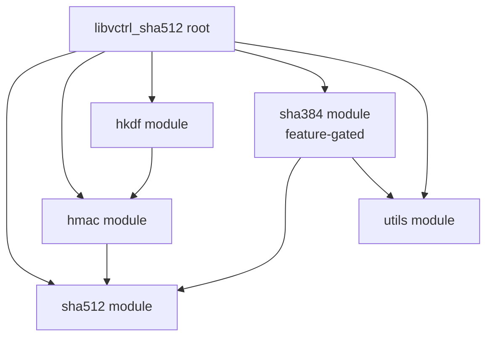
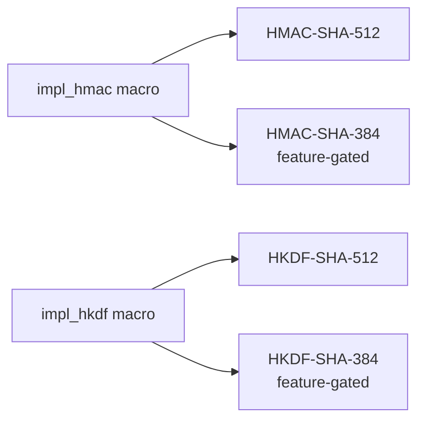
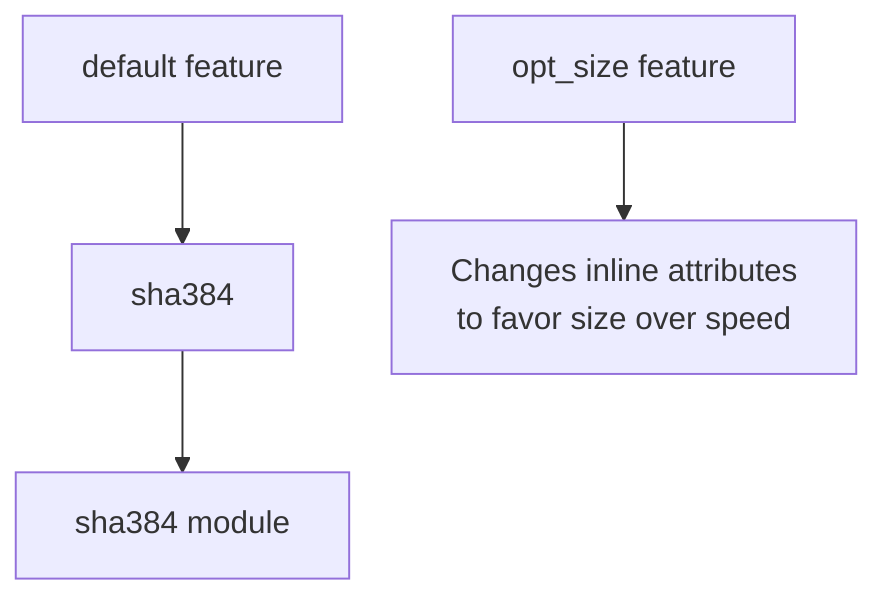
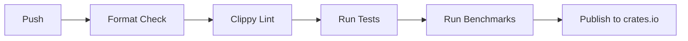

# libvctrl_sha512

**Version:** 2.0.0  
**License:** ISC  
**Crate type:** Rust library (cryptographic primitives)  
**Workspace:** libvcrtl

`libvctrl_sha512` is a zero-dependency, `no_std`-compatible implementation of the SHA-512, HMAC-SHA-512, HKDF-SHA-512, and optional SHA-384 cryptographic algorithms.

The crate is built for performance and minimal code size. All hash algorithms are implemented with careful attention to FIPS 180-4 and RFC 2104/5869. The API is designed for simplicity: one-shot convenience functions sit alongside incremental builders.

The crate contains **no external dependencies** and can be used in both `std` and `no_std` environments. It is intended as the cryptographic foundation for the `libvcrtl` version control system, but it is fully general-purpose.

---

## Table of Contents

- [Overview](#overview)
- [System Architecture](#system-architecture)
- [Core Features](#core-features)
- [Technology Stack](#technology-stack)
- [Project Structure](#project-structure)
- [Getting Started](#getting-started)
  - [Prerequisites](#prerequisites)
  - [Installation](#installation)
  - [Configuration](#configuration)
- [Usage](#usage)
- [API Reference](#api-reference)
  - [Module: sha512](#module-sha512)
  - [Module: sha384](#module-sha384)
  - [Module: hmac](#module-hmac)
  - [Module: hkdf](#module-hkdf)
  - [Module: utils](#module-utils)
  - [Macros](#macros)
  - [Constants](#constants)
- [Testing](#testing)
- [CI/CD Pipeline](#cicd-pipeline)
- [Deployment / Distribution](#deployment--distribution)
- [Security & Compliance](#security--compliance)
- [Contributing](#contributing)
- [License](#license)
- [Changelog](#changelog)

---

## Overview

`libvctrl_sha512` provides robust implementations of the following algorithms:

- **SHA-512** as defined in FIPS 180-4.
- **HMAC-SHA-512** as defined in RFC 2104.
- **HKDF-SHA-512** as defined in RFC 5869.
- **SHA-384** as defined in FIPS 180-4, enabled via the `sha384` feature.
- **HMAC-SHA-384** and **HKDF-SHA-384** through the `sha384` feature.

The crate is designed with the following principles:

- Zero external dependencies.
- `no_std` compatible; no heap allocations are required for hashing.
- Incremental and one-shot APIs.
- Constant-ish time comparison for verification where feasible.
- Strict Clippy and rustdoc linting with `#![deny]`.

All code is written in safe Rust, with a single reviewed `unsafe` block in `utils::verify` used to prevent compiler optimizations from weakening the side-channel mitigation.

---

## System Architecture

### Module Organization

The crate is organized into logical modules:



### Macro-Generated Implementations

HMAC and HKDF are not hand-written for each hash output size. Instead, two exported macros generate the necessary structs:

- `impl_hmac!` generates the `HMAC` struct with `new`, `update`, `finalize`, `mac`, `verify`, and `finalize_verify`.
- `impl_hkdf!` generates the `HKDF` struct with `extract` and `expand`.

These macros are invoked in the `hmac` and `hkdf` modules for SHA-512, and again in the `sha384` module when the `sha384` feature is enabled.



### Feature Gate Mapping



---

## Core Features

- **SHA-512**  
  One-shot and incremental hashing with 64-byte digests.

- **SHA-384**  
  Optional feature-gated implementation with 48-byte digests, sharing the same compression core as SHA-512.

- **HMAC-SHA-512**  
  Keyed-hash message authentication with support for keys longer than the block size, incremental updates, and constant-ish time verification.

- **HMAC-SHA-384**  
  Feature-gated variant with 48-byte output.

- **HKDF-SHA-512**  
  HMAC-based key derivation function following RFC 5869. Provides `extract` and `expand` steps.

- **HKDF-SHA-384**  
  Feature-gated variant.

- **Constant-ish time comparison**  
  `utils::verify` uses XOR accumulation and a `read_volatile` fence to reduce timing side-channel leakage.

- **Zero dependencies**  
  No external crates are required.

- **`no_std` compatible**  
  The core hashing logic does not require the standard library.

- **Compile-time macro expansion**  
  `impl_hmac!` and `impl_hkdf!` reduce code duplication and ensure consistent behavior across hash functions.

- **Strict linting**  
  `#![deny(clippy::all, clippy::pedantic, clippy::nursery, clippy::cargo, missing_docs)]`.

---

## Technology Stack

- **Language:** Rust (edition 2024)
- **Dependencies:** None
- **Dev dependencies:** `criterion` 0.8 for benchmarks
- **Features:**
  - `default = ["sha384"]`
  - `sha384` – enables SHA-384, HMAC-SHA-384, HKDF-SHA-384
  - `opt_size` – favors smaller code size over speed by changing inline attributes
- **Targets:** `no_std` and `std`

---

## Project Structure

```text
libvctrl_sha512/
├── Cargo.toml
├── benches/
│   ├── sha512_bench.rs
│   └── sha384_bench.rs   (requires sha384 feature)
└── src/
    ├── lib.rs
    ├── hkdf.rs
    ├── hmac.rs
    ├── sha384.rs        (feature-gated)
    ├── sha512.rs
    └── utils.rs
```

---

## Getting Started

### Prerequisites

- Rust toolchain 1.96.0 or newer (edition 2024)
- Cargo

No system libraries or external services are required.

### Installation

Add `libvctrl_sha512` to your `Cargo.toml`:

```toml
[dependencies]
libvctrl_sha512 = "2.0.0"
```

Or use Cargo:

```sh
cargo add libvctrl_sha512
```

By default, the `sha384` feature is enabled. To disable it:

```toml
[dependencies]
libvctrl_sha512 = { version = "2.0.0", default-features = false }
```

### Configuration

No configuration is required. Feature flags are the only configuration mechanism.

---

## Usage

### Compute a SHA-512 hash (one-shot)

```rust
use libvctrl_sha512::Hash;

let digest = Hash::hash(b"hello world");
assert_eq!(digest.len(), 64);
```

### Compute a SHA-512 hash (incremental)

```rust
use libvctrl_sha512::Hash;

let mut hasher = Hash::new();
hasher.update(b"hello ");
hasher.update(b"world");
let digest = hasher.finalize();
assert_eq!(digest.len(), 64);
```

### Verify a hash in constant-ish time

```rust
use libvctrl_sha512::Hash;

let expected = Hash::hash(b"verify this");
let mut h = Hash::new();
h.update(b"verify this");
assert!(h.verify(&expected));
```

### HMAC-SHA-512 one-shot

```rust
use libvctrl_sha512::HMAC;

let key = b"my secret";
let tag = HMAC::mac(b"message", key);
assert_eq!(tag.len(), 64);
```

### HMAC-SHA-512 verification

```rust
use libvctrl_sha512::HMAC;

let key = b"another key";
let message = b"data to authenticate";
let expected = HMAC::mac(message, key);

let mut hmac = HMAC::new(key);
hmac.update(&message[..4]);
hmac.update(&message[4..]);
assert!(hmac.finalize_verify(&expected));
```

### HKDF-SHA-512 key derivation

```rust
use libvctrl_sha512::HKDF;

let ikm = [0x0b; 22];
let salt = [0x01; 13];
let info = [0xf0; 10];

let prk = HKDF::extract(salt, ikm);
let mut okm = [0u8; 42];
HKDF::expand(&mut okm, prk, info);

assert_eq!(okm.len(), 42);
```

### SHA-384 (requires `sha384` feature)

```rust
use libvctrl_sha512::sha384::Hash;

let digest = Hash::hash(b"hello world");
assert_eq!(digest.len(), 48);
```

### HMAC-SHA-384 (requires `sha384` feature)

```rust
use libvctrl_sha512::sha384::HMAC;

let key = b"secret";
let tag = HMAC::mac(b"message", key);
assert_eq!(tag.len(), 48);
```

---

## API Reference

### Module: sha512

#### Struct: `Hash`

Represents the SHA-512 hasher state. Provides incremental and one-shot hashing.

**Methods:**

| Method     | Signature                                            | Description                                                        |
| ---------- | ---------------------------------------------------- | ------------------------------------------------------------------ |
| `new`      | `pub fn new() -> Self`                               | Creates a new SHA-512 hasher with the standard IV.                 |
| `update`   | `pub fn update<T: AsRef<[u8]>>(&mut self, input: T)` | Feeds data into the hasher.                                        |
| `finalize` | `pub fn finalize(self) -> [u8; 64]`                  | Consumes the hasher and returns the 64-byte digest.                |
| `hash`     | `pub fn hash<T: AsRef<[u8]>>(input: T) -> [u8; 64]`  | One-shot hash.                                                     |
| `verify`   | `pub fn verify(self, expected: &[u8; 64]) -> bool`   | Finalizes and compares in constant-ish time.                       |
| `zeroize`  | `pub fn zeroize(&mut self)`                          | Overwrites internal state with zeros and inserts a compiler fence. |

**Example:**

```rust
use libvctrl_sha512::Hash;

let mut h = Hash::new();
h.update(b"abc");
let digest = h.finalize();
```

### Module: sha384

Available only with the `sha384` feature.

#### Struct: `Hash`

Thin wrapper around the SHA-512 core with a different IV and truncated 48-byte output.

**Methods:**

| Method     | Signature                                            | Description                   |
| ---------- | ---------------------------------------------------- | ----------------------------- |
| `new`      | `pub fn new() -> Self`                               | Creates a new SHA-384 hasher. |
| `update`   | `pub fn update<T: AsRef<[u8]>>(&mut self, input: T)` | Feeds data.                   |
| `finalize` | `pub fn finalize(self) -> [u8; 48]`                  | Returns the 48-byte digest.   |
| `hash`     | `pub fn hash<T: AsRef<[u8]>>(input: T) -> [u8; 48]`  | One-shot hash.                |
| `zeroize`  | `pub fn zeroize(&mut self)`                          | Clears state.                 |

Additionally, `HMAC` and `HKDF` structs are generated inside this module for 48-byte output and 128-byte block size.

### Module: hmac

#### Struct: `HMAC`

Generated by `impl_hmac!(crate::sha512::Hash, 64, 128)` for SHA-512.

**Methods:**

| Method            | Signature                                                                                    | Description                 |
| ----------------- | -------------------------------------------------------------------------------------------- | --------------------------- |
| `new`             | `pub fn new(k: impl AsRef<[u8]>) -> Self`                                                    | Creates a new HMAC context. |
| `update`          | `pub fn update(&mut self, input: impl AsRef<[u8]>)`                                          | Feeds data.                 |
| `finalize`        | `pub fn finalize(self) -> [u8; 64]`                                                          | Finalizes and returns tag.  |
| `mac`             | `pub fn mac<T: AsRef<[u8]>, U: AsRef<[u8]>>(input: T, k: U) -> [u8; 64]`                     | One-shot HMAC.              |
| `verify`          | `pub fn verify<T: AsRef<[u8]>, U: AsRef<[u8]>>(input: T, k: U, expected: &[u8; 64]) -> bool` | One-shot verification.      |
| `finalize_verify` | `pub fn finalize_verify(self, expected: &[u8; 64]) -> bool`                                  | Finalizes and verifies.     |

### Module: hkdf

#### Struct: `HKDF`

Generated by `impl_hkdf!(crate::sha512::Hash, 64, 128)`.

**Methods:**

| Method    | Signature                                                                      | Description        |
| --------- | ------------------------------------------------------------------------------ | ------------------ |
| `extract` | `pub fn extract(salt: impl AsRef<[u8]>, ikm: impl AsRef<[u8]>) -> [u8; 64]`    | HKDF-Extract step. |
| `expand`  | `pub fn expand(out: &mut [u8], prk: impl AsRef<[u8]>, info: impl AsRef<[u8]>)` | HKDF-Expand step.  |

**Panics:**

- `expand` panics if `prk` length is not 64 bytes, or if `out.len()` is greater than `255 * 64 = 16320`.

### Module: utils

#### Functions:

| Function   | Signature                                                 | Description                             |
| ---------- | --------------------------------------------------------- | --------------------------------------- |
| `load_be`  | `pub fn load_be(base: &[u8], offset: usize) -> u64`       | Loads a big-endian u64 from a slice.    |
| `store_be` | `pub fn store_be(base: &mut [u8], offset: usize, x: u64)` | Stores a u64 as big-endian bytes.       |
| `verify`   | `pub fn verify(x: &[u8], y: &[u8]) -> bool`               | Compares slices with constant-ish time. |

`verify` uses XOR accumulation and `read_volatile` on the final result. This is not formally constant-time but significantly raises the bar for timing attacks.

### Macros

Both macros are exported at crate root.

#### `impl_hmac!`

```rust
macro_rules! impl_hmac {
    ($hash_struct:ty, $output_size:expr, $block_size:expr) => { ... }
}
```

Generates an `HMAC` struct with methods listed above.

#### `impl_hkdf!`

```rust
macro_rules! impl_hkdf {
    ($hash_struct:ty, $output_size:expr, $block_size:expr) => { ... }
}
```

Generates an `HKDF` struct with `extract` and `expand`.

### Constants

| Constant     | Value | Description                   |
| ------------ | ----- | ----------------------------- |
| `BYTES`      | 64    | SHA-512 output size in bytes. |
| `BLOCKBYTES` | 128   | SHA-512 block size in bytes.  |

Both are re-exported at crate root from `utils`.

---

## Testing

The crate includes unit tests, doctests, and benchmarks.

Run unit tests:

```sh
cargo test
```

Run all tests including doctests:

```sh
cargo test --all-features
```

Run doctests only:

```sh
cargo test --doc
```

Run benchmarks:

```sh
cargo bench --all-features
```

The test suite includes known-answer tests for HMAC-SHA-512 and HKDF-SHA-512 using RFC test vectors.

---

## CI/CD Pipeline

No CI/CD pipeline is currently configured in the repository.

If one is added, the following stages are recommended:



Recommended commands:

- Format: `cargo fmt --check`
- Lint: `cargo clippy --all-targets --all-features -- -D warnings`
- Tests: `cargo test --all-features`
- Docs: `cargo doc --no-deps`

---

## Deployment / Distribution

The crate is intended to be published to crates.io.

Release process:

1. Update `version` in `Cargo.toml`.
2. Update `CHANGELOG.md`.
3. Run `cargo publish --dry-run`.
4. Run `cargo publish`.

After publication, documentation will be available at `https://docs.rs/libvctrl_sha512`.

---

## Security & Compliance

`libvctrl_sha512` is a cryptographic library. The following security practices are enforced:

- **No unsafe code except one reviewed block**  
  The only `unsafe` usage is in `utils::verify` to call `core::ptr::read_volatile` and prevent compiler optimizations from weakening the side-channel mitigation.

- **Constant-ish time comparison**  
  `verify` uses XOR accumulation and does not short-circuit, reducing timing side-channel leakage.

- **Zeroization**  
  `Hash::zeroize` and `HMAC`'s `Drop` implementation clear internal state and use a compiler fence.

- **`no_std` compatibility**  
  The crate does not require the standard library for core hashing, reducing attack surface.

- **Audited algorithms**  
  Implementations follow FIPS 180-4, RFC 2104, and RFC 5869.

- **Strict linting**  
  Clippy nursery and pedantic are denied, catching many potential bugs at compile time.

This crate is not formally audited. For high-security applications, prefer a formally verified constant-time library.

---

## Contributing

Contributions are welcome. Follow the workspace `CONTRIBUTING.md`.

For this crate, ensure:

- All public items have documentation with doctests.
- Unsafe code must be minimized and thoroughly reviewed.
- Run `cargo fmt`.
- Run `cargo clippy --all-targets --all-features -- -D warnings`.
- All tests pass with `cargo test --all-features`.
- Benchmark changes are benchmarked with `cargo bench`.

---

## License

This project is licensed under the ISC License. See the `LICENSE` file in the workspace root for details.
