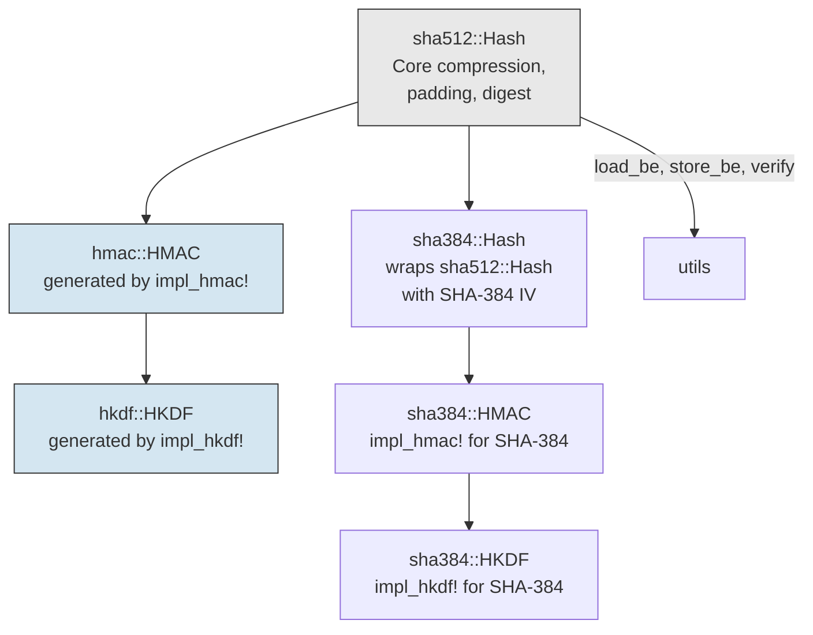
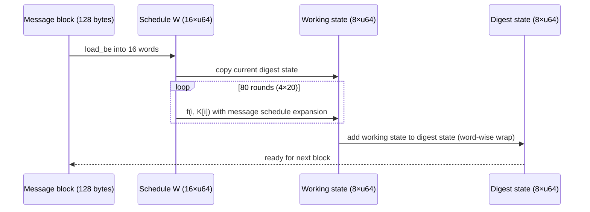
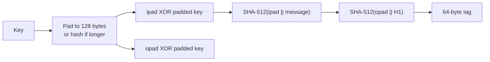
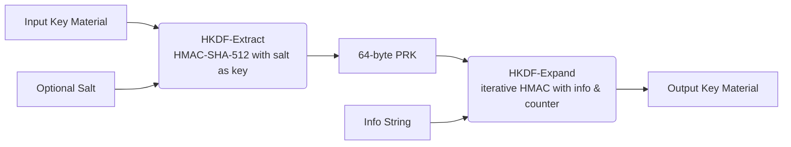

# libvctrl_sha512

## Overview

`libvctrl_sha512` is a **zero‑dependency**, **`#![no_std]`** Rust crate that provides a complete, production‑ready implementation of the following cryptographic primitives:

- **SHA‑512** – FIPS 180‑4 compliant hash function (streaming and one‑shot).
- **HMAC‑SHA‑512** – Keyed‑hash message authentication (RFC 2104).
- **HKDF‑SHA‑512** – HMAC‑based key derivation (RFC 5869).
- **SHA‑384** (optional, enabled by default) – A truncated variant of SHA‑512 with a different initialisation vector, together with its HMAC and HKDF counterparts.

All modules are built on a shared, highly optimised SHA‑512 compression function. The crate is designed for use in embedded systems, WebAssembly, kernels, and any environment where a minimal, auditable, and high‑performance cryptographic library is required. It is a member of the larger `libvctrl` workspace but has no dependencies on other workspace crates and is fully self‑contained.

---

## Architecture

The library’s design separates the core SHA‑512 engine from the HMAC and HKDF constructions via a macro‑based instantiation pattern. The diagram below illustrates the dependency graph between the public modules and the macro layer.



**Key architectural decisions:**

- **Macro‑based code generation** – The `impl_hmac!` and `impl_hkdf!` macros accept any hash type (`sha512::Hash` or `sha384::Hash`) and produce a fully functional `HMAC`/`HKDF` struct. This eliminates code duplication and ensures identical behaviour across the two hash sizes.
- **SHA‑384 as a thin wrapper** – `sha384::Hash` internally uses the full SHA‑512 `State` and compression logic, overriding only the initialisation vector and truncating the final 64‑byte digest to 48 bytes. This guarantees that SHA‑384 outputs are exactly the leftmost 384 bits of a SHA‑512 computation performed with the SHA‑384 IV.
- **`no_std` compliance** – The entire crate relies only on `core`, making it suitable for bare‑metal and WebAssembly targets. No heap allocations are performed; all buffers are stack‑allocated with fixed sizes.
- **Side‑channel resistance** – All verification operations (hash comparison, HMAC tag verification) use a non‑branching, XOR‑accumulation‑based comparison (`utils::verify`) that does not leak timing information. A volatile read forces the compiler to emit the comparison as written, preventing dead‑code elimination or short‑circuiting.

### SHA‑512 Compression Flow

The following sequence outlines the Merkle‑Damgard construction used for a single message block.



After all full blocks are processed, the final incomplete block is padded with a `1` bit, zeros, and a 128‑bit big‑endian message length, then processed similarly.

### HMAC Construction



### HKDF Two‑Step Derivation



---

## Core Features

- **SHA‑512 (FIPS 180‑4)** – Streaming and one‑shot hashing; constant‑time digest verification.
- **HMAC‑SHA‑512 (RFC 2104)** – One‑shot and incremental MAC generation; automatic key hashing for keys > 128 bytes; constant‑time tag verification.
- **HKDF‑SHA‑512 (RFC 5869)** – Extract‑then‑expand key derivation; supports arbitrary output lengths up to 16 320 bytes.
- **SHA‑384 support** – Feature‑gated (`sha384`); provides `sha384::Hash`, `sha384::HMAC`, and `sha384::HKDF` with 48‑byte outputs.
- **Zero external dependencies** – Only the `core` crate; no `alloc`, no `std`, no third‑party libraries.
- **`no_std` compatible** – Works on bare‑metal, kernels, and WebAssembly.
- **Constant‑time comparison** – `utils::verify` prevents timing side‑channel leakage during all verification operations.
- **Memory zeroisation** – HMAC contexts zero the padded key on drop; hash state can be explicitly cleared with `zeroize()`.
- **Feature flags** – Optional SHA‑384 inclusion (`sha384`) and code‑size optimisation (`opt_size`).
- **Fully documented** – Every public item has doc‑comments; all examples are tested as doctests.

---

## Technology Stack

- **Language:** Rust (edition 2024)
- **Frameworks/Libraries:** None (pure Rust, core only)
- **License:** ISC
- **Repository:** [https://github.com/mroczect/libvctrl](https://github.com/mroczect/libvctrl)

---

## Project Structure

```text
libvctrl_sha512/
├── Cargo.toml
├── README.md
├── src/
│   ├── lib.rs          # Crate root, macro definitions, public re‑exports
│   ├── sha512.rs       # SHA‑512 hasher, state, and block compression
│   ├── sha384.rs       # SHA‑384 wrapper (only with feature "sha384")
│   ├── hmac.rs         # HMAC‑SHA‑512 instantiated via impl_hmac!
│   ├── hkdf.rs         # HKDF‑SHA‑512 instantiated via impl_hkdf!
│   └── utils.rs        # Endian helpers, constant‑time verify, constants
├── benches/
│   ├── sha512_bench.rs
│   └── sha384_bench.rs (requires "sha384" feature)
└── tests/              # (integration tests can be placed here)
```

---

## Getting Started

### Prerequisites

- Rust toolchain (stable) version **1.85** or later (edition 2024).
- No external libraries or system dependencies.

### Installation

Add the crate to your `Cargo.toml`:

```toml
[dependencies]
libvctrl_sha512 = "2.0.0"
```

#### Feature Flags

| Flag       | Default | Description                                     |
| ---------- | ------- | ----------------------------------------------- |
| `sha384`   | Yes     | Enable SHA‑384, HMAC‑SHA‑384, and HKDF‑SHA‑384. |
| `opt_size` | No      | Prioritise smaller binary size over raw speed.  |

Example with default features disabled:

```toml
libvctrl_sha512 = { version = "2.0.0", default-features = false }
```

### Configuration

No environment variables or configuration files are needed. The crate compiles with `#![no_std]`; it does not require an allocator.

---

## Usage

### SHA‑512 Hashing

```rust
use libvctrl_sha512::Hash;

// One‑shot
let digest = Hash::hash(b"hello world");
assert_eq!(digest.len(), 64);

// Streaming
let mut hasher = Hash::new();
hasher.update(b"hello ");
hasher.update(b"world");
assert_eq!(hasher.finalize(), digest);

// Constant‑time verification
let mut verifier = Hash::new();
verifier.update(b"hello world");
assert!(verifier.verify(&digest));
```

### HMAC‑SHA‑512

```rust
use libvctrl_sha512::HMAC;

let key = b"super secret";
let msg = b"important data";

// One‑shot
let mac = HMAC::mac(msg, key);

// Streaming
let mut hmac = HMAC::new(key);
hmac.update(&msg[..10]);
hmac.update(&msg[10..]);
assert_eq!(hmac.finalize(), mac);

// Verify in constant time
assert!(HMAC::verify(msg, key, &mac));
```

### HKDF‑SHA‑512

```rust
use libvctrl_sha512::HKDF;

let ikm = b"input key material";
let salt = b"random salt";
let info = b"encryption key";

// Extract
let prk = HKDF::extract(salt, ikm);
assert_eq!(prk.len(), 64);

// Expand
let mut aes_key = [0u8; 32];
HKDF::expand(&mut aes_key, prk, info);
```

### SHA‑384 & Friends

Enable the `sha384` feature (on by default) and import from the `sha384` module:

```rust
use libvctrl_sha512::sha384::{Hash, HMAC, HKDF};

let digest = Hash::hash(b"abc");
assert_eq!(digest.len(), 48);

let mac = HMAC::mac(b"message", b"key");
assert_eq!(mac.len(), 48);

let prk = HKDF::extract(b"salt", b"ikm");
assert_eq!(prk.len(), 48);
```

---

## API Reference / Core Modules

### Crate Root

The crate re‑exports the most frequently used types and constants:

| Item         | Description                     |
| ------------ | ------------------------------- |
| `Hash`       | SHA‑512 hasher (`sha512::Hash`) |
| `HMAC`       | HMAC‑SHA‑512 (`hmac::HMAC`)     |
| `HKDF`       | HKDF‑SHA‑512 (`hkdf::HKDF`)     |
| `BLOCKBYTES` | SHA‑512 block size (128)        |
| `BYTES`      | SHA‑512 output size (64)        |

### `utils` Module

Low‑level helpers exposed for advanced use cases.

| Function / Constant            | Description                                                 |
| ------------------------------ | ----------------------------------------------------------- |
| `BLOCKBYTES: usize = 128`      | SHA‑512 block size.                                         |
| `BYTES: usize = 64`            | SHA‑512 output length.                                      |
| `load_be(base, offset) -> u64` | Load a big‑endian u64 from a byte slice.                    |
| `store_be(base, offset, x)`    | Store a u64 as big‑endian bytes.                            |
| `verify(x, y) -> bool`         | Constant‑time slice comparison; returns `true` if `x == y`. |

### `sha512` Module – SHA‑512 Hasher

**`Hash` struct**

```rust
pub struct Hash { /* fields hidden */ }

impl Hash {
    pub fn new() -> Self;
    pub fn update<T: AsRef<[u8]>>(&mut self, input: T);
    pub fn finalize(self) -> [u8; 64];
    pub fn hash<T: AsRef<[u8]>>(input: T) -> [u8; 64];
    pub fn verify(self, expected: &[u8; 64]) -> bool;
    pub fn zeroize(&mut self);
}
impl Default for Hash;
impl Clone for Hash;
```

- **`new()`** – Creates a hasher with the standard SHA‑512 initial vector.
- **`update()`** – Feeds arbitrary bytes; can be called any number of times.
- **`finalize()`** – Pads the message according to FIPS 180‑4 and returns the 64‑byte digest. Consumes the hasher.
- **`hash()`** – One‑shot convenience function.
- **`verify()`** – Finalizes and compares the digest against `expected` using constant‑time comparison. Returns `true` on match.
- **`zeroize()`** – Overwrites all internal state with zeros and inserts a compiler fence.

### `hmac` Module – HMAC‑SHA‑512

**`HMAC` struct**

```rust
pub struct HMAC { /* fields hidden */ }

impl HMAC {
    pub fn mac<T: AsRef<[u8]>, U: AsRef<[u8]>>(input: T, k: U) -> [u8; 64];
    pub fn new(k: impl AsRef<[u8]>) -> Self;
    pub fn update(&mut self, input: impl AsRef<[u8]>);
    pub fn finalize(self) -> [u8; 64];
    pub fn finalize_verify(self, expected: &[u8; 64]) -> bool;
    pub fn verify<T: AsRef<[u8]>, U: AsRef<[u8]>>(input: T, k: U, expected: &[u8; 64]) -> bool;
}
impl Drop for HMAC;
```

- **`mac()`** – One‑shot HMAC computation. Keys longer than 128 bytes are hashed first.
- **`new()`** – Creates a streaming context; the key is processed immediately.
- **`update()`** – Incrementally feeds input data.
- **`finalize()`** – Produces the 64‑byte authentication tag and consumes the context.
- **`finalize_verify()`** – Finalizes and compares the tag in constant time.
- **`verify()`** – One‑shot verification equivalent to `mac` + constant‑time comparison.
- The `Drop` implementation zeroes the padded key buffer.

### `hkdf` Module – HKDF‑SHA‑512

**`HKDF` struct** (stateless, zero‑sized)

```rust
pub struct HKDF;

impl HKDF {
    pub fn extract(salt: impl AsRef<[u8]>, ikm: impl AsRef<[u8]>) -> [u8; 64];
    pub fn expand(out: &mut [u8], prk: impl AsRef<[u8]>, info: impl AsRef<[u8]>);
}
```

- **`extract()`** – Computes a 64‑byte pseudorandom key (PRK) from salt and input keying material.
- **`expand()`** – Derives output keying material (OKM) of arbitrary length `out.len()`.
  - **Panics** if `prk` is not exactly 64 bytes, or if `out.len() > 16 320` (the RFC 5869 maximum).

### `sha384` Module (feature `sha384`)

Provides SHA‑384, HMAC‑SHA‑384, and HKDF‑SHA‑384. The API is identical to the SHA‑512 counterparts, but all outputs are 48 bytes.

| Type           | Analogue to    |
| -------------- | -------------- |
| `sha384::Hash` | `sha512::Hash` |
| `sha384::HMAC` | `hmac::HMAC`   |
| `sha384::HKDF` | `hkdf::HKDF`   |

Example:

```rust
use libvctrl_sha512::sha384::Hash;

let digest = Hash::hash(b"abc");
assert_eq!(digest, [
    0xcb, 0x00, 0x75, 0x3f, 0x45, 0xa3, 0x5e, 0x8b,
    0xb5, 0xa0, 0x3d, 0x69, 0x9a, 0xc6, 0x50, 0x07,
    0x27, 0x2c, 0x32, 0xab, 0x0e, 0xde, 0xd1, 0x63,
    0x1a, 0x8b, 0x60, 0x5a, 0x43, 0xff, 0x5b, 0xed,
    0x80, 0x86, 0x07, 0x2b, 0xa1, 0xe7, 0xcc, 0x23,
    0x58, 0xba, 0xec, 0xa1, 0x34, 0xc8, 0x25, 0xa7,
]);
```

---

## Testing

### Unit Tests and Doctests

Run the full test suite (including all doc examples) with:

```bash
cargo test --all-features
```

Doctests are guaranteed to be accurate; they are compiled and executed as part of the test run. The suite also covers internal edge cases such as HMAC with empty keys, long keys, and HKDF length limits.

### Benchmarks

Benchmarks are written using [Criterion](https://bheisler.github.io/criterion.rs/book/index.html). To execute them:

```bash
cargo bench --all-features
```

Two benchmark suites are included:

- `sha512_bench` – Measures throughput for SHA‑512 and HMAC‑SHA‑512.
- `sha384_bench` (requires `sha384` feature) – Same for SHA‑384.

On a typical x86‑64 machine, the default build hashes tens of megabytes per second. Enabling `opt_size` trades approximately 16% of throughput for a roughly 75% reduction in code size, making it ideal for embedded targets with tight flash budgets.

---

## Versioning & Stability

This project adheres to [Semantic Versioning 2.0.0](https://semver.org/).

- The public API is considered stable. Any breaking change (removing an item, altering a method signature, changing constant values, or modifying the behaviour of a function in a non‑backward‑compatible way) will result in a major version bump.
- New methods, new trait implementations, or additions to the `sha384` module (while keeping existing APIs unchanged) do not constitute breaking changes.
- Feature flags (`sha384`, `opt_size`) are additive; removing a feature flag or changing its default status would be a breaking change and will be treated accordingly.

Consult the repository’s changelog for version‑specific notes before upgrading.

---

## Contributing

Contributions are welcome. Please open an issue or a pull request on the [GitHub repository](https://github.com/mroczect/libvctrl). By contributing, you agree that your work will be released under the same ISC license.

For substantial changes, it is recommended to discuss the proposal via an issue first to ensure alignment with the project’s goals.

---

## License

This crate is distributed under the **ISC License**.

```
Copyright (c) 2019-2026 Frank Denis
Copyright (c) 2026 mroczect

Permission to use, copy, modify, and/or distribute this software for any
purpose with or without fee is hereby granted, provided that the above
copyright notice and this permission notice appear in all copies.

THE SOFTWARE IS PROVIDED "AS IS" AND THE AUTHOR DISCLAIMS ALL WARRANTIES
WITH REGARD TO THIS SOFTWARE INCLUDING ALL IMPLIED WARRANTIES OF
MERCHANTABILITY AND FITNESS. IN NO EVENT SHALL THE AUTHOR BE LIABLE FOR
ANY SPECIAL, DIRECT, INDIRECT, OR CONSEQUENTIAL DAMAGES OR ANY DAMAGES
WHATSOEVER RESULTING FROM LOSS OF USE, DATA OR PROFITS, WHETHER IN AN
ACTION OF CONTRACT, NEGLIGENCE OR OTHER TORTIOUS ACTION, ARISING OUT OF
OR IN CONNECTION WITH THE USE OR PERFORMANCE OF THIS SOFTWARE.
```

---

## Acknowledgements

This library is a fork of Frank Denis’s [rust-hmac-sha512](https://github.com/jedisct1/rust-hmac-sha512). The core cryptographic logic remains unchanged; this version adds SHA‑384 support, HKDF, FIPS‑compliant full‑length padding, comprehensive documentation, benchmarks, and a modular macro‑based structure.
