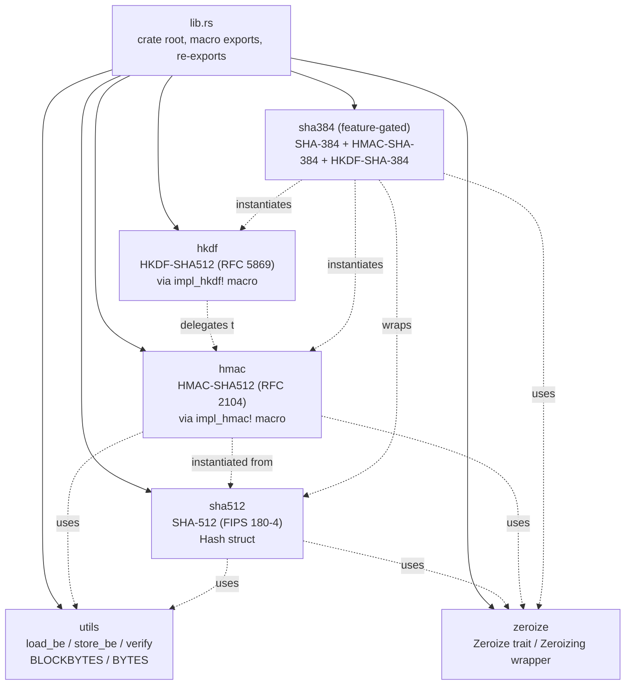
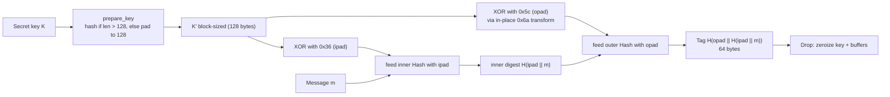
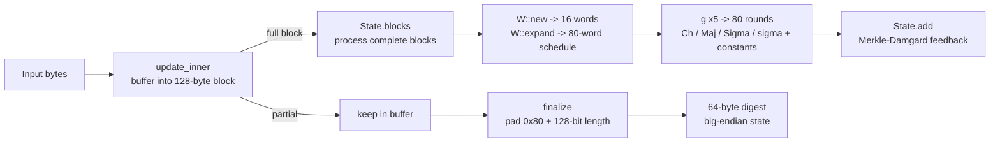

# libvctrl_sha512

Minimal-dependency cryptographic primitives: SHA-512, HMAC-SHA512, HKDF-SHA512, and optional
SHA-384. A pure-Rust, auditable cryptography crate that serves as the content-addressing and
message-authentication backbone for the `libvctrl` workspace while remaining usable as a
standalone crypto library.

- **Crate:** `libvctrl_sha512` 3.2.0 (library, `no_std`-compatible by default)
- **Language:** Rust, edition 2024 — MSRV **1.96.0** (declared via `rust-version`)
- **License:** ISC (distinct from the MIT license used by the rest of the workspace)
- **Repository:** https://github.com/mroczect/libvctrl
- **Documentation:** https://docs.rs/libvctrl_sha512

> The crate has exactly **one external dependency**: `zeroize` (with
> `default-features = false`), used to guarantee zeroization of sensitive intermediate
> state in a `no_std`-compatible manner. The core hash, HMAC, and HKDF types use
> fixed-size arrays and are allocation-free. The crate is `no_std` when built outside of
> test targets (`#![cfg_attr(not(test), no_std)]`).

---

## Overview

`libvctrl_sha512` provides four cryptographic primitives in a single, dependency-light
crate:

- **SHA-512** — the FIPS 180-4 hash function used for content addressing.
- **HMAC-SHA512** — keyed message authentication per RFC 2104.
- **HKDF-SHA512** — key derivation per RFC 5869.
- **SHA-384** (optional) — the FIPS 180-4 truncated variant of SHA-512, plus its
  HMAC-SHA-384 and HKDF-SHA-384 companions.

The implementation prioritises auditability (minimal dependencies, readable code),
security (constant-time verification, zeroization of intermediate state via `zeroize`), and
performance (aggressive inlining with an optional size-optimisation feature). The HMAC and
HKDF types are generated by exported macros, so downstream crates can instantiate them with
other hash functions.

---

## Architecture

The crate is organised as a thin layer over the SHA-512 core. The `sha512` module is the
foundation; `hmac` and `hkdf` are generated from it by macros; `sha384` wraps the SHA-512
core with a different initialisation vector and truncates the output; `utils` provides
shared byte-order and constant-time comparison helpers.



### HMAC-SHA512 construction (RFC 2104)

HMAC normalises the key to the 128-byte block size, then computes the standard
inner/outer hash sandwich. A notable implementation detail: `finalize` transforms the
in-place `ipad` buffer into `opad` by XOR with `0x6a` (since `0x36 ^ 0x5c == 0x6a`),
avoiding a second key copy. The `HMAC` struct implements `Drop` to zeroize the inner
hasher and the padded key buffer.



### SHA-512 incremental pipeline

The `Hash` struct maintains eight 64-bit working variables, a 128-byte block buffer, a
buffered-byte counter, and a `u128` total length. Input is buffered until a full 128-byte
block is available, at which point the block is processed through the message schedule and
80-round compression function.



---

## Core Features

- **Minimal dependencies.** Only `zeroize` with default features disabled; the entire
  hash core is pure Rust over `core`.
- **SHA-512 (FIPS 180-4).** Merkle–Damgård construction, 128-byte block, 64-byte output,
  80 round constants. Incremental and one-shot APIs.
- **HMAC-SHA512 (RFC 2104).** One-shot and incremental APIs, key normalisation, in-place
  ipad/opad transform, and `Drop`-based zeroization of key material.
- **HKDF-SHA512 (RFC 5869).** Extract-and-expand key derivation with enforced output
  length limits.
- **Optional SHA-384.** Wraps the SHA-512 core with a different IV and truncates to 48
  bytes; also generates HMAC-SHA-384 and HKDF-SHA-384.
- **Constant-time verification.** `verify` accumulates XOR differences across all bytes
  and uses `core::hint::black_box` to inhibit compiler short-circuiting; a WebAssembly
  target receives an additional hash-based mask.
- **Guaranteed zeroization.** `Hash` and `HMAC` types implement `zeroize::Zeroize`, and
  sensitive intermediate arrays are wrapped in `zeroize::Zeroizing` so that the compiler
  cannot elide the clearing writes.
- **Exported macros.** `impl_hmac!` and `impl_hkdf!` are `#[macro_export]`, allowing
  downstream crates to instantiate HMAC and HKDF with their own hash structs.
- **Size optimisation.** The `opt_size` feature shrinks the binary by de-inlining the
  compression round functions, for embedded, WebAssembly, and minimal-CLI targets.
- **`no_std` compatible.** The crate compiles without the Rust standard library when not
  compiling tests; only `core` and `alloc` are used.

---

## Technology Stack

- **Language:** Rust (edition 2024, MSRV 1.96.0 — explicitly declared)
- **Dependencies:** `zeroize` 1.8 (`default-features = false`); otherwise none.
- **Dev-dependencies:** `criterion` 0.8 (`default-features = false`, with
  `cargo_bench_support`) for benchmarks.
- **Lint policy:** workspace-inherited, with local allowances for
  `clippy::indexing_slicing` and `clippy::arithmetic_side_effects` in the
  performance-critical crypto paths where bounds are guaranteed by invariants.
- **Features:** `default = ["sha384"]`, `sha384`, `opt_size`.

---

## Project Structure

```text
libvctrl_sha512/
├── Cargo.toml
├── LICENSE
├── README.md
├── benches/
│   ├── sha512_bench.rs
│   └── sha384_bench.rs
└── src/
    ├── lib.rs
    ├── sha512.rs
    ├── hmac.rs
    ├── hkdf.rs
    ├── sha384.rs
    └── utils.rs
```

The published package includes `src/**/*`, `Cargo.toml`, `README.md`, and `LICENSE`
(per the `include` field); benchmarks remain in the repository for local use.

---

## Getting Started

### Prerequisites

- Rust toolchain **1.96.0** or newer (edition 2024 is required)
- Cargo

No system libraries or external services are required.

### Installation

For most `libvctrl` workspace users, depend on the facade, which wires this crate with
`default-features = false` and re-exports it under the `crypto` namespace:

```toml
[dependencies]
libvctrl = "2.2"
```

To depend on `libvctrl_sha512` directly for standalone crypto use:

```toml
[dependencies]
libvctrl_sha512 = "3.2"
```

Or via Cargo:

```bash
cargo add libvctrl_sha512
```

### Configuration

| Use case                     | Configuration                                       |
| ---------------------------- | --------------------------------------------------- |
| Default (SHA-512 + SHA-384)  | `default` (includes `sha384`)                       |
| SHA-512 only                 | `default-features = false`                          |
| Size-optimised, full crypto  | `features = ["opt_size"]`                           |
| Size-optimised, SHA-512 only | `default-features = false, features = ["opt_size"]` |

```toml
# Default: SHA-512 + SHA-384
libvctrl_sha512 = "3.2"

# Minimal: SHA-512 only
libvctrl_sha512 = { version = "3.2", default-features = false }

# Size-optimised, full crypto
libvctrl_sha512 = { version = "3.2", features = ["opt_size"] }

# Size-optimised, SHA-512 only
libvctrl_sha512 = { version = "3.2", default-features = false, features = ["opt_size"] }
```

- **`sha384`** (default): enables the `sha384` module, exposing `sha384::Hash`,
  `sha384::HMAC`, and `sha384::HKDF` (SHA-384 plus HMAC-SHA-384 and HKDF-SHA-384). Disable
  it to reduce compile time and code size when only SHA-512 is needed.
- **`opt_size`**: switches the SHA-512 compression round functions from `#[inline(always)]`
  to `#[inline(never)]`. The result is smaller code size at the cost of slower hashing.
  Intended for embedded, WebAssembly, and minimal-CLI targets. It is purely a code-size
  optimisation and does not affect `no_std` status.

---

## Usage

### SHA-512 one-shot and incremental

```rust
use libvctrl_sha512::Hash;

// One-shot
let digest = Hash::hash(b"hello world");
assert_eq!(digest.len(), 64);

// Incremental
let mut hasher = Hash::new();
hasher.update(b"hello ");
hasher.update(b"world");
assert_eq!(hasher.finalize(), Hash::hash(b"hello world"));
```

### SHA-512 constant-time verification

```rust
use libvctrl_sha512::Hash;

let expected = Hash::hash(b"abc");
let mut hasher = Hash::new();
hasher.update(b"abc");
assert!(hasher.verify(&expected));
```

### HMAC-SHA512 authentication

```rust
use libvctrl_sha512::HMAC;

// One-shot computation
let tag = HMAC::mac(b"message", b"secret-key");
assert_eq!(tag.len(), 64);

// Constant-time verification
let key = b"secret-key";
let tag = HMAC::mac(b"message", key);
assert!(HMAC::verify(b"message", key, &tag));
```

### HKDF-SHA512 key derivation

```rust
use libvctrl_sha512::HKDF;

let prk = HKDF::extract(b"salt", b"input key material");
let mut okm = [0u8; 32];
HKDF::expand(&mut okm, prk, b"context-info");
assert_eq!(okm.len(), 32);
```

### SHA-384 (requires the `sha384` feature)

```rust
use libvctrl_sha512::sha384::Hash as Sha384;

let digest = Sha384::hash(b"abc");
assert_eq!(digest.len(), 48);
```

### Instantiating the macros for a custom hash (downstream crates)

The `impl_hmac!` and `impl_hkdf!` macros are exported so other crates can build HMAC and
HKDF on top of their own hash struct:

```rust,no_run
// Conceptual: assumes your crate provides a `MyHash` type with the same
// API surface as libvctrl_sha512::sha512::Hash (new / update / finalize /
// hash / zeroize), plus an output size and block size.
// impl_hmac!(MyHash, OUTPUT_SIZE, BLOCK_SIZE);
// impl_hkdf!(MyHash, OUTPUT_SIZE, BLOCK_SIZE);
```

---

## API Reference / Core Modules

Full API documentation is published at <https://docs.rs/libvctrl_sha512>. The crate root
hosts the SHA-512 family; SHA-384 types live under the `sha384` module.

### Root re-exports (SHA-512 family)

| Item         | Type   | Description                                                                    |
| ------------ | ------ | ------------------------------------------------------------------------------ |
| `Hash`       | struct | SHA-512 hasher (`new`, `update`, `finalize`, `hash`, `verify`, `zeroize`).     |
| `HMAC`       | struct | HMAC-SHA512 (`mac`, `new`, `update`, `finalize`, `finalize_verify`, `verify`). |
| `HKDF`       | struct | HKDF-SHA512 (`extract`, `expand`).                                             |
| `BYTES`      | const  | SHA-512 output size in bytes (`64`).                                           |
| `BLOCKBYTES` | const  | SHA-512 block size in bytes (`128`).                                           |

> `BYTES` and `BLOCKBYTES` refer to **SHA-512** sizes. SHA-384 shares the 128-byte block
> size but produces a 48-byte output.

### `sha512` — SHA-512 (FIPS 180-4)

- **`Hash`** — the incremental hasher. Holds eight 64-bit working variables, a 128-byte
  block buffer, a buffered-byte counter, and a `u128` total length. `Clone` so that
  HMAC/HKDF can fork intermediate state. `finalize` applies standard padding (`0x80`, zero
  fill, 128-bit big-endian length) and returns the 64-byte digest. `verify` finalises and
  compares in constant time. `zeroize` overwrites state, buffer, and length using the
  `zeroize` crate. `Drop` also zeroizes all sensitive state.
- Internal types `W` (message schedule) and `State` (eight `u64` working variables)
  implement the `Ch`/`Maj`/`Σ0`/`Σ1`/`σ0`/`σ1` logical functions, the 80-word expansion,
  and the 80-round compression function with the standard round constants.

### `hmac` — HMAC-SHA512 (RFC 2104)

- **`HMAC`** — generated by `impl_hmac!(Hash, 64, 128)`. `prepare_key` normalises the key
  to the 128-byte block size (hashing it if too long). The inner hash is seeded with
  `ipad XOR key` (`0x36`); `finalize` transforms the buffer in place to
  `opad XOR key` (`0x5c`) via XOR `0x6a`, then computes the outer hash. `Drop` zeroizes
  the inner hasher and the padded key buffer using `zeroize`.

### `hkdf` — HKDF-SHA512 (RFC 5869)

- **`HKDF`** — generated by `impl_hkdf!(Hash, 64, 128)`. A zero-sized type.
  `extract(salt, ikm)` returns a 64-byte PRK (HMAC with the salt as key). `expand(out, prk, info)`
  fills the output buffer with OKM of arbitrary length, enforcing the RFC 5869 limit
  (`out.len() <= 255 * output_size`) and requiring the PRK to be exactly `output_size` bytes.

### `sha384` — SHA-384, HMAC-SHA-384, HKDF-SHA-384 (feature-gated)

Available only when the `sha384` feature is enabled.

- **`sha384::Hash`** — wraps the SHA-512 core with the SHA-384 initialisation vector and
  truncates the 64-byte digest to 48 bytes. Same incremental API as SHA-512.
- **`sha384::HMAC`** — HMAC-SHA-384, generated by `impl_hmac!(Hash, 48, 128)`.
- **`sha384::HKDF`** — HKDF-SHA-384, generated by `impl_hkdf!(Hash, 48, 128)`.

### `utils` — Shared helpers

| Item         | Kind  | Description                                                        |
| ------------ | ----- | ------------------------------------------------------------------ |
| `load_be`    | fn    | Loads a `u64` from a byte slice at an offset in big-endian order.  |
| `store_be`   | fn    | Stores a `u64` into a byte slice at an offset in big-endian order. |
| `verify`     | fn    | Constant-time comparison of two byte slices; `black_box`-guarded.  |
| `BLOCKBYTES` | const | `128` — SHA-512 block size.                                        |
| `BYTES`      | const | `64` — SHA-512 output size.                                        |

### Exported macros

| Macro        | Purpose                                                                        |
| ------------ | ------------------------------------------------------------------------------ |
| `impl_hmac!` | Generates an `HMAC` type for a given hash struct, output size, and block size. |
| `impl_hkdf!` | Generates an `HKDF` type for a given hash struct, output size, and block size. |

Both are `#[macro_export]` and use `$crate` for path stability when invoked from
external crates.

---

## Testing

The crate ships with known-answer tests for HMAC and HKDF (RFC test vectors) plus SHA-512
and SHA-384 digest vectors. Run the test suite with:

```bash
cargo test
```

To run only the SHA-512 or SHA-384 tests:

```bash
cargo test --lib sha512
cargo test --lib sha384   # requires the sha384 feature (on by default)
```

### Benchmarks

Benchmarks use `criterion` and live under `benches/`. Run them with:

```bash
cargo bench
```

The `sha384_bench` benchmark requires the `sha384` feature. With default features it runs
automatically; if you have disabled default features, enable it explicitly:

```bash
cargo bench --features sha384
```

To run a single benchmark:

```bash
cargo bench --bench sha512_bench
cargo bench --bench sha384_bench   # requires the sha384 feature
```

---

## Contributing

Contributions are welcome. The crate enforces `#![forbid(unsafe_code)]` and inherits the
workspace lint policy. All public items must be documented.

For contribution guidelines, code style, and the full lint configuration, see the
repository's `CONTRIBUTING.md` and the workspace root `README.md`:

- Repository: https://github.com/mroczect/libvctrl

When contributing, preserve the minimal-dependency invariant: no new external crates may
be added without strong justification. New primitives should be implemented over `core`
APIs only, and zeroization should continue to use the `zeroize` crate.

---

## Ecosystem

`libvctrl_sha512` is the crypto engine of the `libvctrl` workspace. The related crates
are listed below; each has its own documentation.

| Crate                | Role                                                        | Documentation                      |
| -------------------- | ----------------------------------------------------------- | ---------------------------------- |
| `libvctrl`           | Facade: re-exports contracts, reference impl, and crypto    | https://docs.rs/libvctrl           |
| `libvctrl_handler`   | Contract layer: traits, types, limits, validation           | https://docs.rs/libvctrl_handler   |
| `libvctrl_core`      | Reference implementations (codec, builders, stores, hasher) | https://docs.rs/libvctrl_core      |
| `libvctrl_plumbing`  | Command-level VCS operations built on `libvctrl_core`       | https://docs.rs/libvctrl_plumbing  |
| `libvctrl_porcelain` | High-level, user-facing VCS operations                      | https://docs.rs/libvctrl_porcelain |

The facade wires this crate with `default-features = false` and re-exports it under the
`crypto` namespace, so most workspace users never need to depend on `libvctrl_sha512`
directly.

---

## License

Licensed under the **ISC License**. This differs from the rest of the `libvctrl`
workspace, which is MIT-licensed; the ISC license is a short, permissive license commonly
used for security-focused code.

Copyright (c) 2026, mroczect `<mroczect@proton.me>`. The full text is in the `LICENSE`
file of the repository. The substantive terms of the ISC License are:

```txt
ISC License

Copyright (c) 2020-2026, Frank Denis.
Copyright (c) 2026, mroczect

Permission to use, copy, modify, and/or distribute this software for any
purpose with or without fee is hereby granted, provided that the above
copyright notice and this permission notice appear in all copies.

THE SOFTWARE IS PROVIDED "AS IS" AND THE AUTHOR DISCLAIMS ALL WARRANTIES
WITH REGARD TO THIS SOFTWARE INCLUDING ALL IMPLIED WARRANTIES OF
MERCHANTABILITY AND FITNESS. IN NO EVENT SHALL THE AUTHOR BE LIABLE FOR
ANY SPECIAL, DIRECT, INDIRECT, OR CONSEQUENTIAL DAMAGES OR ANY DAMAGES
WHATSOEVER RESULTING FROM LOSS OF USE, DATA OR PROFITS, WHETHER IN AN
ACTION OF CONTRACT, NEGLIGENCE OR OTHER TORTIOUS ACTION, ARISING OUT OF
OR IN CONNECTION WITH THE USE OR PERFORMANCE OF THIS SOFTWARE.
```
